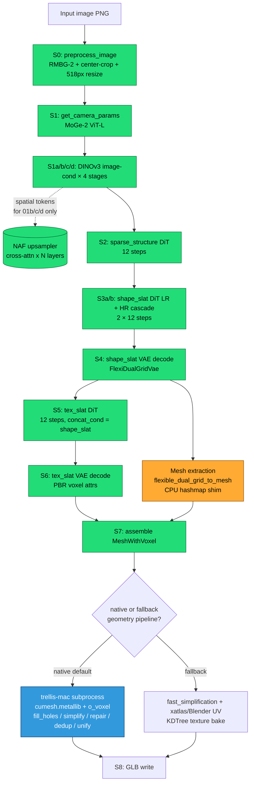
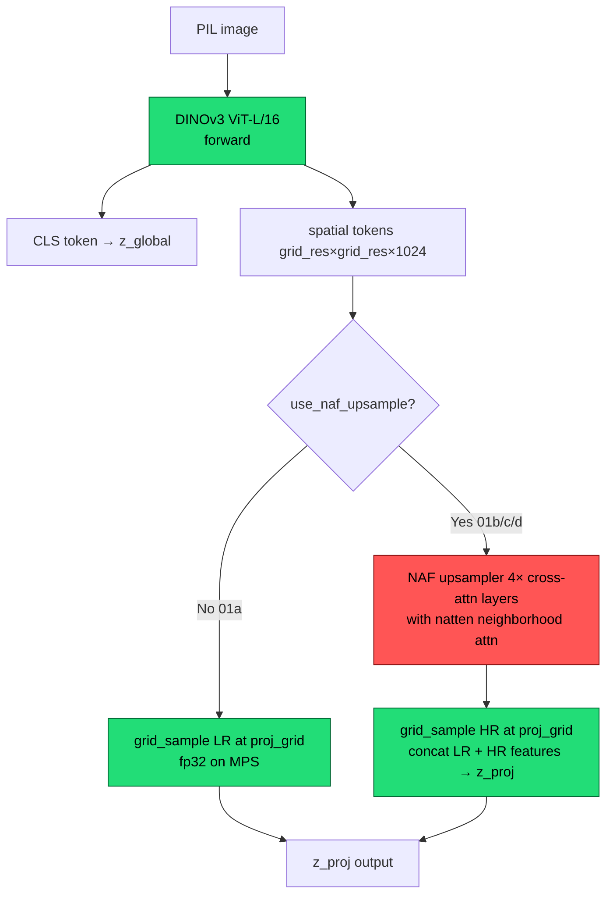
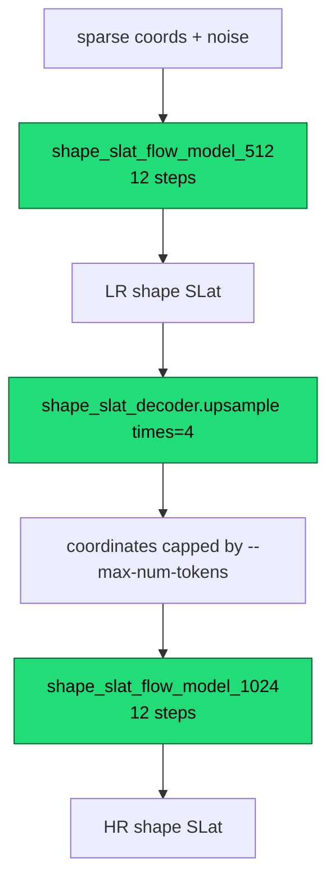

# Pixal3D Apple Silicon Pipeline — Atlas

**Last revised:** 2026-05-27 (Session 21 close)
**Purpose:** Ground-truth map of every stage, every model, every monkey-patch,
every device-routing decision, every known CUDA-vs-Mac divergence, and every
configuration knob. This is the *flat-file* reference we open before any
further investigation so we don't re-discover wires that were already
labelled.

**How to read this doc:**
- §1 is the bird's-eye flow diagram. Look here first.
- §2 lists every model loaded by the Mac pipeline.
- §3 walks every stage in order with per-stage sub-diagrams.
- §4 is the monkey-patch catalog (the section you'll re-read most).
- §5 is the device-routing matrix.
- §6 catalogues every CUDA-specific feature we lose on Mac and what — if
  anything — replaces it. **Read this with §7 (env vars) to know which knobs
  exist.**
- §7 is the exhaustive env-var registry.
- §8 is the canonical fixture-name reference.
- §9 documents exploration directions that haven't been built yet
  (ANE/CoreML, MPS-conv determinism). **Forward-looking.**
- §10 is the "things we already ruled out" log so we stop re-running them.

References below are absolute paths; line numbers as of `beef0ef` (master)
with Session 14 uncommitted changes on `feat/apple-silicon-port`.

Stage tags in this doc match the fixture names dumped by
`generate_mps.py:_install_pipeline_fixture_hooks` so cross-referencing
against captures in `/Users/pawelma/code/ai/fixtures/` is direct.

---

## §1 — Bird's-eye flow



Colour legend everywhere in this doc:
- **green** = runs on MPS by default
- **orange** = runs on CPU by default (or pinned via env var)
- **blue** = runs in a separate Python subprocess (the o_voxel native exporter)
- **grey dashed** = CUDA-only feature dropped on Mac

---

## §2 — Models registry

Every model loaded by the Mac pipeline. Source ID in monospace.

| Slot | Source | Stage(s) | Device default | Load timing |
|---|---|---|---|---|
| Pixal3D pipeline (8 submodels) | `TencentARC/Pixal3D` | S2–S6 | MPS | eager in `init_pipeline` |
| ↳ `sparse_structure_flow_model` | bf16 DiT | S2 | MPS | eager |
| ↳ `sparse_structure_decoder` | dense Conv3D | S2 | MPS | eager |
| ↳ `shape_slat_flow_model_512` | bf16 DiT | S3a / S3b LR | MPS | eager |
| ↳ `shape_slat_flow_model_1024` | bf16 DiT | S3b HR | MPS | eager |
| ↳ `shape_slat_decoder` | fp16 FlexiDualGridVae | S4 + mesh extract | MPS (or CPU via `PIXAL3D_CPU_MODELS`) | eager |
| ↳ `tex_slat_flow_model_1024` | bf16 DiT | S5 | MPS | eager |
| ↳ `tex_slat_decoder` | fp16 VAE | S6 | MPS (or CPU) | eager |
| ↳ (`tex_slat_flow_model_512` exists in spec but not used) | — | — | — | — |
| DINOv3 ViT-L/16 (×4 instances) | `camenduru/dinov3-vitl16-pretrain-lvd1689m` | S1a/b/c/d | MPS | eager |
| MoGe-2 ViT-L | `Ruicheng/moge-2-vitl` | S1 | MPS | lazy, freed after S1 |
| NAF upsampler | `valeoai/NAF` via `torch.hub.load` | S1b/c/d only | MPS (or CPU via `PIXAL3D_NAF_DEVICE`) | lazy on first `proj_grid` call |
| RMBG-2 / BiRefNet | `pixal3d.pipelines.rembg.*` | S0 | MPS | eager |
| natten-mps Metal kernels (opt-in) | `/Users/pawelma/code/ai/natten-mps/` | S1b/c/d NAF inner calls | MPS | on `PIXAL3D_NATTEN_MPS_ENABLE=1` |

Weight dtypes on disk are bf16 (DiTs) / fp16 (VAEs), but PyTorch upcasts to
fp32 at load on MPS. A global `.float()` cast triggered a Metal matmul
dtype mismatch — instead we have per-submodel toggles
(`PIXAL3D_FP32_MODELS`).

Two "native" tools used through subprocesses, not loaded as torch models:

| Tool | What | When |
|---|---|---|
| `o_voxel` native exporter | `trellis-mac/.venv` Python 3.11 with `cumesh.metallib` + `o_voxel` wheel | S8 native cleanup chain |
| Blender 4.x | UV unwrap via subprocess | S8 fallback path |

---

## §3 — Per-stage detail

### S0 — `00_preprocessed_image`

Background removal + center-crop + resize to ~518 px. `pipeline.preprocess_image()`
at `pixal3d/pipelines/pixal3d_image_to_3d.py:145-189`. Single forward through
RMBG-2.0 / BiRefNet, then PIL ops. Output is a configurable-background RGB PIL.

Runs on MPS. Toggled `.cpu()` if `low_vram=True` (Mac default).

### S1 — `01_camera_params` (MoGe-2)

```mermaid
flowchart LR
    A[preprocessed RGB] --> B[MoGe-2 ViT-L forward]
    B --> C[intrinsics]
    C --> D[distance_from_fov<br/>numpy CPU]
    D --> E[{camera_angle_x,<br/>distance,<br/>mesh_scale}]
    classDef mps fill:#2d7,stroke:#063,color:#000
    classDef cpu fill:#fa3,stroke:#840,color:#000
    class B mps
    class D cpu
```

`generate_mps.py:797 get_camera_params_wild_moge`. Bypassed when CLI
`--fov >0`. We used `--fov 0.6061` for all isolation experiments.

### S1a/b/c/d — DINOv3 image-cond × 4

This is where the work happens. Four separate `DinoV3ProjFeatureExtractor`
instances, each with different image_size / grid_resolution / NAF settings:

| Stage | image_size | grid_resolution | use_naf_upsample | naf_target_size | z_proj shape |
|---|---|---|---|---|---|
| 01a `ss` | 512 | 16 | **No** | — | `[B, 16³, 1024]` |
| 01b `shape_512` | 512 | 32 | Yes | 512 | `[B, 32³, 2048]` |
| 01c `shape_1024` | 1024 | 64 | Yes | 512 | `[B, 64³, 2048]` |
| 01d `tex_1024` | 1024 | 64 | Yes | 1024 | `[B, 64³, 2048]` |



**G is the red zone.** Session 11 proved natten itself is not the cause:
Q/K already differ before the attention kernel. Session 12 then traced NAF
internals and refined the culprit to the NAF image encoder:
`encoder` / `sem_encoder` Conv2d + GroupNorm + SiLU blocks, with the
semantic 3×3 branch (`sem_encoder.1.conv1/conv2`) showing the largest early
jump. There are no explicit `q_proj/k_proj/v_proj` Linear layers in this NAF
variant; Q and K are reshaped/pooled image-encoder outputs, and V is resized
DINO features. V remains GREEN (~1e-5), while Q/K drift is amplified by
softmax + AV gather into ~2e-2 NAF output drift and 2.4-2.8e-2 z_proj RED.

Session 12/13 `01b` trace, CUDA vs MPS. **Bold** rows are Session 13
full-tensor captures (33.5M elements); others are 8192-sample max:

| Boundary | max_abs |
|---|---:|
| image input / first branch inputs | 0 |
| **`encoder.1.conv1`** (full) | **9.02e-4** YELLOW |
| **`encoder.1.conv2`** (full) | **2.34e-3** |
| `encoder.2.conv2` / `encoder.output` | 2.40e-3 |
| **`sem_encoder.1.conv1`** (full) | **6.56e-3** |
| **`sem_encoder.1.conv2`** (full) | **1.16e-2** |
| `sem_encoder.2.norm1` | 7.41e-3 |
| `sem_encoder.2.conv2` / `sem_encoder.output` | 2.11e-3 |
| post-concat / pool / RoPE input | 2.40e-3 |
| `q_raw` | 2.29e-3 |
| `k_raw` | 1.11e-3 |
| `v_raw` | 1.14e-5 |
| NAF upsampler output | 2.20e-2 |
| final `01b z_proj` | 2.77e-2 |

Full-tensor max-abs is consistently 1.8–2.5× the sampled max-abs because
the worst-case pixels live in the tails the 8192 deterministic sample
missed. Qualitative offender ordering is unchanged.

Code: `pixal3d/trainers/flow_matching/mixins/image_conditioned_proj.py`,
forward at line 484, `_load_naf()` at line 420, NAF forward branch
at 562-576.

### S2 — `02_sparse_structure`

```mermaid
flowchart LR
    A[noise '1, C_in, 32, 32, 32'] --> B[FlowEulerSampler over<br/>sparse_structure_flow_model<br/>12 steps]
    B --> C[sparse_structure_decoder]
    C --> D[sparse coords '[N, 4]' int<br/>N≈2.5k]
    classDef mps fill:#2d7,stroke:#063,color:#000
    class B,C mps
```

Code: `pixal3d_image_to_3d.py:302 sample_sparse_structure`. Per-step
fixtures `02_sparse_structure_stepNN` carry `pred_x_t, pred_x_0`. Sampler
patched (§4-C) to capture RNG state too.

### S3a / S3b — `03a_shape_slat` and `03b_shape_slat_cascade`



Code: `pixal3d_image_to_3d.py:351 sample_shape_slat`, line 391
`sample_shape_slat_cascade`, plus inlined cascade in `run()` lines 717-787.

**S24: `--max-num-tokens` is a no-op at 1024.** The cap is gated `if num_tokens <
max_num_tokens or hr_resolution == 1024:` (lines 455, 731) — the `or hr_resolution
== 1024` always short-circuits at Mac's locked 1024_cascade, so the cap never binds.
Final voxel count (e.g. robocrab 6.32M) is set by the FDG cascade decode, not the
token cap; there is no knob to shrink the decoded field at 1024.

The `03b_shape_slat_cascade` hook fires **twice** in a single `run()` —
once as the LR pass and once as the HR pass. The second invocation lands
in fixtures with a `_call1` suffix.

**S26 — MPS SDPA cliff (Bug D; INVESTIGATION_FACTS §2 Bug D / §4F).** The HR pass
(`shape_slat_flow_model_1024`, B/F above) runs sparse attention over **~21,500 tokens**,
above the ~18–20k threshold where MPS's fused `scaled_dot_product_attention` is numerically
wrong → HR slat std collapses 5.63→4.99 → geometry shrinkage + colour death. Fixed by the
`naive` chunked-fp32 attention backend (now default); HR slat std restored to 5.67. Simpler
meshes (turtle) stay under the cliff and were never affected.

### S4 — `04_shape_slat_decoded`

`shape_slat_decoder` (`FlexiDualGridVaeDecoder`, `pixal3d/models/sc_vaes/fdg_vae.py`).
Produces a `List[Mesh]` *and* a `List[SparseTensor]` carrying FDG fields
(`fdg_coords / fdg_dual_vertices / fdg_intersected / fdg_split_weight`).

Inside the decoder, mesh extraction routes through
`pixal3d/utils/mesh_extract.py:flexible_dual_grid_to_mesh` — see §4-H for the
CPU hashmap shim that replaces the CUDA-only `o_voxel._C.hashmap_*_3d_cuda`.

**S25 — subdiv-logit VARIANCE COLLAPSE drives the size-shrinkage (INVESTIGATION_FACTS §4F):**
the returned `subs` (= `SparseResBlockC2S3d.to_subdiv` logits) collapse in variance vs CUDA,
worsening with cascade depth (std ratio 0.89→0.88→0.60→0.54; subs3 20.2 vs 37.7) → fewer voxels
clear the `subdiv > -_SUBDIV_BIAS` threshold → 6.27M vs 7.86M. **CPU≡MPS** (not an MPS-op bug),
fp32-insensitive (not fp16), input (03a) bit-identical ⇒ intrinsic Mac↔CUDA reduction, amplified
by the cascade. Recalibrating subdiv std→CUDA recovers voxel count 6.27M→**7.33M**. Multi-pass:
`upsample()` (`pixal3d_image_to_3d.py:716`) + final `decode_shape_slat` (`:505`).

**S25 — the mesh DESTRUCTION (perforation) is HERE, not in the bake/simplify:** the RAW mesh
(`flexible_dual_grid_to_mesh` output, pre-`to_glb`) is already shredded — **7.94% open/boundary
edges** (Euler −83k, non-watertight); recalib → 7.52% (Euler −63k). The holes precede simplify ⇒
latent-driven (gappy field; §4C: FDG extractor is faithful). Size-scaling: fairy raw 2.99%≈CUDA
3.16% vs robocrab 7.94%. **Corrects the reflexive "§4B simplify wall" attribution for robocrab.**

### S5 — `05_tex_slat`


Code: `pixal3d_image_to_3d.py:511 sample_tex_slat`.

### S6 — `06_tex_slat_decoded`

`tex_slat_decoder` produces PBR voxel attributes. Channel layout (from
`o_voxel_native_export.py:20-25`):
- ch 0-2: `base_color`
- ch 3: `metallic`
- ch 4: `roughness`
- ch 5: `alpha`

Output mapped to `[0, 1]` via `* 0.5 + 0.5` (in `decode_tex_slat`, line 570).

**S24 — texture COLOUR desaturation (Mac S5 bug, see INVESTIGATION_FACTS §4E):**
Mac decoded base_color is grey/desaturated and scales with mesh size (turtle ≈ GT,
orc splotchy, robocrab 6.3M → ~0% red); CUDA-vs-Mac decoded `06`: mean-sat 0.49 vs
0.14, red-dominant 0.405 vs 0.0001, metallic 0.0002 vs 0.21. **Mac-specific, localized
upstream of the decoder in S5 (tex_slat flow / conditioning):** the decoder is faithful
(forcing it + its input to fp32 changes nothing), and attention precision
(`PIXAL3D_FP32_ATTN=1`) changes nothing. Distinct from the §4D speckle. Next: rental
stage-diff of `image_cond` + `05_tex_slat`, or cross-inject CUDA `tex_slat`+`subs`
→ Mac `decode_tex_slat`.

**S25 — RESOLVED: colour = tex-flow VARIANCE COLLAPSE, not the decoder (INVESTIGATION_FACTS §4F):**
the rental stage-diff showed conditioning + 03a are **bit-identical** Mac↔CUDA; `05_tex_slat` is
variance-collapsed on every channel (std 2.46 vs 2.70; ch22 0.49, ch8 0.67). Per-channel recalib
of `tex_slat`→CUDA recovers **red 0.0003→0.066** + **metallic 0.222→0.0013** (sat 0.14→0.18,
partial — hue compounds across the 12 flow steps). Same mechanism as the S4/§4F shape-decoder
collapse (one cause, two loci). NB: the geometry perforation is ALSO this collapse (raw mesh
7.94% boundary pre-bake, see S4 note) — NOT the §4B simplify wall, for robocrab.

**S29 — §4F COLOUR CLOSED; tex path proven faithful (INVESTIGATION_FACTS §4F-S29):** the S25
variance collapse was Bug D (S26), fixed by `naive`. The residual is now settled: **bake** loses
no sat (field 0.32 ≈ baked 0.34), **decoder** bit-faithful CPU≡MPS (Δ0.0), **latent** std 2.69 ≈
CUDA 2.70, **flow** forward CPU≡MPS to 1e-6 on real inputs (no 2nd Bug-D; "proj" is a per-voxel
Linear, not cliff attention; fairy tex 10.8k voxels under the cliff). **CUDA fairy ref** (1_img
seed 42): Mac sat **0.324 ≥ CUDA 0.305** (muted = inherent), metallic **0.408 vs 0.313** (CUDA
fairy metallic is 0.31, **not** ~0 — the 0.0002 was robocrab; metallic is object-dependent). The
~0.09 metallic residual is upstream shape-cascade drift (§4C), not the tex path. `--tex-recalib`
(default off) is a **cosmetic** PBR override, not a fidelity fix.

### S7 — `07_run_output`

`MeshWithVoxel` assembled from shape mesh + tex voxel attributes
(`pixal3d_image_to_3d.py:587-606`). This is the checkpoint format we serialize
when `--save-mesh` is used; `--load-mesh` rewinds to here to skip S1–S6.

### S8 — Geometry cleanup + GLB write

**S28 — Bug E ROOT-CAUSED & FIXED; remesh is now the Mac default (see INVESTIGATION_FACTS
§2 Bug F/G/H).** The "broken Metal remesh" was NOT a cumesh DC/hash defect — it was
`mtlbvh.unsigned_distance` over-estimating on large meshes (the BVH closest-triangle
traversal used a 24-deep stack, `bvh.metal:177`, that silently dropped pushes; the
8.6M-face mesh's BVH4 needs ~34–46 → subtrees skipped). One-line fix `FixedStack24→64`
makes the remesh **watertight** (real fairy: remesh out 8.03%→0.00% boundary; final baked
GLB 0.06% / 353 comp / largest 0.974 vs CUDA 0.0% / 235 / 0.978). `--native-remesh` flipped
default-on + project 0.9; GLB now exports smooth vertex normals (`include_normals=True`,
Bug H — fixes faceted shading + ~9MB of the size gap). Also bounded the cumesh hash GPU
probe loops (Bug G — an unbounded `while(true)` hung the GPU/WindowServer). Residual: §4F
colour saturation + minor post-remesh QEM-simplify thin-feature holes (0.06% vs old 10.7%).

**S27 (superseded by S28 above) — Mac↔CUDA mesh divergence is the `remesh` flag (Bug E, see
INVESTIGATION_FACTS §2/§5/§8).** The CUDA reference always bakes `to_glb(remesh=True)`
(`TRELLIS.2/app.py:503`) → narrow-band dual-contouring rebuilds a **watertight** manifold
(0% welded boundary, ~1.7k charts). Mac runs `remesh=False` (default; `--native-remesh`
opt-in) → the simplify-sieve flow below → **10.7% welded boundary holes + 30k–100k charts**
= the visible "shredded high-detail + bad atlas." Reason Mac skips it: the **Metal DC remesh**
(`mtlmesh/.../metal/simple_dual_contour.metal` + `svox2vert.metal`) is **broken** (outputs
8.78% boundary / 18,636 components, not watertight). Cross-bake proved the cleanup kernels
below are faithful Mac↔CUDA and the Mac decoded mesh is fine (Mac mesh → CUDA `remesh=True`
bake = 0.0% welded boundary). **Fix pending:** port/repair the Metal DC remesh vs
`CuMesh/src/remesh/simple_dual_contour.cu`, then default `remesh=True`.

Two paths — controlled by command-line `--no-texture`, `--force-texture-fallback`,
and whether `cumesh.metallib` is loadable:

**Native default** (`try_export_native_o_voxel_glb`, `generate_mps.py:1045`):


**Session 23 — runs IN-PROCESS by default.** After the unify-py310 consolidation
(single Python 3.10 venv, native packages vendored in `extern/` and imported
in-process), `try_export_native_o_voxel_glb` calls `o_voxel_native_export.main(argv)`
directly via `_run_native_o_voxel_in_process`. The old Python 3.11 subprocess
(`trellis-mac/.venv/bin/python`, `.npz`-over-disk) is retained behind
`PIXAL3D_NATIVE_SUBPROCESS=1` and as an auto-fallback if `o_voxel.postprocess`
isn't importable in the running interpreter (sentinel 127).

Six of those nine kernels are monkey-patched — see §4-H for the table.

**Texture quality finding (Session 23 — see INVESTIGATION_FACTS §4D):** the
"Sampling attributes" step samples the sparse tex_slat field at each texel's
interpolated 3D surface position (mtldiffrast rasterize → mtlgemm sparse
`grid_sample_3d`, trilinear). Mac textures show ~15× more speckle than CUDA
(0.13% vs 0.0085% near-black dropout texels) + softer content. **Substitute
bake (CUDA-perfect mesh + tex_slat → Mac `o_voxel`) reproduces the full speckle
→ the bake CHAIN is the cause, not the DiT/tex_slat.** Ruled out: dense fallback
(unused), mtlgemm grid_sample (renormalizes correctly), source noise (smooth),
surface-off-shell (99.99% on shell). Open sub-cause: cumesh simplify roughening
vs mtldiffrast off-surface interpolation. Softness is mostly inherent (CUDA
source only 1.17× sharper). Cheap fix: post-bake inpaint of dropout texels.

**S24 — mtldiffrast depth/tie-break fixed (Bug C).** The Metal rasterizer kept the
*farthest* triangle (`GreaterEqual`+`clearDepth=0`) vs nvdiffrast's smallest-z/w
(`atomicMin`); at the z=0 UV bake this gave last-drawn-wins instead of keep-first
(a UV-seam speckle contributor). Fixed in `extern/mtldiffrast` (vertex z-remap
`(z+w)*0.5`, fragment `2*depth−1`, `Less`+`clearDepth=1`, compute-fallback flipped;
4 test CPU-refs corrected; 66/66 pass). Audits confirmed `interpolate`, `texture`
(dormant on Mac path), and `mtlbvh unsigned_distance` faithful. Addresses one speckle
sub-cause (UV seams); the dominant off-shell-sampling contributor remains.

**Fallback** (`export_fallback_texture_glb`, `generate_mps.py:1132`): pure
PyTorch + trimesh. Used when the native subprocess fails or when
`--force-texture-fallback`. Chain: rotation → `fast_simplification` →
xatlas/Blender UV → KDTree texture bake → GLB.

---

## §4 — Monkey patches

Sorted by load order. Each entry: what's patched, why, where it lives, the
device implication.

### A. `natten.na2d` ⇒ in-tree pure-PyTorch `_torch_na2d`

- **Where:** `generate_mps.py:410-481`
- **Why:** natten 0.21's `cutlass-fna` backend is CUDA-only. `flex-fna`
  refuses MPS and materializes the full `[B, H, X, Y, K²]` scores tensor on
  CPU (~80 GB on shape-512), which crashes the MPS allocator.
- **Replacement:** Index-gather over the `K²` neighbor positions (with
  natten's shifted-window boundary rule) → tiled masked SDPA. Memory-tile
  controlled by `_NA2D_QUERY_CHUNK = 2048`.
- **Routing:** Stays on the caller's device (MPS). No CPU round-trip.
- **Status:** Default. Active unless §4-B preempts.

### B. `natten.na2d` ⇒ Metal kernels via `natten_mps`

- **Where:** `generate_mps.py:645-680`
- **SESSION 23 — switched BACK to our in-house `extern/natten-mps`.** The
  community **ssmall256/natten-mps 0.3.0** was found to be dead weight: its
  *fused* `na2d` requires Q/K/V to share a head dim, but NAF's cross-attention
  is asymmetric (Q/K head_dim 64, V head_dim 256), so it raised
  `ValueError: Head dim must match` on every call → silent fallback to §4-A's
  pure-PyTorch `_torch_na2d`. The Metal kernel never fired. Our in-house port
  (pawel-mazurkiewicz/natten-mps, now `extern/natten-mps`) has *split* kernels
  (`na2d_qk` + `na2d_av`) that handle asymmetric K/V natively. We added
  `natten_mps/compat/v020.py` mirroring the community API but backed by the
  split kernels, so `generate_mps.py`'s existing import is unchanged.
  Verified: 3/3 NAF dispatches hit Metal, zero fallbacks. **BEHAVIOR CHANGE:**
  mesh shifts ~0.4% (our fp32 ≠ PyTorch fallback; flips borderline voxels).
  Our kernels are CUDA-cutlass-fna-golden-validated (~1e-3, S11); the fallback
  was never CUDA-validated, so plausibly closer to CUDA but unmeasured.
  Also fixed a shim bug: the `sys.modules` walk used `getattr(mod,"na2d")`
  which tripped transformers' lazy `_LazyModule.__getattr__` (~180 alias-warning
  lines per run) — now probes `mod.__dict__.get("na2d")`.
- **Historical (pre-S23):** Session 15 had swapped from our port to the
  community package on the (mistaken) belief it was more complete.
- **Replacement:** explicit monkey-patch using the v020 compatibility shim:
  `from natten_mps.compat import v020; natten.na2d = v020.na2d` (plus the
  same on `natten.functional.na2d`). Targets NATTEN v0.20+ API; our venv
  ships NATTEN v0.21 which matches.
- **Routing:** MPS tensors → community Metal kernels; CPU/CUDA tensors →
  community impl's own routing (its `has_cuda()=False`, `has_mps()=True`).
- **Default:** ON since Session 15. Opt out via `PIXAL3D_NATTEN_MPS=pytorch`
  to use the slow-but-bulletproof pure-PyTorch `_torch_na2d` fallback
  (was the source of the 2.5e-2 z_proj RED that originally spawned the
  port). Legacy `PIXAL3D_NATTEN_MPS_ENABLE=1` is still honoured as a
  forced-on override. Session 11 verified the (former in-tree) kernel
  fires correctly; the v020 community kernels are drop-in replacements
  with the same NATTEN-v0.20 API contract.

### C. `FlowEulerSampler.sample` (fixture capture)

- **Where:** `generate_mps.py:198-238`
- **Why:** Capture per-step `pred_x_t` / `pred_x_0` and RNG state for
  divergence hunting.
- **Replacement:** wraps original, snapshots `torch.get_rng_state()`,
  `cuda_all` state if available, `mps` state, calls original, dumps
  intermediates per step.
- **Trigger:** `PIXAL3D_DUMP_FIXTURES=<dir>`.

### D. Pipeline stage `setattr` wrappers

- **Where:** `generate_mps.py:105-122`
- **Why:** Same as C, at coarser granularity. Wraps `sample_sparse_structure`,
  `sample_shape_slat`, `sample_shape_slat_cascade`, `decode_shape_slat`,
  `sample_tex_slat`, `decode_tex_slat`.

### E. DINOv3 forward hooks

- **Where:** `generate_mps.py:139-162`
- **Why:** Capture `(z_global, z_proj)` from each of the 4 DinoV3 extractors.
- **Replacement:** `register_forward_hook` per model, dumps to
  `01a/b/c/d_image_cond_*`.

### F. `PIXAL3D_CPU_MODELS` model relocator

- **Where:** `generate_mps.py:629-771`
- **Why:** Some VAE decoders are suspected of having MPS bugs (was a
  hypothesis for tex_slat channel 3/4 RED that turned out to be upstream).
- **Replacement:** For each named submodel: walks params/buffers in place
  to CPU, drains `obj._spatial_cache` so SparseTensor neighbor tables
  rebuild on CPU, then replaces `sub.forward` with a closure that
  re-forces CPU each call, ferries args/SparseTensor in (recursively,
  including `.data['feats']` and `coords`), runs orig_forward, ferries
  output back to MPS.
- **Routing:** Submodel runs on CPU; rest of pipeline stays on MPS.
- **Trigger:** `PIXAL3D_CPU_MODELS=<csv>`.

### G. `PIXAL3D_FP32_MODELS` upcast

- **Where:** `generate_mps.py:549-627`
- **Why:** Some VAE forward paths re-downcast via internal
  `h.type(self.dtype)` calls even after we `.float()` the module.
- **Replacement:** For each named submodel: `.float()`, set
  `convert_to_fp32() / .dtype = fp32 / .use_fp16 = False`. Also wraps
  the pipeline call site (`decode_tex_slat`, `decode_shape_slat`) to
  recursively cast `SparseTensor.data['feats']` to fp32 on entry.
- **Status:** Proved a no-op in Session 10 — params were already fp32, only
  `self.dtype` flip mattered. Retained for diagnostic flexibility.

### H. `o_voxel.postprocess` patches (executed in trellis-mac subprocess)

These live in `pixal3d/utils/o_voxel_native_export.py` and run inside the
S8 native subprocess. Six kernels patched:

| Patch | Original | Replacement | Trigger / opt-out |
|---|---|---|---|
| `_patch_grid_sample_output` (line 870-875) | CUDA-specialized `_grid_sample_3d` | Portable dense-volume + `F.grid_sample` | Auto: when `_HAS_FLEX_GEMM=False` |
| `_patch_repair_non_manifold_edges` (307) | Metal `repair_nme` (over-splits) | `pixal3d/utils/cumesh_port/repair.py` (CPU port) | **Default = native Metal (Session 15)**; `PIXAL3D_REPAIR_NME=pamo` opts back to CPU port |
| `_patch_remove_small_connected_components` (392) | Metal small_cc (over-culls) | Either no-op or numeric threshold override | Off unless `PIXAL3D_SMALL_CC=noop\|<float>` |
| `_patch_simplify` (665) | cumesh's PAMO QEM (Metal) | `pixal3d/utils/pamo_simplify.py` (CPU port) | **Default = native Metal (Session 15)**; `PIXAL3D_SIMPLIFY=pamo` opts back to CPU port |
| `_patch_fill_holes` (564) | Metal fill_holes (perimeter 3e-2 default) | Same Metal kernel, custom perimeter | Off unless `PIXAL3D_FILL_HOLES_PERIMETER=<float>` |
| `_patch_unify_face_orientations` (490) | Buggy Metal unify_face_orientations | CPU re-implementation | **Default = native Metal (Session 15)**; `PIXAL3D_UNIFY_FACE_ORIENTATIONS=pamo` opts back to CPU port |

Session-7 history: the Metal kernels were initially distrusted wholesale
(over-culling, over-splitting), but a `simplify` audit found the Metal port
faithful and 50% faster. We re-enabled it as an opt-in. Other Metal kernels
remain replaced.

**Session-15 update:** the Metal cleanup chain (simplify + repair_nme +
unify_face_orientations) has been validated end-to-end via the
"CUDA-mesh-through-Mac-cleanup" exoneration test (pushing a CUDA-rendered
mesh through Mac's Metal cleanup produces a visually-clean result). All
three patches have flipped their default — Metal native is now the
default; `PIXAL3D_<name>=pamo` opts back to the CPU port for safe
rollback / debugging. Run time on a single mesh drops from minutes
(pamo CPU) to seconds (Metal native).

### I. `flex_gemm.ops.spconv.submanifold_conv3d.SubMConv3dNeighborCache` stub

- **Where:** `generate_mps.py:1574-1590`
- **Why:** Some pickled fixtures (saved on CUDA) reference the CUDA-only
  neighbor cache class. `torch.load(weights_only=False)` needs *some* class
  to deserialize against.
- **Replacement:** Pure-Python `ModuleType` + dataclass stub registered in
  `sys.modules`.

### J. SDPA kernel context

- **Where:** `generate_mps.py:1770-1786`
- **Why:** Diagnostic. Wraps `pipeline.run()` in
  `torch.nn.attention.sdpa_kernel([math|efficient|flash])`.
- **Trigger:** `PIXAL3D_SDPA_BACKEND=math|efficient|flash`.
- **Status:** Per Session-N analysis, all three SDPA backends produce
  identical output on MPS torch 2.12 (the MPS backend ignores the
  selector). Retained for future-proofing.

### K. FDG mesh extractor — `o_voxel._C.hashmap_*_3d_cuda` stub

- **Where:** `pixal3d/utils/mesh_extract.py:38, 55` (Session 8 vendoring)
- **Why:** o_voxel's hashmap is CUDA-only.
- **Replacement:** Plain Python `dict` mimicking the upstream contract.
  `coords.detach().cpu().long().contiguous().tolist()` for keys, outputs
  ferried back with `.to(device=device)`.
- **Routing:** CPU for the hashmap step itself; result lands back on MPS.

### L. NAF internal trace hooks

- **Where:** `generate_mps.py:_install_naf_trace_hooks`
- **Why:** Fingerprint exactly where Session 11's NAF q/k drift enters before
  natten by capturing image-encoder Conv/GN/SiLU, branch concat, pooling,
  RoPE, query/key/value, and `_resize` outputs.
- **Replacement:** Instrumentation only. Registers module hooks and wraps
  `image_encoder.forward_encoder` plus `upsampler._resize`.
- **Payload:** Default is scalar stats + deterministic flat samples so huge
  512²/1024² maps remain tractable. Selected full tensors are opt-in.
- **Trigger:** `PIXAL3D_NAF_TRACE=1` with `PIXAL3D_DUMP_FIXTURES=<dir>`.

---

## §5 — Device routing matrix

| Op / submodel | Default device | Can pin to CPU? | Notes |
|---|---|---|---|
| RMBG-2 / BiRefNet | MPS | implicit via `low_vram` | always cycled MPS↔CPU on entry/exit |
| MoGe-2 | MPS | no env knob | freed after S1 |
| DINOv3 (all 4) | MPS | no env knob | identity weights, drift small |
| **NAF upsampler** | MPS | `PIXAL3D_NAF_DEVICE=cpu` | known source of drift (§6) |
| **HR proj_grid** | MPS | `PIXAL3D_PROJ_GRID_DEVICE=cpu` | exonerated by Session-10 Exp 5 |
| natten attention inside NAF | MPS via `_torch_na2d` or natten-mps | follows NAF device | §4-A or §4-B |
| sparse_structure_flow_model | MPS | no env knob | |
| sparse_structure_decoder | MPS | no env knob | |
| shape_slat_flow_model_512 | MPS | no env knob | |
| shape_slat_flow_model_1024 | MPS | no env knob | |
| shape_slat_decoder | MPS | `PIXAL3D_CPU_MODELS=shape_slat_decoder` | per Session-N: deterministic |
| tex_slat_flow_model_1024 | MPS | no env knob | |
| tex_slat_decoder | MPS | `PIXAL3D_CPU_MODELS=tex_slat_decoder` | per Session-N: deterministic |
| FDG mesh extract (hashmap) | CPU | always — hard-coded | `cpu().long().tolist()` |
| Sparse 3D conv (when `flex_gemm` absent) | MPS for kernel, CPU for neighbor build | hard-coded | `conv_none.py:54` |
| o_voxel native exporter | trellis-mac subprocess (CPU + Apple Metal) | hard-coded | separate Python 3.11 venv |

Pipeline base device: `resolve_device("mps")` (`generate_mps.py:484`). Set
once at startup, propagated to everything below.

`low_vram=True` is the config default — every model is `.to(self.device)`
on entry and `.cpu()` on exit. So even the "MPS" submodels above shuttle
through CPU twice per pipeline run.

---

## §6 — CUDA divergence catalog

Every CUDA-specific feature we lose on Apple Silicon, and our current posture
toward it. Read this with §9 to see which postures might change.

| CUDA feature | What it provides | Mac substitute | Status / divergence |
|---|---|---|---|
| `flash_attn` 2/3/4 | Fused exact-attention with online softmax | `sdpa` via PyTorch's MATH backend | Replaced. MPS SDPA is at fp32 floor (~1e-6 vs fp64 truth). `metal-flash-attention` evaluated and retired (Session 7). |
| TF32 matmul on Ada/Hopper | 10-bit-mantissa matmul, default for fp32 on recent NVIDIA | Full fp32 on Mac | **Accepted drift.** Apple has no TF32. Dominant source of Metal-vs-CUDA kernel-level drift in natten-mps (~1e-3 rel). Cannot eliminate. |
| cuDNN reduction order | Vendor-tuned algorithm + reduction strategy per shape | MPSGraph reduction (vendor-tuned but different) | **RETIRED as a relevant-to-mesh direction (Session 15).** History: Session 14 retired CoreML/ANE; Session 15 retired TF32 + Winograd + reduction-order via formal fp32-strict CUDA capture (`mathType=DEFAULT_MATH`, 32/32 conv calls). The Mac↔CUDA z_proj gap stayed at 2.70e-2 (vs 2.77e-2 TF32-on), proving the gap is intrinsic fp32 framework difference (cuDNN DEFAULT_MATH vs MPSGraph), not algorithm choice. **More importantly:** Session 15's 11-mesh bisection battery showed substituting CUDA image_cond / SS / shape_slat does NOT fix the visible Mac mesh damage. z_proj-level fixes are orthogonal to the actual bug, which lives in the cleanup chain (see §9-D). Custom Metal NAF (§9-C) was built anyway and validated bit-equivalent to MPSGraph; it ships as a controllable substrate but doesn't change mesh quality. |
| TensorCore fp16 / bf16 + fp32 accumulator | High-throughput mixed precision | MPSGraph fp16/bf16 (similar shape) | Replaced. Drift consistent with TF32 case above. |
| `cutlass-fna` / `hopper-fna` / `blackwell-fna` | Fused neighborhood attention on tensor cores | `_torch_na2d` index-gather (§4-A) OR `natten_mps` Metal kernels (§4-B) | Replaced. Kernel correctness validated. Not the bottleneck. |
| `flex_gemm` (Pixal3D's sparse 3D submanifold conv) | Specialized CUDA sparse conv | `pixal3d/modules/sparse/conv/conv_none.py` (CPU + MPS, slow neighbor build on CPU) | Replaced. Speed worse, correctness unaffected. |
| `o_voxel._C.hashmap_*_3d_cuda` | Spatial hash for FDG mesh extraction | Python dict shim in `mesh_extract.py` | Replaced. Session 8 vendoring is bit-identical on stored FDG checkpoint. |
| `Mesh.fill_holes()` (CUDA-only) | In-pipeline hole filling | Gated by `device.type == 'cuda'` (skipped on MPS) | Skipped in-pipeline. Picked up by Pedro's mtlmesh fill_holes inside the S8 native subprocess. |
| `o_voxel.postprocess._grid_sample_3d` (CUDA-specialised) | 3D bilinear sampling on grid | Dense volume + `F.grid_sample` (§4-H) | Replaced. Correctness OK; some perf cost. |
| `cumesh` PAMO QEM Metal port | Mesh decimation | `pamo_simplify.py` (CPU port) OR Metal Q-EM (now trusted) | Both available. Default `pamo` for safety. |
| `cumesh.repair_non_manifold_edges` Metal | NME repair | `repair.py` (CPU port) | Default CPU. Metal opt-in via env var. |
| `cumesh.unify_face_orientations` Metal | Face winding repair | CPU re-impl | Default CPU. Metal buggy. |
| `cumesh.remove_small_connected_components` Metal | Tiny island culling | Optional no-op or numeric override | Off unless explicitly enabled. |

Drift roll-up (current best understanding):

| Source | Magnitude | Sessions confirming |
|---|---|---|
| TF32 vs fp32 in matmul layers | ~1e-3 rel | 11 (CUDA golden test) |
| cuDNN-vs-MPS conv/norm reduction order in NAF image encoder | first jump 9e-4–1.16e-2 (full); q_raw 2.29e-3, k_raw 1.11e-3, V GREEN | 11, 12, 13 |
| NAF attention amplification of q/k drift | q/k drift → NAF output 2.20e-2 → `01b z_proj` 2.77e-2 | 11, 12, 13 |
| ~~ANE fp16 vs CUDA fp32 for `sem_encoder.1.conv1` (validated relief)~~ — RETRACTED Session 14 | local win real (1.08e-3 / 1.02e-5) but does NOT propagate end-to-end | 13 (probe), 14 (end-to-end disproof) |
| MPS SDPA precision floor | ~1e-6 abs | 7 |
| Sampler accumulated drift over 12 DiT steps | grows from `pred_x_t` ~1e-3 → ~1e-1 by step 11 | 9, 10 |

---

## §7 — Env-var registry

### Pixal3D-namespaced

| Var | Type | Read at | Effect |
|---|---|---|---|
| `PIXAL3D_DUMP_FIXTURES` | path | `generate_mps.py:29` | Enable fixture capture |
| `PIXAL3D_STOP_AFTER` | string | `generate_mps.py:84` | Clean process exit after fixture name |
| `PIXAL3D_NAF_TRACE` | `0/1/summary/full` | `generate_mps.py:_install_naf_trace_hooks` | Enable NAF internals trace; `full` dumps all tensors |
| `PIXAL3D_NAF_TRACE_SAMPLES` | int | same | Number of deterministic flat samples per tensor (default 4096) |
| `PIXAL3D_NAF_TRACE_FULL` | csv substrings | same | Dump full tensors whose label contains any selector |
| `PIXAL3D_NATTEN_MPS` | `metal/pytorch` (default `metal` since S15) | `generate_mps.py:660` | `=pytorch` opts out to slow PyTorch fallback. Default routes via community [`ssmall256/natten-mps`](https://github.com/ssmall256/natten-mps) `compat.v020` shim. |
| `PIXAL3D_NATTEN_MPS_ENABLE` | `0/1` (legacy) | `generate_mps.py:660` | Pre-S15 opt-in alias. `=1` still forces Metal on; otherwise inert (new default already on). |
| `PIXAL3D_NAF_METAL` | `0/1` | `generate_mps.py` (post NAF preload) | **S15 opt-in.** Swaps NAF `image_encoder` Conv2d/GroupNorm/SiLU for the custom Metal kernels in `scripts/metal_naf_kernels.py`. Bit-equivalent to MPSGraph within fp32 noise. Currently no win or loss vs MPSGraph; substrate for future precision experiments. |
| `PIXAL3D_NAF_METAL_SCOPE` | dotted path | same | Override the scope attr name (default `image_encoder`). |
| `PIXAL3D_CUDA_SUBSTITUTE` | csv `<stage>:<path>[,...]` | `generate_mps.py` (pre fixture-dump hook install) | **S15 bisection harness** (`scripts/cuda_substitute.py`). Substitutes the named stage's output with a tensor loaded from a CUDA fixture, bypassing the Mac producer entirely. Stage names mirror `_install_pipeline_fixture_hooks`: `01a/b/c/d_image_cond_*`, `02_sparse_structure`, `03a_shape_slat`, `03b_shape_slat_cascade`, `04_shape_slat_decoded`, `05_tex_slat`, `06_tex_slat_decoded`. **S20 gotcha**: `03b_shape_slat_cascade` substitution is silently no-op because `pipeline.sample_shape_slat_cascade()` is defined but never called by `pipeline.run()` in 1024_cascade mode (HR sampling is inlined at line 756). Use `PIXAL3D_HR_SLAT_INJECT` for HR slat injection instead. |
| `PIXAL3D_HR_SLAT_INJECT` | path | `generate_mps.py:2374` | **S20**. Monkey-patches `pipeline.shape_slat_sampler.sample` to return a pre-loaded HR shape SLAT (SparseTensor pickle) instead of running Mac's HR DiT. Fills the gap left by `PIXAL3D_CUDA_SUBSTITUTE`'s broken `03b_shape_slat_cascade` stage (see above). Drains `_spatial_cache` after `.to(device)` to prevent stale CPU index tensors from crashing the texture sampler's RoPE downstream. Used with `PIXAL3D_CUDA_SUBSTITUTE=03a_shape_slat:...` to fully bypass both DiT stages for decoder-only divergence isolation. |
| `PIXAL3D_DUMP_SUBDIV` | path | `pixal3d/models/sc_vaes/sparse_unet_vae.py:22` | **S20**. Dumps `subdiv.feats` + `coords` + `x.feats` per call of `SparseResBlockC2S3d._forward`. Produces `level_NN.pt` files in dump dir (NN = 0..11 for three cascade invocations × 4 levels). Diagnostic for cascade trajectory divergence between Mac and CUDA. See `scripts/cuda/diff_subdiv_dumps.py` for analysis script. |
| `PIXAL3D_FP32_ATTN` | `0/1` | `pixal3d/modules/sparse/attention/full_attn.py:232`, `pixal3d/modules/attention/full_attn.py:142` | **S21 — DEAD LEVER, kept for diagnostic completeness**. Upcasts SDPA inputs to fp32 around the `scaled_dot_product_attention` call. Idea was that MPS SDPA might use fp16 accumulators on bf16/fp16 inputs, but with `PIXAL3D_FP32_MODELS` already set (production recipe), q/k/v entering SDPA are fp32 and the cast is a no-op. Verified bit-identical output to baseline (`torch.equal(...)` == True). Left in tree for future bf16-inference experiments where it would matter. |
| `PIXAL3D_NAF_DEVICE` | `cpu/mps/cuda` | `image_conditioned_proj.py:432` | Pin NAF device |
| `PIXAL3D_PROJ_GRID_DEVICE` | `cpu/mps` | `image_conditioned_proj.py:582` | Pin HR proj_grid device |
| `PIXAL3D_FP32_MODELS` | csv | `generate_mps.py:1011` | Upcast named submodels to fp32. **S19**: now handles DiTs too — falls back to `convert_to(torch.float32)` for DiT-style API (sparse_structure_flow / structured_latent_flow / texture flow) when `convert_to_fp32()` is absent. Forces activation casts inside DiT forwards from bf16 → fp32, eliminating the bulk of MPS-vs-CUDA drift. **Production recipe**: `PIXAL3D_FP32_MODELS=sparse_structure_flow_model,sparse_structure_decoder,shape_slat_flow_model_512,shape_slat_flow_model_1024,tex_slat_flow_model_1024`. Wall-time cost ~7% on 1024 cascade. |
| `PIXAL3D_CPU_MODELS` | csv | `generate_mps.py:1101` | Pin named submodels to CPU. **S19**: SparseTensor device-shuffle bug fixed in `_to_device` — now uses `SparseTensor.to(device)` + drains `_spatial_cache` on the result. Functional as a slow-but-correct fallback (40-60 min wall on shape DiT alone, not production-viable). |
| `PIXAL3D_SUBDIV_BIAS` | float (default 0.0) | `pixal3d/models/sc_vaes/sparse_unet_vae.py:14` | **S19/S20 — DEAD LEVER, kept for completeness**. Shifts the C2S3d cascade threshold from `subdiv.feats > 0` to `subdiv.feats > -bias`. **S20 measurement**: subdiv logits at L0 have mean +31.7 std 134; near-zero band (-0.5, 0] holds <2% of values. Cells Mac drops but CUDA keeps have Mac-logit median -4.9 (decisive negatives), not borderline waverers. Even bias=1.0 recovers <16% of dropped cells. Use 0.0 (default no-op). |
| `PIXAL3D_PRECLEAN_NME` | `0/1/true/yes` | `generate_mps.py:1834` | Run CPU NME repair before native export |
| `PIXAL3D_KEEP_NATIVE_O_VOXEL_INPUT` | `0/1` | `generate_mps.py:1125` | Keep .npz handed to native subprocess |
| `PIXAL3D_SDPA_BACKEND` | `math/efficient/flash` | `generate_mps.py:1770` | SDPA selector context |
| `PIXAL3D_NAF_ANE_REPLACE` | csv substrs | `generate_mps.py` (post NAF preload) | Per-conv ANE swap (Session 14). Substring-matches reflect `Conv2d` modules under each NAF, replaces with `CoreMLConv2dWrap`. Empirically does not move z_proj end-to-end; kept as general-purpose tool. |
| `PIXAL3D_NAF_ANE_WHOLE` | csv dotted paths | same | Whole-module ANE wrap (Session 14). e.g. `image_encoder.encoder,image_encoder.sem_encoder`. Replaces subgraphs with `CoreMLWholeModuleWrap`. Also doesn't move z_proj. |
| `PIXAL3D_NAF_ANE_KEEP_FP32` | csv op_type substrs | same | For whole-module path: passes `ct.transform.FP16ComputePrecision(op_selector=...)` keeping matching ops fp32 (e.g. `group_norm,layer_norm,reduce_mean,reduce_sum`). Documented coremltools mechanism. |
| `PIXAL3D_NAF_ANE_COMPUTE_UNITS` | `ALL/CPU_ONLY/CPU_AND_GPU/CPU_AND_NE` | same | CoreML compute_units, default `ALL`. Use `ALL`, not split (Session 13/14 confirmed). |
| `PIXAL3D_NAF_ANE_PRECISION` | `FLOAT16/FLOAT32` | same | CoreML compute_precision, default `FLOAT16`. fp32 routes to GPU = MPSGraph. |
| `PIXAL3D_NAF_ANE_CACHE_DIR` | path | same | Where compiled mlpackages are cached. Default `/private/tmp/naf_ane_swap_models`. |
| `PIXAL3D_FDG_CAP_PARTIAL_QUADS` | `0/1` | `generate_mps.py:1022` | **INERT** (Session 8 vendoring obsoleted) |
| `PIXAL3D_FDG_VERBOSE` | `0/1` | `mesh_extract.py:133,181` | Per-call stats from FDG extractor |
| `PIXAL3D_REPAIR_NME` | `metal/pamo` (default `metal` since S15) | `o_voxel_native_export.py:307` | `=pamo` opts back to CPU port |
| `PIXAL3D_REPAIR_VERBOSE` | `0/1` | line 337 | CPU repair verbose |
| `PIXAL3D_SMALL_CC` | `noop\|<float>` | line 392 | small_cc override |
| `PIXAL3D_UNIFY_FACE_ORIENTATIONS` | `metal/pamo` (default `metal` since S15) | line 490 | `=pamo` opts back to CPU port |
| `PIXAL3D_UNIFY_VERBOSE` | `0/1` | line 516 | unify_face_orientations verbose |
| `PIXAL3D_FILL_HOLES_PERIMETER` | float | line 564 | fill_holes threshold override |
| `PIXAL3D_SIMPLIFY` | `metal/pamo` (default `metal` since S15) | line 665 | `=pamo` opts back to CPU port |

### Backend selectors (read by pixal3d itself)

| Var | Default on Mac | Effect |
|---|---|---|
| `ATTN_BACKEND` | `sdpa` | Full (dense) attention backend — image-cond; proven faithful (S25) |
| `SPARSE_ATTN_BACKEND` | **`naive`** (S26; was `sdpa`) | Sparse-attention backend; `naive`=chunked-fp32 matmul+softmax, works around the MPS fused-SDPA cliff (Bug D). Falls back to `ATTN_BACKEND` if unset |
| `SPARSE_CONV_BACKEND` | `none` (auto if `flex_gemm` import fails) | Sparse conv backend |

### Auxiliary

| Var | Value | Why |
|---|---|---|
| `PYTORCH_ENABLE_MPS_FALLBACK` | `1` | Allow MPS ops with missing kernels to silently fall back to CPU |
| `OPENCV_IO_ENABLE_OPENEXR` | `1` | EXR I/O for camera dumps |
| `FLEX_GEMM_AUTOTUNE_CACHE_PATH` | path | Set even though flex_gemm absent (harmless) |
| `FLEX_GEMM_AUTOTUNER_VERBOSE` | `1` | Same |
| `TMPDIR` | path | Set inside native o_voxel subprocess only |

### natten-mps (out-of-tree, surfaces in Pixal3D logs)

| Var | Effect |
|---|---|
| `NATTEN_MPS_NO_AUTOINSTALL` | Disable shim auto-install on import |
| `NATTEN_MPS_DISABLE` | Runtime disable (CPU/CUDA passthrough only) |
| `NATTEN_MPS_VERBOSE` | Print dispatch counts |
| `NATTEN_MPS_CAPTURE_FIRST` | Path to dir; dump first call's (q, k, v, attn_scores, attn, out) |

---

## §8 — Fixture names

Canonical fixture names dumped by `_install_pipeline_fixture_hooks` and the
top-level `_dump_fixture` calls. Tag → file → contents.

| Tag | Contents |
|---|---|
| `00_metadata.json` | image_path, sha256, seed, args, torch ver, device, env subset |
| `00_preprocessed_image.pt` | `{mode, size, pixels HxWx3 uint8}` |
| `01_camera_params.pt` | `{camera_angle_x, distance, mesh_scale}` |
| `01a_image_cond_ss.pt` | `{z_global [B, 5, 1024], z_proj [B, 16³, 1024]}` |
| `01b_image_cond_shape_512.pt` | `{z_global, z_proj [B, 32³, 2048]}` |
| `01c_image_cond_shape_1024.pt` | `{z_global, z_proj [B, 64³, 2048]}` |
| `01d_image_cond_tex_1024.pt` | `{z_global, z_proj [B, 64³, 2048]}` |
| `02_sparse_structure.pt` | sparse coords output `[N, 4]` int |
| `02_sparse_structure_stepNN.pt` | `{pred_x_t, pred_x_0}` per step (NN=00..11) |
| `02_sparse_structure_rng_state.pt` | `{cpu, mps, cuda_all (if present)}` |
| `03a_shape_slat.pt` | LR shape SLat SparseTensor as dict |
| `03a_shape_slat_stepNN.pt` | per-step pred_x_t / pred_x_0 |
| `03a_shape_slat_rng_state.pt` | RNG snapshot |
| `03b_shape_slat_cascade.pt` | HR shape SLat |
| `03b_shape_slat_cascade_stepNN.pt` | per-step |
| `03b_shape_slat_cascade_call1*.pt` | (second invocation suffix) |
| `04_shape_slat_decoded.pt` | `List[Mesh]` + `List[SparseTensor]` (FDG fields) |
| `05_tex_slat.pt` | tex SLat |
| `05_tex_slat_stepNN.pt` | per-step |
| `06_tex_slat_decoded.pt` | PBR voxel attrs |
| `07_run_output.pt` | full MeshWithVoxel checkpoint |

natten-specific (when `NATTEN_MPS_CAPTURE_FIRST` or rental capture wrapper):

| Tag | Contents |
|---|---|
| `natten_mps_call0.pt` (Mac) | `{q, k, v, attn_scores, attn, out, kernel_size, dilation, scale, shapes_str}` |
| `natten_qk_call0.pt` (CUDA) | `{q, k, out, kernel_size, dilation, shapes_str}` |
| `natten_av_call0.pt` (CUDA) | `{attn, v, out, kernel_size, dilation, shapes_str}` |

NAF trace-specific (when `PIXAL3D_NAF_TRACE=1`):

| Tag pattern | Contents |
|---|---|
| `01b_image_cond_shape_512_naf_<label>.pt` | NAF internals for shape-512 |
| `01c_image_cond_shape_1024_naf_<label>.pt` | NAF internals for shape-1024 |
| `01d_image_cond_tex_1024_naf_<label>.pt` | NAF internals for tex-1024 |

Each NAF trace payload stores `{name, shape, dtype, device, numel, summary,
samples}`. `samples.indices` are deterministic flat indices; `samples.values`
are the captured values. If `PIXAL3D_NAF_TRACE_FULL` matches the label, the
payload also includes `full`.

Capture directories under `/Users/pawelma/code/ai/fixtures/`:

| Dir | What it is |
|---|---|
| `fixtures_cuda/` | Reference CUDA full-run capture |
| `mps_fdg/` + `.glb` | Mac baseline |
| `mps_isolate_naf_cpu/` | Session 10 Exp 3 — NAF pinned to CPU |
| `mps_isolate_proj_grid_cpu/` | Session 10 Exp 5 — NAF=CPU + HR proj_grid=CPU |
| `mps_natten_mps_naf/` | Session 11 Exp 6 — natten-mps active |
| `mps_natten_mps_diag/` | Session 11 instrumentation-only diag (stop after 01b) |
| `mps_natten_inputs/` | Session 11 Exp 7 — first natten call's IO for diff |
| `mps_naf_trace_01b/` | Session 12 NAF internals trace for Mac, stopped after `01b_image_cond_shape_512` |
| `cuda_naf_trace_01b.tar` | Session 12 rental CUDA NAF internals trace archive |
| `mps_naf_trace_01b_full/` | Session 13 Mac trace with `encoder.1.conv{1,2}` + `sem_encoder.1.conv{1,2}` full tensors |
| `cuda_naf_trace_01b_full.tar` | Session 13 rental CUDA trace with same 4 full tensors (4.0 GB) |
| `mps_naf_trace_01b_probe_inputs/` | Session 13 Mac trace with `sem_encoder.1.activation_fn` full (CoreML probe inputs) |
| `mps_naf_ane_swap_01b/` | Session 14 v1 — end-to-end 2-layer per-conv ANE swap (`sem_encoder.1.{conv1,conv2}`) |
| `mps_naf_ane_swap_01b_v2_all_encs/` | Session 14 v2 — end-to-end 8-layer per-conv ANE swap (all 4 EncBlocks) |
| `mps_naf_ane_swap_01b_v6a_whole_fp16/` | Session 14 v6a — whole-module ANE wrap, vanilla fp16 |
| `mps_naf_ane_swap_01b_v6b_whole_fp32gn/` | Session 14 v6b — whole-module ANE wrap, fp16 + GroupNorm-fp32 hybrid (via `op_selector`) |
| `sieve_test_stage08/` | Session 7 cleanup-only replay |
| `natten-fixture.tar` | Rental capture archive |

---

## §9 — Exploration directions (forward-looking)

These are NOT implemented. Captured here as candidate plays to ground future
work.

### §9-A — ANE / CoreML for NAF's image encoder — RETIRED (Session 14)

**Status:** Empirically dead at every granularity tested. Seven probes
ran across two sessions. Per-conv ANE wins are real *locally* (Session
13 measured 23× mean / 6× max reduction at `sem_encoder.1.conv1` output)
but do **not** propagate to z_proj at end-to-end Pixal3D inference.

**End-to-end z_proj drift vs CUDA (full `01b_image_cond_shape_512`
replay, all variants):**

| Variant | z_proj max | z_proj mean | vs MPS baseline |
|---|---:|---:|---:|
| Mac baseline (S12/S13) | 2.7700e-2 | 1.5071e-4 | — |
| S14 v1 — per-conv ANE, 2 layers (`sem_encoder.1.*`) | 2.7693e-2 | 1.5065e-4 | -0.03% / -0.04% (noise) |
| S14 v2 — per-conv ANE, 8 layers (all 4 EncBlocks) | 2.7699e-2 | 1.5097e-4 | -0.00% / +0.17% |
| S14 v6a — whole-module ANE fp16 (vanilla) | 2.7719e-2 | 1.5240e-4 | +0.07% / +1.12% (WORSE) |
| S14 v6b — whole-module ANE fp16 + GroupNorm-fp32 (hybrid) | 2.7727e-2 | 1.5101e-4 | +0.10% / +0.20% |

**Why it doesn't propagate:** The image encoder feeds into
`forward_encoder.concat → pool → RoPE → upsampler (4× cross-attn with
softmax + AV gather)`. Each downstream op divides/multiplies by Mac-side
statistics (norm variances, softmax denominators). Fixing the numerator
of a few terms doesn't help when the denominators are still Mac-shaped.

**Scripts (kept for reference + future ML inference work):**
- `scripts/coreml_probe_stage1.py` — captures NAF inputs + weights
- `scripts/coreml_probe_stage2.py` — 6-backend × 2-layer numerical probe
- `scripts/coreml_probe_stage3.py` — fused-block (NO)
- `scripts/coreml_probe_stage3b.py` — conv1 leverage ceiling (25% max)
- `scripts/coreml_probe_stage4.py` — chained per-conv (P3: 13× local win)
- `scripts/naf_ane_swap.py` — production wrapper module:
  - `CoreMLConv2dWrap` (per-conv)
  - `CoreMLWholeModuleWrap` (whole-module, with `op_selector` hybrid)
  - `install_ane_swap_on_naf` / `install_ane_swap_whole_module_on_naf`

**Permanently established facts (carry forward):**
1. All Mac fp32 paths are equivalent (torch CPU ≡ torch MPS ≡ CoreML
   CPU fp32 ≡ CoreML ALL fp32).
2. CoreML fp32 routes to GPU = MPSGraph. fp32 cannot use ANE.
3. ANE fp16 produces locally different math than MPSGraph fp32, but
   the difference does not survive multi-op composition.
4. `CPU_AND_NE` is strictly worse than `ALL` due to engine-partition
   conversions.
5. `compute_precision=ct.transform.FP16ComputePrecision(op_selector=fn)`
   works as documented; keeping `group_norm` in fp32 has no end-to-end
   effect in this pipeline.

**What this means:** CoreML/ANE is closed off as a way to close the
z_proj gap. The infrastructure in `scripts/naf_ane_swap.py` is general-
purpose and can be reused for any future Apple Silicon ML inference
work that *isn't* trying to bit-match cuDNN. For our specific problem
it remains in the tree but is disabled by default (no env vars = no
swap, zero overhead).

### §9-A-decider — RETIRED (Session 15: TF32 was the actual decider, was refuted)

The fp64-CPU-NAF probe described below was the planned Session 14 decider.
Session 15 short-circuited it: a cheaper formal test (fp32-strict CUDA
capture via `Pixal3D_fresh/scripts/cuda_capture_fp32_strict.sh` with TF32
disabled in cuDNN + cuBLAS via `NVIDIA_TF32_OVERRIDE=0` + Python
`allow_tf32=False`, cuDNN log `mathType=DEFAULT_MATH` confirmed across all
32 conv calls) showed the Mac↔CUDA z_proj gap *stayed at 2.70e-2*. TF32
contributes only ~1.1e-2 *inside the CUDA pipeline*; the dominant gap is
intrinsic. So even an "infinite-precision NAF" (fp64 on CPU) couldn't be
expected to close the gap.

More important: the Session 15 11-mesh bisection battery (§9-D) showed
mesh quality is *not z_proj-bound* anyway. The bug lives downstream in
the cleanup chain. The fp64-CPU-NAF probe — even if it could close the
NAF gap — would still produce a sieved mesh, because the sieve happens
post-decode.

### §9-A-decider (historical — was never run) — fp64 NAF on CPU

Cheap experiment that gates §9-C. Cast `naf.image_encoder` to fp64 on
CPU (fp64 reduction order is invisible; precision dwarfs ordering
noise), run end-to-end, look at the mesh.

- **Clean mesh** → the target ("match cuDNN at 1e-5 in NAF image
  encoder") is real and reachable. Custom Metal (§9-C) is worth 2-4
  days because we have concrete per-layer reference outputs to match.
- **Still-broken mesh** → NAF is overfit to cuDNN's specific numerical
  signature and arithmetic matching won't fix it. Pivot to: drop NAF
  entirely (DINOv3-only conditioning), or fork NAF and retrain on
  Mac-side numerics.

Estimated cost: 1 day (fp64 CPU NAF is slow — ~30 min per image — but
one image to a mesh suffices).

### §9-B — `torch.use_deterministic_algorithms(True)` + MPS tile-size hints

MPS lets us set `MPS_PREFER_DETERMINISTIC=1` (undocumented; varies by
torch version) and certain matmul tile-size hints. Worth a small
experiment to see if any of those bring MPS conv reduction order
closer to cuDNN's default.

**Lift estimate:** half-day. Low confidence of meaningful change.

### §9-C — Custom Metal NAF image encoder — BUILT & SHIPS (Session 15)

**Status: validated bit-equivalent to MPSGraph, opt-in via `PIXAL3D_NAF_METAL=1`.**

Built in Session 15: `scripts/metal_naf_kernels.py` has 4 Metal kernels
(Conv2d 3×3 reflect, Conv2d 1×1, GroupNorm 8, SiLU); each self-tests within
fp32 noise of `torch.nn` equivalents. `scripts/naf_metal_swap.py` provides
`MetalConv2d / MetalGroupNorm / MetalSiLU` drop-in `nn.Module` replacements
and an `install_metal_on_naf(naf)` orchestrator that walks
`image_encoder` and substitutes in-place (66 modules swapped across all
4 NAF instances for `01b` — 30 conv2d + 24 groupnorm + 12 silu, 0 skipped).

End-to-end z_proj diff vs Mac MPSGraph baseline: **max 1.92e-4, mean
9.76e-7** on (1, 32768, 2048) tensor. Effectively bit-equivalent within
fp32 noise. Mesh quality on the Metal-NAF path: same as MPSGraph (didn't
change the cuDNN gap, but per §9-D that gap is orthogonal to mesh quality).

Future use: swap individual kernels with mixed-precision / Kahan / Winograd
/ TF32-emulating variants without touching upstream code. Also a clean
substrate if MPSGraph regresses.

### §9-C (historical framing) — was: primary remaining native path

Now the only remaining native Apple Silicon direction after §9-A
retirement. Gated by the §9-A-decider fp64-CPU-NAF probe described
above.

**Why it might work where §9-A didn't:** custom Metal kernels give us
full control over reduction order. cuDNN's reduction order is a known
algorithm class (tile-based with specific accumulator widths); a Metal
3×3 reflect-pad Conv2d kernel that mirrors that algorithm should match
cuDNN to ~1e-5 in fp32, far better than MPSGraph's vendor-tuned but
divergent reduction. Same applies to GroupNorm (variance reduction
order) and SiLU (per-element, no reduction-order issue).

**Bounded scope:** we have full-tensor reference outputs at every layer
of the image encoder (Session 13 capture). Each kernel has clear
pass/fail criteria — implement `conv1`, diff against
`/private/tmp/pixal3d_cuda_naf_trace_full_extract/cuda_naf_trace_01b_full/01b_image_cond_shape_512_naf_image_encoder.{encoder,sem_encoder}.1.conv1.pt`.
Iterate until 1e-5 max-abs match. Then `conv2`. Then `norm` (if fp32
GroupNorm in PyTorch already matches, just keep it; if not, port).

**Tooling ready:** `metal-kernel` skill loaded in this session (covers
`native_functions.yaml` dispatch, `aten/src/ATen/native/mps/kernels/`
patterns, `torch.mps.compile_shader` for JIT iteration, `c10/metal/`
utilities for reduction patterns).

**Lift estimate:** 2-4 days for a `sem_encoder.1` proof (one EncBlock);
1-2 weeks for production-quality full NAF image encoder if proof works.
The §9-A-decider gate above is what decides whether to spend those days.

### §9-D — v0.2 fused `na2d_fused.metal` (natten-mps)

Flash-style online softmax. Matches modern natten 0.21 `na2d` semantics
exactly — no materialized `[B, H, X, Y, K²]` attention tensor (memory
cost in v0.1 split path). Also fixes the
`backend="cutlass-fna"` hard-fail in NAF for any Mac-deployed model.

**Lift estimate:** 1.5 days. Not on the critical path for z_proj
since the bottleneck is upstream.

### §9-E — Visible-quality regression test as ship gate

**Status (Session 14 note):** Effectively pre-answered NO. We've
already observed (pre-instrumentation, earliest sessions) that the Mac
mesh has holes, missing faces, and missing back-side reconstruction
even with `--seed 42` matching CUDA. Pushing CUDA-output through Mac
cleanup gives a fine mesh, which exonerated the cleanup chain and
motivated the entire upstream NAF deep-dive (Sessions 11–14).

So a formal SSIM/LPIPS harness would confirm what's already visible by
eye: the drift produces visibly worse output. We can't escape via "drift
is invisible at mesh level."

A formal harness is still worth building eventually — for **regression
catching** once we have an actual fix (§9-C). It becomes the CI gate
that says "did the fix actually close the visible-quality gap?". But
it's not a ship-gate test that could let us declare victory without a
fix.

**Lift estimate:** half-day local + rental cycle (still cheap).

### §9-F — The Sieve: cleanup chain is structurally broken (S16 sharpened diagnosis)

**Dominant cause of visible Mac mesh damage.** Session 15's "missing vertex
merge" diagnosis was a wrong call — S16 disproved it. The correct diagnosis
is below.

**S16 evidence chain (see `SESSION_16_FINDINGS.md`):**

1. **Mac FDG is exonerated.** Feeding CUDA's PRE-cleanup stage-07 mesh
   (V=4.19M, V/F=0.449, 0% dup verts at 1e-5 — a near-perfect manifold)
   through Mac cleanup produces the same sieve as feeding Mac's own FDG
   output (V=4.60M, V/F=0.425) through Mac cleanup. The bug is entirely
   in cleanup; mesh extraction is fine.
2. **The B_idx metric is polluted.** Boundary edges measured on raw face
   indices include UV-seam splits from texture bake — CUDA golden has 42%
   dup verts at 1e-5 too, all UV-seam splits. The correct metric is
   `B_true` (boundary edges after coord-merge at 1e-5). CUDA produces
   B_true=0 (sealed). Mac produces B_true=50-240K (real holes).
3. **`repair_nme` doesn't generate boundaries.** Per-stage trace shows
   `repair_nme` adds **zero** real holes (ΔB_true=0) — splits are
   coord-paired exactly. The S15 docstring claim that
   `PIXAL3D_REPAIR_NME=pamo` "splits an order of magnitude less aggressively"
   than metal is stale; both are equivalent (3.20M vs 3.20M output verts,
   Δ=450).
4. **The damage comes from `small_cc` + `simplify_target` + ineffective
   `fill_holes`.** Per-stage ΔB_true: stage 02 `simplify_3x` -180K (good),
   stage 05 `small_cc(1e-5)` deletes 1.06M faces, stage 06 `fill_holes(3e-2)`
   adds 177K faces but only closes 44K holes (terrible ratio), stage 07
   `simplify_target` *adds* 34K holes by collapsing without coord-aware
   weld.
5. **The S7 "cleanup exoneration" was structurally invalid.** It used
   CUDA's stage-**08** (POST-cleanup) input. Polishing the polished doesn't
   stress the chain. Use stage **07** (`--load-fixture-07`) as the standard
   harness from now on.

**Env-var matrix exhaustively tested** (8 variants on CUDA-07 input):

| Variant | B_true | NME_true | comment |
|---|---:|---:|---|
| CUDA golden (target) | **0** | 3,326 | — |
| Mac default | 178,709 | 13,127 | — |
| `SMALL_CC=noop` | 135,571 | 20,375 | |
| `REPAIR_NME=noop` | 123,101 | 66,786 | adds visible NMEs |
| BOTH noop | 73,266 | 421,767 | NMEs everywhere |
| `FILL_HOLES=3e-1` | 51,020 | 23,307 | "anus" fan patches |
| `FILL=3e-1 + SMALL_CC=noop` | **46,689** | 28,423 | best B_true, worst-looking |

**Floor: ~47K real holes** — no env-var combo goes below. Bigger fill_holes
*looks worse* than smaller (single-fan-from-centroid patches at doorways/windows
are visually grosser than the smaller holes they replace).

**The real fix is structural:** port `cumesh.simplify`'s NME-aware GPU QEM
to Metal. CUDA `simplify.cu` (591 lines, per SESSION_NOTES.md:469) handles
NMEs by splitting vertices during collapse rather than collapsing through
them. mtlmesh Metal simplify and the `pamo_simplify.py` CPU port both lack
this behavior. SESSION_NOTES.md:387-389 already declared this port "could
not be ported this session" — still true after S16.

**Bisection harness (standard for future cleanup investigations):**
```
.venv/bin/python generate_mps.py \
    --load-fixture-07 /Users/pawelma/code/ai/fixtures/fixtures_cuda/fixtures_cuda/07_run_output.pt \
    --seed 42 --fov 0.6061 \
    --native-debug-stages-dir /private/tmp/stages_<variant> \
    --native-debug-stages-only \
    --native-debug-raw-stages \
    --output /private/tmp/stages_<variant>/final.glb
```
75s per run, no upstream pipeline cost; pair with the B_true / NME_true
coord-merge analyzer (see `SESSION_16_FINDINGS.md` §4).

**S16 also added a separate finding — shape SLat decoder drift (§9-G).**

### §9-G — Shape SLat decoder algorithmic drift (S16)

**`shape_slat_decoder` (FlexiDualGridVae) Mac vs CUDA divergence:**

| Stage 04 field | CUDA V | Mac V | coord overlap | mean_abs_diff | val range |
|---|---:|---:|---:|---:|---|
| `fdg_dual_vertices` (mesh positions!) | 4,185,441 | 4,596,199 | **27.1%** | **0.270** | [-0.49, 1.49] |
| `fdg_h_feats` (7-channel feats) | 4,185,441 | 4,596,199 | 27.1% | 6.37 | [-109, 27] |
| `04[1][0]` sparse latent (full-res) | 10,886 | 10,931 | 88.2% | 74.7 | [-191, 364] |

`03a` (decoder INPUT) has 99.6% coord overlap and 7% feat drift — so the
divergence is generated entirely inside the decoder, not inherited from
upstream. Mac's mesh extractor gets a fundamentally different sparse field
(73% disjoint at coord level).

**Test: `PIXAL3D_FP32_MODELS=shape_slat_decoder` does NOT help.** Drift
changed 0.2696 → 0.2678 (noise). So this is **algorithmic, not precision**
— a kernel-level disagreement somewhere in the MPS sparse-conv /
sparse-attention stack.

**Importance ranking:** explains *silhouette / vertex-density differences*
between Mac and CUDA meshes (Mac is ~10% denser). Does **NOT** explain the
visible sieve damage (since S16-A had CUDA's decoder output substituted via
`--load-fixture-07` and still showed the same sieve). Lower visual leverage
than §9-F, but the right target for a separate "decoder fidelity" workstream.

**Next-session entry point:** per-layer instrumentation of FlexiDualGridVae
(`shape_slat_decoder` module) — dump intermediate sparse-conv outputs Mac
vs CUDA at the same input, find first layer where outputs diverge. That's
the suspect kernel.

---

## §10 — Ruled out (don't re-run)

**S22 additions** (SESSION_22_FINDINGS.md):
- ❌ **DiT-side fixes as the path forward** — Mac LR DiT runs fp32-correct
  (Mac↔CPU coord IoU 1.0, feat mean |Δ| 3.5e-5 — within fp32 noise floor).
  S21's "DiTs are the bug" conclusion overturned.  Layer-by-layer DiT hook
  instrumentation (S21 candidate-test #3) and CUDA-side TF32 re-tests
  (S21 candidate-test #4) are unnecessary — Mac DiT == CPU DiT, so the
  Mac↔CUDA delta is CUDA-side and unreproducible from Mac regardless.
- ❌ **NME-edge guard in `get_edge_collapse_cost_kernel`** — patched
  `simplify.metal` to set INFINITY cost for edges with `edge2face_cnt > 2`.
  Result: 41% → 61% NME after `01_simplify_3x` (worse).  Blocking NME-incident
  collapses forces the simplifier into worse alternatives.  Wrong intuition.
- ❌ **`memory_order_seq_cst` on `atomic_min_explicit(ulong*)` in
  `propagate_cost_kernel`** (Codex's primary hypothesis) — MSL compiler
  rejects: `'order' argument must be 'metal::memory_order_relaxed'`.  S19's
  `volatile` read + relaxed write is the only ordering Metal allows for this
  atomic on this type.
- ❌ **Pre-cleanup vertex weld (cKDTree, eps=1e-5 or 1e-4)** — refuted.
  FDG mesh has 0 pairs at eps=1e-6, 19 pairs at 1e-5, 8,706 pairs (0.22% of V)
  at 1e-4.  Welding has no effect on final mesh quality (boundary 6.81%
  vs baseline 6.76%).  S15's "vertex weld is the cheapest fix" prescription
  was based on Blender's *post-cleanup* Merge-By-Distance measurement;
  coincident verts are created by `repair_nme`'s split, not present in raw FDG.
- ❌ **`mtlmesh` PR #1 (NoahBPeterson) as a quick fix on M5 Max** — PR #1's
  main contribution (atomic-float-min CAS fallback) targets Apple7/8 (M1/M2)
  where `propagate_cost_kernel` literally fails to compile.  We're on Apple9+
  (M5 Max) where the native float atomic works; PR #1's additional adjacency
  calls (`get_edge_face_adjacency() + get_vertex_edge_adjacency()`) feed the
  Apple7/8 fallback kernel which we don't dispatch.  Worth applying upstream
  for M1/M2 users; doesn't move the needle for us.
- ❌ **"Fix simplify.metal" as a tractable session-scoped task** — three
  independent investigations (code-explorer, codex-rescue, web research)
  converged on "structural parallel-QEM behavior, not a Mac-specific bug."
  Upstream CUDA author JeffreyXiang acknowledges this as WONTFIX in
  [CuMesh #28](https://github.com/JeffreyXiang/CuMesh/issues/28).  Both
  Pedro's Metal port AND the previously-built PaMO CPU port produce the
  same failure mode (re-confirmed in S22 search of prior notes).  The
  canonical fix is PaMO-paper-style post-collapse self-intersection +
  revert, which is multi-week effort.  Not session-scoped.

**S18 additions** (texture-terrazzo root cause finally pinned; SESSION_18_FINDINGS.md):
- ✅ **ROOT CAUSE confirmed**: Pedro's Metal `cumesh.simplify` produces **92.6% NME vertices** (face_count != 2). CUDA produces single-digit-percent. compute_charts cannot merge through NMEs → chart-count explosion → terrazzo atlas. This is the single bug that explains every texture artifact across S9-S18.
- ❌ **Pedro's Metal compute_charts port as suspect** — CUDA bisection (`scripts/cuda_compute_charts_test.py` on Mac-simplified .npz) produced 557,532 charts vs Mac's 687,069. 23% precision drift, both catastrophic. Port is innocent; input mesh defeats both.
- ❌ **compute_charts knob tuning** as a fix — `area_penalty_weight=0 perim_weight=0 threshold=3.0 refine=100` *increased* chart count to 703k (refine_charts + reassign_chart_ids fragmenting). Verified exhaustively in S17 already.
- ❌ **xatlas single-call bypass at ~800k face scale** — got stuck at 64% with 22 GB real / 335-338 GB reported memory. S15 ruled it out at 10M faces; S18 re-confirmed at sub-1M.
- ❌ **fast_simplification as drop-in** — chart count better (343k vs 687k, 78.2% NME vs 92.6%) but produces blocky geometry with spike artifacts (mushroom caps faceted, roof spikes). Texture map still terrazzo. Geometric quality regression not justified by texture marginal-win. (Already ruled out S15 on different grounds; S18 adds NME% measurement and screenshots.)
- ❌ **`fast_simplification` + Pedro's default cleanup chain** — small_cc@1e-5 + repair_nme delete ~36% then ~9% of faces in successive passes; "improved" 48k chart count is because chart-bearing geometry was deleted, not healed. Must pair fast with `--native-skip-repair-nme --native-skip-small-cc`.
- ❌ **Vertex Taubin/Laplacian/Humphrey smoothing pre-compute_charts** (vanilla) — Laplacian on 92.6%-NME mesh yanks vertices into spike shrapnel. Visually catastrophic; image in conversation.
- ❌ **NME-aware vertex smoothing** (S18-built `_patch_presmooth_for_compute_charts` with freeze-on-NME) — clean run, no shrapnel, but only 7.4% (metal) or 21.8% (fast) of vertices smoothable. Charts dropped 3-4% each. Smoothable interior is in flat regions where merging already worked; the NME vertices at chart boundaries that actually matter are frozen.
- ❌ **pymeshlab** as simplify replacement — user re-confirmed S15 ruling: never finishes on our meshes.

**S16 additions** (don't re-run; proven dead-ends for cleanup / mesh quality):
- ❌ `PIXAL3D_REPAIR_NME=pamo` as a "fix" — functionally equivalent to `metal`
  (S16 trace: pamo V=3,196,862 vs metal V=3,197,312, Δ=-450 verts, 0.014%).
  S15 docstring claim that pamo splits "an order of magnitude less aggressively"
  is stale. S16 added `=noop` for diagnostic; don't ship as default.
- ❌ `PIXAL3D_SMALL_CC` tuning (`noop`, `1e-7`, `1e-5`) as a "fix" —
  reduces B_true by 24-31% but leaves the visible damage; floors at ~135K holes.
- ❌ `PIXAL3D_FILL_HOLES_PERIMETER=3e-1` (or any value >> 3e-2) as a "fix" —
  improves B_true to ~47K but creates visibly-worse "anus" / single-fan patches
  at legitimate gaps (doorways, windows).
- ❌ `fast_simplification` as a simplify replacement — `~921K` face floor on
  Pixal3D meshes (refuses NME collapses), already documented SESSION_NOTES.md:110.
- ❌ `pymeshlab` as a simplify replacement — collapses through NMEs producing
  "spiky blob" output, already documented SESSION_NOTES.md:378+.
- ❌ Python-level `_weld_vertices(tol=1e-5)` step (S15's proposed cleanup
  patch) — Mac splits are bit-exact at 1e-5 already; welding has nothing to do.
- ❌ Stage-08 cleanup_only tests as evidence Mac cleanup works (S7 anti-pattern;
  use stage 07 / `--load-fixture-07` instead).
- ❌ `PIXAL3D_FP32_MODELS=shape_slat_decoder` as a "fix" for shape latent drift —
  drift went 0.2696 → 0.2678 (noise). Divergence is **algorithmic**, not
  precision (S16). Same conclusion as the earlier `tex_slat_decoder` test
  flagged in SESSION_NOTES.md:851.

Things we've already proven are NOT the cause of z_proj RED:

- ❌ MPS `F.grid_sample` HR (Session 10 Exp 5; pinning to CPU shaves
  <2% off the residual).
- ❌ MPS `F.grid_sample` LR (implicit; identical behaviour at lower
  resolution).
- ❌ natten flex-fna vs cutlass-fna algorithmic gap (Session 11; our
  Metal port matches cutlass-fna at 1e-3 relative; z_proj unchanged).
- ❌ tex_slat_decoder MPS bug (Session N; VAEs verified deterministic;
  CPU run gives same output as MPS run when fed same input).
- ❌ shape_slat_decoder MPS bug (same).
- 🟡 ~~Global fp32 upcast of model weights (Session N; PIXAL3D_FP32_MODELS
  proved a no-op because params already at fp32).~~ **REVISITED Session
  19**: dismissal was based on `param.dtype` check only. DiTs explicitly
  `manual_cast(h, self.dtype)` activations in their forwards, and
  `self.dtype` comes from the `_bf16.safetensors` checkpoint suffix — so
  activations + matmul + attention all ran in bf16 even with fp32 params.
  The original PIXAL3D_FP32_MODELS code only handled VAE-style decoders
  (which expose `convert_to_fp32`); DiTs (which expose `convert_to(dtype)`)
  were untouched. S19 extended the patch to call `convert_to(fp32)` on
  DiT-style models. Result: ~7% wall-time cost, NME drops ~30% on fairy
  house, chart count goes from 67k → 32k. **NOT ruled out; production
  recipe.** See `PIXAL3D_FP32_MODELS` in §7 and Bug B in
  `SESSION_19_FINDINGS.md`.
- ❌ MPS-vs-CPU SDPA backend selection (Session N; MPS SDPA selector
  is a no-op in torch 2.12).
- ❌ MLX-native port (retired; visibly worse output than MPS).
- ❌ metal-flash-attention by philipturner (retired Session 7; MPS
  SDPA already at fp32 floor).
- ❌ FDG mesh extractor (Session 8 vendoring is bit-identical to CUDA
  on stored FDG checkpoint).
- ❌ Sieve / cleanup floor (Session 7; replay with `--load-fixture-07`
  produces same diff regardless of cleanup pipeline tuning).
- ❌ Metal `repair_nme` / `small_cc` / `unify_face_orientations` over-
  doing work (Session 7; CPU ports installed).
- ❌ DINOv3 [CLS] token MPS drift (z_global matches GREEN at 1e-5
  across all 4 stages).
- ❌ NAF value path as root cause (Session 12; `v_raw` max-abs
  1.14e-5 and resized V max-abs 7.33e-6 on `01b`).
- ❌ "Maybe `torch.compile` / a non-MPS PyTorch backend helps" — Session
  13 probe shows `torch_cpu_fp32 ≡ torch_mps_fp32` within 3e-5. PyTorch
  CPU on Apple Silicon uses the same reduction order as MPSGraph for
  Conv2d. Backend swap inside PyTorch can't help.
- ❌ "Maybe CoreML fp32 helps" — Session 13 probe shows
  `coreml_cpu_fp32 ≡ coreml_all_fp32 ≡ torch_mps_fp32` within 3e-5.
  fp32 CoreML routes to GPU (= MPSGraph). Same math.
- ❌ CPU_AND_NE compute units — Session 13 probe shows op partitioning
  makes drift strictly worse (2.72e-2 / 3.49e-2 max). Don't mix engines;
  use `compute_units=ALL` if going CoreML.
- ❌ **CoreML/ANE for NAF image encoder, every granularity** — Session
  14 ran 7 probes. Per-conv (2L, 8L) gave 0% z_proj improvement.
  Whole-module fp16 was actively WORSE (+0.07% max, +1.12% mean).
  Smart hybrid (fp16 + `op_selector` keeping `group_norm` in fp32, per
  coremltools docs) bit-equivalent to baseline. The cuDNN-vs-MPSGraph
  reduction-order drift is distributed, not concentrated, and partial
  fixes get re-normalized downstream into drift of equal magnitude.
- ❌ Per-op `compute_precision=FP16ComputePrecision(op_selector=...)`
  tuning inside CoreML — Session 14 stage6B was the best version of
  this idea (keep `group_norm/layer_norm/reduce_mean/reduce_sum` fp32,
  rest fp16). No advantage over vanilla fp16 or per-conv replacement at
  z_proj level.
- ❌ Adding more layers to per-conv ANE swap — Session 14 v2 already
  covered all 8 EncBlock convs across all 3 NAF instances. There are no
  more reflect-pad `Conv2d` modules in the image encoder to add.
- ❌ **TF32 hypothesis** (Session 15) — fp32-strict CUDA capture with
  `NVIDIA_TF32_OVERRIDE=0` + `mathType=DEFAULT_MATH` confirmed in cuDNN
  log (32/32 conv calls); Mac↔CUDA z_proj gap stayed at 2.70e-2 (vs
  2.77e-2 TF32-on). TF32 contributes ~1.1e-2 inside CUDA but is not
  the dominant cause.
- ❌ **Winograd F(4,3) cuDNN algorithm match** (Session 15) — built a
  Metal Winograd kernel; landed at *exactly the same* 6.55e-3 vs CUDA as
  naive direct conv. Whole direct-vs-Winograd family produces identical
  gap to CUDA.
- ❌ **Reduction-order sweep** (Session 15) — 5 orderings (naive
  ci-ky-kx, ky-kx-ci, pairwise tree, Kahan, chunked tile=4) all landed
  at 6.5-6.6e-3 vs CUDA. Rules out "different reduction order matches
  cuDNN".
- ❌ **NAF z_proj numerical fix as path to fix mesh quality** (Session
  15) — bisection battery showed substituting CUDA image_cond / SS /
  shape_slat features does NOT fix Mac mesh defects. Mesh #11 proves
  it definitively: feed CUDA's complete pre-decoded mesh + textures
  into Mac, let Mac do only cleanup → still sieved. The mesh bug
  lives in the cleanup chain (§9-F), not upstream.

Things we currently believe ARE the cause of the Mac mesh damage
(**S22 — OVERTURNS S21**):

> **Session 22 update — S21's "DiT divergence is the bug" claim is overturned.**
>
> S22 ran the LR DiT (`shape_slat_flow_model_512`) on CPU fp32 via
> `PIXAL3D_CPU_MODELS` and diffed against Mac MPS fp32 output:
> coord IoU **1.000000**, feat mean |Δ| **3.46e-5**, max **3.55e-3** —
> within fp32 noise floor, ~14,000× smaller than the Mac↔CUDA |Δ|
> of 0.5 that S21 reported.  **The Mac DiT is computing fp32 correctly.**
>
> S21's "inject CUDA-03b → near-CUDA-quality" claim was numerical-only
> (fdg_coords IoU 0.9985, excess % match) and was **never visually
> verified after cleanup + texture**.  S22 confirmed the raw hrinj GLB
> looks like the Mac baseline (same pinpricks, similar V/F).  The S21
> headline relied on metrics that didn't translate to visible recovery.
>
> S21's 03b "divergence" (mean |Δ| 1.06 at step 0) reflects
> *statistically-identical distributions* with different per-voxel
> realizations: Mac \|feats\| mean 0.7746 / max 4.402 vs CUDA 0.7748 /
> 4.442.  This is the same pattern as MoGe/NAF — tensors glow red but
> downstream behavior is indistinguishable.
>
> **Re-localized cause (S22)**: the cleanup chain's *parallel-QEM*
> behavior on dense thin-feature meshes.  Upstream CuMesh author
> JeffreyXiang acknowledges this as **WONTFIX** ([issue #28](https://github.com/JeffreyXiang/CuMesh/issues/28)):
> *"This is working as intended. Because we use a parallel QEM
> decimation approach, the number of triangles reduced per iteration
> can vary."*  Both Pedro's Metal port AND the previously-retired
> PaMO CPU port produce the same failure mode — confirming this is
> not a Mac-specific implementation bug.  S22 patches attempted:
>  - **NME-edge guard** in `get_edge_collapse_cost_kernel`: made it
>    worse (41% → 61% NME after simplify_3x)
>  - **`memory_order_seq_cst`** on `atomic_min_explicit`: compile-rejected
>    by MSL ("order argument must be `metal::memory_order_relaxed`").
>    Codex's primary hypothesis is literally not expressible in MSL;
>    the S19 `volatile` + relaxed combo is the only ordering Metal allows.
>  - **Pre-cleanup vertex weld** (cKDTree, eps=1e-5 and 1e-4): refuted.
>    FDG mesh has 0.22% near-coincident pairs; weld has no effect on
>    final mesh quality.  S15's prescription was based on Blender's
>    *post-cleanup* measurement, not raw FDG input — coincident verts
>    are created by `repair_nme`'s split, not present in the input.
>
> See `SESSION_22_FINDINGS.md` for full detail.  The text below preserves
> S21's superseded conclusion as historical record.

---

**S21 headline result** (S20's "distributed across decoder"
conclusion was wrong, but S21's "DiTs are the cause" is *also* now
overturned per S22 above): inject CUDA's HR cascade output (03b) on
Mac and the rest of the pipeline produces **near-CUDA-quality output**
*on numerical metrics*:
- fdg_coords IoU with CUDA: **0.9985** (vs Mac baseline 0.1424)
- excess %: **5.16%** (vs CUDA's 5.14%)
- intersected on-rate: **35.358%** (vs CUDA's 35.357%, three-decimal agreement)

So the **FDG VAE decoder cascade is kernel-parity Mac↔CUDA** when given
identical input. S20's "decoder still produces 58% surface area on
CUDA-injected slats" finding was measuring something else (likely
the area-of-the-old-broken-mesh metric, not the new 03b-inject
recipe). The decoder is not the bug.

Additionally verified this session:
- **Cleanup chain is bit-parity Mac↔CUDA**: ran Mac's full `to_glb`
  stage order on Mac fp32 raw mesh on CUDA hardware and got 21.01%
  boundary, same as Mac's 20.67% within measurement noise. Then ran
  the same chain on CUDA raw mesh on both sides — Mac chain got
  10.74%, CUDA chain got 10.63%. **Cleanup kernels agree.**
- **MPS fp32 matmul is bit-identical to CPU fp32**: max |Δ| 0.0e+0
  on a 1024×1024 fp32 matmul (deterministic across runs).
- **CUDA fp32 matmul uses `allow_tf32=False`** (verified on rental).
  So CUDA fp32 matmul == CPU fp32 matmul too. Linear/matmul shouldn't
  diverge in fp32 mode.
- **CUDA `cudnn.allow_tf32=True`** but the sparse DiTs don't use cuDNN —
  they use flex_gemm Triton kernels. So cuDNN TF32 is not the source.

**The unfixed root cause**: `shape_slat_flow_model_512` (LR DiT) and
`shape_slat_flow_model_1024` (HR cascade DiT) produce different
sparse-latent outputs Mac vs CUDA, **at step 0 of their sampling
trajectories**, despite both running in fp32:

| Stage | Mac↔CUDA agreement | feats \|Δ\| at step 0 |
|---|---|---|
| 02 sparse_structure | IoU 0.9883 (2550 coords both) | n/a (binary) |
| 03a LR shape SLAT | coord IoU 0.9883 (same as 02) | **mean 0.64** |
| 03b HR cascade | V 10887 vs 10892 | **mean 1.06** |
| 04 FDG VAE decode | drives via 03b → parity given clean input | — |

The LR DiT diverges from CUDA on the very first forward pass. The
trajectory maintains rather than amplifies this through 12 sampling
steps. Strongest remaining suspect: **flex_gemm Triton-Metal vs
Triton-CUDA sparse-conv accumulation order**. Both backends are
"fp32" but their parallel-reduction tile layout differs, producing
non-bit-exact (but small) per-op drift that accumulates across
many sparse-conv layers in the DiT.

3a-inject test rules out "LR DiT alone is the bug": Mac with CUDA 03a
injected gives V=4.02M F=8.80M excess=7.05% — only marginal improvement
over Mac baseline (excess 6.47%), coord IoU 0.2172 vs CUDA. The HR
cascade DiT *also* diverges on CUDA input. Both DiTs are broken.

Below: S19's two patched bugs (still valid), then the S21
re-localization to the DiTs (replaces S20's distributed-decoder
claim).

- ✅ **FIXED — Bug A: `simplify.metal` atomic-vs-non-atomic type
  mismatch (S19)**. Pedro's Metal port declared `propagated_costs` as
  `device atomic_ulong*` in `propagate_cost_kernel` (writer, line 137)
  but as `device const ulong*` in `collapse_edges_kernel` (reader, line
  163). Per MSL spec, reading an atomic-written buffer through a
  non-atomic non-volatile pointer is UB; compiler caches stale reads →
  mutual-agreement check fails → simultaneous collapses on shared-vertex
  edges → 92.6% NME explosion. **One-line fix** at
  `/Users/pawelma/code/ai/mtlmesh/src/metal/simplify.metal`: changed
  the reader's parameter type to `device const volatile ulong*`. Forces
  fresh memory loads, can't be hoisted/cached. Rebuilt
  `cumesh.metallib` and deployed to all three venv consumers
  (mtlmesh/cumesh, trellis-mac venv, Pixal3D venv). **Verified
  numerically**: `cumesh.simplify(target=900k)` on turtle 07 mesh
  produces 5.15% NME (CUDA: 5.18%) and 1.16% excess edges (CUDA: 1.35%) —
  fully matched. End-to-end turtle chart count goes 687,069 → 2,330
  (~300× improvement). The S18 diagnosis location guess
  (`chart_collapse_edges_kernel` shared-vertex race) was the wrong
  kernel; the real bug was the type mismatch.
- ✅ **FIXED — Bug B: DiT activations cast to bf16 inside forwards
  (S19)**. The DiT classes (`sparse_structure_flow.py`,
  `structured_latent_flow.py`) explicitly `manual_cast(h, self.dtype)`
  on all activations / time embeddings / conds inside forward.
  `self.dtype` initializes from the trained checkpoint dtype = bf16 per
  the `_bf16.safetensors` suffix. Even with fp32 params, computation
  was bf16 throughout → MPS bf16 reductions diverge from CUDA bf16 ones
  at ~1e-3 to 1e-4 per op → compounded ~3.06 mean-abs drift at stage
  03a per Session 6 measurement. The pre-existing `PIXAL3D_FP32_MODELS`
  was a stale partial fix that only handled `convert_to_fp32()` (VAE
  API). DiTs use `convert_to(dtype)` and were never upcast. **Fix in
  `generate_mps.py`**: added the missing DiT-API branch — when
  `convert_to_fp32` is absent, call `model.convert_to(torch.float32)`.
  **Verified numerically**: Mac fp32 fairy 07 raw mesh has 22.28%
  NME-v / 6.47% excess (CUDA: 25.66% / 7.56% — Mac cleaner topology).
  End-to-end fairy chart count goes ~700k → 32k. Wall time 538s vs
  bf16's 580s — full MPS acceleration preserved.

  **Production recipe** (always-on for Mac users):
  ```
  PIXAL3D_FP32_MODELS=sparse_structure_flow_model,sparse_structure_decoder,shape_slat_flow_model_512,shape_slat_flow_model_1024,tex_slat_flow_model_1024 \
  .venv/bin/python generate_mps.py assets/images/<image>.png ...
  ```
- 🟡 **CONFIRMED-AND-DISTRIBUTED — Thin-feature swiss-cheese on fairy /
  palm / any thin-shelled mesh (S20)**. After Bug A + Bug B fixes,
  visible damage on `1_img.png` (fairy walls have holes everywhere,
  pumpkin shatters into eggshell, lamp chain breaks into dots).
  Confirmed same pattern on `3_img.webp` (palm fronds tear). NOT
  image-specific — it's a **thin-feature failure mode**: thin features
  need N consecutive voxels to all decide "yes." A 5-10% per-voxel flip
  rate (Mac↔CUDA bf16/fp16 reduction drift on borderline subdiv /
  `intersected > 0` logits) destroys thin features because there are
  no thick neighbors to fill in. Turtle (`0_img.png`, chunky) tolerates
  the same flip rate because neighbors absorb it.

  **S20 bisection (CUDA-fixture injection at each stage)**:

  | Stage replaced with CUDA fixture | Mac F | Mac area | vs CUDA 4.43 | Verdict |
  |---|---|---|---|---|
  | None (Mac native bf16) | 937k | 2.84 | 64% | swiss-cheese |
  | LR slat (03a) only | 998k | 2.52 | 57% | partial — pumpkin shape recovered but shattered |
  | LR + HR slat (03a + inject 03b, FULL DiT bypass, decoder-only) | 893k | **2.58** | **58%** | **walls cleaner but STILL swiss-cheese** |
  | CUDA fp16 reference | 993k | 4.43 | 100% | clean |

  **Conclusion**: divergence is split ~50/50 between (a) bf16 DiT
  reduction drift (LR slat per-coord per-channel mean |Δ|=3.27 vs CUDA;
  S19's measurement of 3.06 reproduced) and (b) decoder cascade drift
  on identical inputs (58% surface-area gap remains even with CUDA-exact
  slats injected). Likely decoder-side sources: MPS sparse-conv
  `flex_gemm` accumulation order, LayerNorm reduction order,
  `to_subdiv(x).feats > 0` and FDG `intersected > 0` threshold flips on
  borderline cells. **No single-line fix exists**.
- ❌ **DEAD LEVER — `PIXAL3D_SUBDIV_BIAS`** (S20 measurement). Bias was
  added in S19 to relax the C2S3d threshold for borderline voxels.
  S20 measured the actual subdiv logit distribution: at L0 mean=+31.7
  std=134; at L3 mean=-0.6 std=18.7. Near-zero band (-0.5, 0] holds
  <2% of values. Cells Mac drops but CUDA keeps have Mac-logit median
  -4.9 (decisive negatives) — not borderline. Even bias=1.0 recovers
  <16% of dropped cells. Env var remains in `sparse_unet_vae.py:14`
  for completeness (default 0.0 = no-op) but **documented as dead**.
- ⚪ **Earlier S15 "missing vertex-merge in cleanup" theory** —
  superseded by S18 NME measurement, then itself superseded by S19's
  simplify type-mismatch fix. Welding remained available as workaround
  before S19; after Bug A fix, no longer needed for turtle-class
  meshes.
- ⚪ **Cleanup-bug scaling** (S15) — superseded; S19 located the
  underlying type-mismatch UB that scales with thread-count.

Things we *also* see drift in (real, but **NOT** the dominant
visible-quality cause now that Bugs A+B are fixed):

- ⚪ cuDNN-vs-MPS conv/norm reduction-order drift inside NAF's image
  encoder (Sessions 12-13). Real and reproducible, but Session 15
  bisection proves z_proj fixes don't change mesh quality.
- ⚪ Residual reduction-order drift inside MPS fp32 ops
  vs CUDA fp32. **S22 EXONERATES the DiTs.** S21 localized the
  drift to `shape_slat_flow_model_512` / `..._1024` based on Mac↔CUDA
  per-voxel |Δ|.  S22 ran the LR DiT on CPU fp32 via
  `PIXAL3D_CPU_MODELS=shape_slat_flow_model_512` and measured Mac↔CPU
  agreement at coord IoU 1.0, mean |Δ| 3.5e-5 — within fp32 noise
  floor.  Mac is computing fp32 correctly; the apparent Mac↔CUDA
  divergence is statistically-equivalent noise structure, not
  magnitude drift (Mac 03b |feats| mean 0.7746 vs CUDA 0.7748 —
  distributions match to 4 sig figs).  No further DiT-side
  investigation warranted.  The list of "remaining suspects"
  (F.layer_norm, MPS SDPA, RoPE, CUDA-side non-determinism) is
  retired — none of them can be the cause given Mac == CPU.

Things we have a Mac-native fix candidate for (validated relief):

- ✅ **`PIXAL3D_FP32_MODELS` extended to DiT path** (S19) — see Bug B
  above. **Production-ready.** ~7% wall-time cost; substantial visible
  quality improvement on all images; gap to CUDA closed from severe
  (terrazzo + sieve) to acceptable (recognizable + correct topology,
  minor geometry shrinkage on fine details).
- ✅ **`simplify.metal` volatile fix** (S19) — see Bug A above.
  **Production-ready.** Zero wall-time cost; fully eliminates the
  92.6%-NME explosion for any mesh complexity.
- ❌ **DEAD — `PIXAL3D_SUBDIV_BIAS`** (S20 measurement). See above —
  subdiv logits aren't near-zero, dropped cells have decisive negatives.
  No useful effect at sensible values.
- ❌ **DEAD — Adding `shape_slat_decoder` to `PIXAL3D_FP32_MODELS`**
  (S20). Empirically tested: produces slightly WORSE mesh (873k V vs
  889k V at `--resolution 1024`, area 2.51 vs 2.84). The decoder loads
  with mixed precision (outer layers fp32, inner blocks fp16); forcing
  full fp32 changes the cascade trajectory away from what CUDA's
  fp16-cascade produces, not towards it.
- ❌ **DEAD — `--pipeline-type 1536_cascade` on Mac** (S20). At higher
  resolution Mac shatters catastrophically: 147,925 connected components,
  top component only 321 V (vs CUDA-at-1536's clean output). Pedro's
  Metal simplify can't handle 1.79M raw L11 voxels — a second-order
  failure beyond the S19 Bug A volatile patch. Mac is functionally
  locked to 1024_cascade.
- 🟡 **PROVISIONAL — `--native-skip-simplify-3x`** (S21). Skips only the
  destructive 1st `simplify(target*3)` pass in `o_voxel.postprocess.to_glb`;
  keeps the final `simplify(target)`. Measured impact on Mac fp32 fairy raw
  mesh: final indexed boundary 21.0% → 7.8% (3.6× reduction in unmatched
  edges). **But likely a placebo for the visual swiss-cheese problem**:
  Codex's earlier preclean-nme recipe achieved 7.9% boundary with the same
  qualitative outcome (still visibly broken geometry per user report).
  Both recipes converge to ~7.8% boundary because both end up running
  `repair_nme` on a non-massively-amplified NME population. Wired through
  to `generate_mps.py:--native-skip-simplify-3x` and a monkey-patch
  `_patch_simplify_skip_3x` in `pixal3d/utils/o_voxel_native_export.py`.
  Awaiting visual GLB confirmation before promoting to "production-ready"
  or demoting to "DEAD".
- ~~🟢 ANE fp16 via CoreML for `sem_encoder.1.conv1` — Session 13 probe:
  mean drift 23× lower than MPSGraph, max drift 6× lower.~~ **RETRACTED
  Session 14:** local win confirmed, but end-to-end Pixal3D z_proj
  unchanged (±0.1%) at every granularity tested. See §9-A RETIRED
  status for full table.

---

## Appendix — Quick reference cards

### Re-run isolation experiment with natten-mps

```bash
PIXAL3D_NATTEN_MPS_ENABLE=1 \
NATTEN_MPS_VERBOSE=1 \
PIXAL3D_DUMP_FIXTURES=/path/to/dir \
PIXAL3D_STOP_AFTER=01d_image_cond_tex_1024 \
python generate_mps.py assets/images/1_img.png \
  --seed 42 --fov 0.6061 --output /tmp/throwaway.glb
```

### Capture natten inputs for cross-platform diff

```bash
PIXAL3D_NATTEN_MPS_ENABLE=1 \
NATTEN_MPS_CAPTURE_FIRST=/path/to/dir \
PIXAL3D_STOP_AFTER=01b_image_cond_shape_512 \
python generate_mps.py assets/images/1_img.png ...
```

### Diff Mac fixtures vs CUDA reference

```bash
python /Users/pawelma/code/ai/Pixal3D_fresh/scripts/diff_fixtures.py \
  /Users/pawelma/code/ai/fixtures/fixtures_cuda/fixtures_cuda \
  /Users/pawelma/code/ai/fixtures/<run_dir>
```

### Diff NAF trace internals

```bash
.venv/bin/python scripts/diff_naf_trace.py \
  /Users/pawelma/code/ai/fixtures/<cuda_naf_trace_dir> \
  /Users/pawelma/code/ai/fixtures/<mps_naf_trace_dir> \
  --prefix 01b_image_cond_shape_512 --top 30
```

For the Session 12 archive without unpacking the 3+ GB natten captures:

```bash
mkdir -p /private/tmp/pixal3d_cuda_naf_trace_extract
tar -tf /Users/pawelma/code/ai/fixtures/cuda_naf_trace_01b.tar \
  | rg '^cuda_naf_trace_01b/(00_metadata\.json|run\.log|01b_image_cond_shape_512(_naf_.*)?\.pt)$' \
  > /private/tmp/pixal3d_cuda_naf_trace_extract/filelist.txt
tar -xf /Users/pawelma/code/ai/fixtures/cuda_naf_trace_01b.tar \
  -C /private/tmp/pixal3d_cuda_naf_trace_extract \
  -T /private/tmp/pixal3d_cuda_naf_trace_extract/filelist.txt
.venv/bin/python scripts/diff_naf_trace.py \
  /private/tmp/pixal3d_cuda_naf_trace_extract/cuda_naf_trace_01b \
  /Users/pawelma/code/ai/fixtures/mps_naf_trace_01b \
  --prefix 01b_image_cond_shape_512 --top 40 \
  --json /private/tmp/pixal3d_cuda_mps_naf_trace_01b_diff.json
```

### Trigger probe-only CUDA capture on rental

```bash
# On rental (after `git pull` on Pixal3D_fresh feature/pixal-fixtures)
./scripts/run_cuda_capture.sh --probe-only \
  --image <path> --output <out.glb> --fixtures <dir>
```

Yields paired `natten_qk_call0.pt` + `natten_av_call0.pt` (~3.2 GB total),
sufficient for natten-mps CUDA golden parity + cross-platform input diff.

### Run the CoreML/ANE probe (Session 13)

Stage 1 — capture sem_encoder.1 conv inputs + weights using cached NAF:

```bash
.venv/bin/python scripts/coreml_probe_stage1.py
# -> /private/tmp/coreml_probe_inputs/{sem_encoder_1_state.pt, conv{1,2}_{in,out}.pt}
```

Stage 1b — recapture probe inputs at full resolution via Pixal3D trace
(required because stage 1's NAF.forward path uses different spatial dims
than the 01b production pipeline):

```bash
PIXAL3D_DUMP_FIXTURES=/Users/pawelma/code/ai/fixtures/mps_naf_trace_01b_probe_inputs \
PIXAL3D_NAF_TRACE=1 \
PIXAL3D_NAF_TRACE_FULL=image_encoder.sem_encoder.1.activation_fn \
PIXAL3D_STOP_AFTER=01b_image_cond_shape_512 \
.venv/bin/python generate_mps.py assets/images/1_img.png \
  --seed 42 --fov 0.6061 --output /private/tmp/naf_probe_inputs.glb
# -> *.activation_fn.pt (conv1 input) + *.activation_fn_call1.pt (conv2 input), full
```

Stage 2 — 4-way probe against CUDA reference, with verdict:

```bash
.venv-ane-probe/bin/python scripts/coreml_probe_stage2.py
# Tables to stdout, full JSON to /private/tmp/coreml_probe_results.json
# Compiled mlpackages cached at /private/tmp/coreml_probe_models/ (reusable)
```

### Run the end-to-end ANE swap variants (Session 14, all retired-status)

Per-conv 2-layer swap (sem_encoder.1 only):

```bash
PIXAL3D_DUMP_FIXTURES=/Users/pawelma/code/ai/fixtures/mps_naf_ane_swap_01b \
PIXAL3D_NAF_ANE_REPLACE=sem_encoder.1.conv1,sem_encoder.1.conv2 \
PIXAL3D_NATTEN_MPS_ENABLE=1 \
PIXAL3D_STOP_AFTER=01b_image_cond_shape_512 \
.venv/bin/python generate_mps.py assets/images/1_img.png \
  --seed 42 --fov 0.6061 --output /private/tmp/throwaway.glb
```

Per-conv 8-layer swap (all 4 EncBlocks):

```bash
PIXAL3D_DUMP_FIXTURES=/Users/pawelma/code/ai/fixtures/mps_naf_ane_swap_01b_v2_all_encs \
PIXAL3D_NAF_ANE_REPLACE=encoder.1.conv1,encoder.1.conv2,encoder.2.conv1,encoder.2.conv2,sem_encoder.1.conv1,sem_encoder.1.conv2,sem_encoder.2.conv1,sem_encoder.2.conv2 \
PIXAL3D_NATTEN_MPS_ENABLE=1 \
PIXAL3D_STOP_AFTER=01b_image_cond_shape_512 \
.venv/bin/python generate_mps.py assets/images/1_img.png \
  --seed 42 --fov 0.6061 --output /private/tmp/throwaway.glb
```

Whole-module wrap (vanilla fp16):

```bash
PIXAL3D_DUMP_FIXTURES=/Users/pawelma/code/ai/fixtures/mps_naf_ane_swap_01b_v6a_whole_fp16 \
PIXAL3D_NAF_ANE_WHOLE=image_encoder.encoder,image_encoder.sem_encoder \
PIXAL3D_NATTEN_MPS_ENABLE=1 \
PIXAL3D_STOP_AFTER=01b_image_cond_shape_512 \
.venv/bin/python generate_mps.py assets/images/1_img.png \
  --seed 42 --fov 0.6061 --output /private/tmp/throwaway.glb
```

Whole-module hybrid (fp16 + GroupNorm-fp32 via op_selector):

```bash
PIXAL3D_DUMP_FIXTURES=/Users/pawelma/code/ai/fixtures/mps_naf_ane_swap_01b_v6b_whole_fp32gn \
PIXAL3D_NAF_ANE_WHOLE=image_encoder.encoder,image_encoder.sem_encoder \
PIXAL3D_NAF_ANE_KEEP_FP32=group_norm,layer_norm,reduce_mean,reduce_sum \
PIXAL3D_NATTEN_MPS_ENABLE=1 \
PIXAL3D_STOP_AFTER=01b_image_cond_shape_512 \
.venv/bin/python generate_mps.py assets/images/1_img.png \
  --seed 42 --fov 0.6061 --output /private/tmp/throwaway.glb
```

Diff each variant's `01b_image_cond_shape_512.pt` against CUDA reference
`/private/tmp/pixal3d_cuda_naf_trace_extract/cuda_naf_trace_01b/01b_image_cond_shape_512.pt`
on `z_proj` to reproduce the §9-A RETIRED table.
