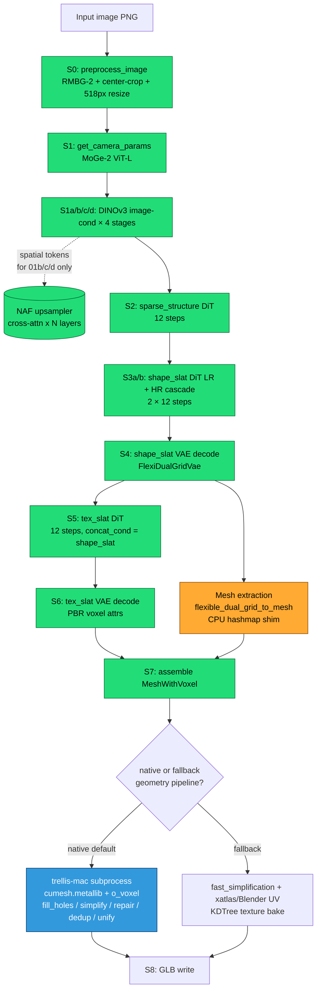
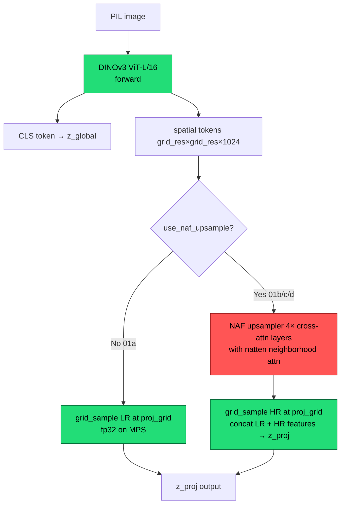
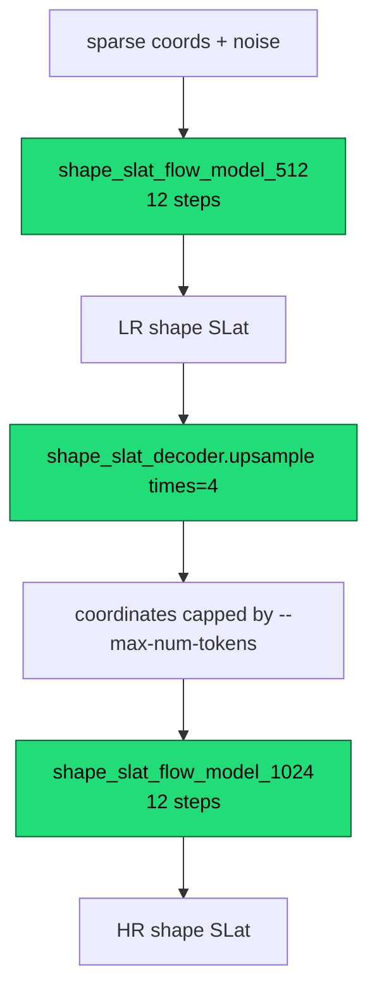

# Pixal3D Apple Silicon Pipeline — Atlas

**Last revised:** 2026-05-23 (Session 11 close)
**Purpose:** Ground-truth map of every stage, every model, every monkey-patch,
every device-routing decision, every known CUDA-vs-Mac divergence, and every
configuration knob. This is the *flat-file* reference we open before any
further investigation so we don't re-discover wires that were already
labelled.

**How to read this doc:**
- §1 is the bird's-eye flow diagram. Look here first.
- §2 lists every model loaded by the Mac pipeline.
- §3 walks every stage in order with per-stage sub-diagrams.
- §4 is the monkey-patch catalog (the section you'll re-read most).
- §5 is the device-routing matrix.
- §6 catalogues every CUDA-specific feature we lose on Mac and what — if
  anything — replaces it. **Read this with §7 (env vars) to know which knobs
  exist.**
- §7 is the exhaustive env-var registry.
- §8 is the canonical fixture-name reference.
- §9 documents exploration directions that haven't been built yet
  (ANE/CoreML, MPS-conv determinism). **Forward-looking.**
- §10 is the "things we already ruled out" log so we stop re-running them.

References below are absolute paths; line numbers as of `beef0ef` (master)
with Session 11 uncommitted changes on `feat/apple-silicon-port`.

Stage tags in this doc match the fixture names dumped by
`generate_mps.py:_install_pipeline_fixture_hooks` so cross-referencing
against captures in `/Users/pawelma/code/ai/fixtures/` is direct.

---

## §1 — Bird's-eye flow



Colour legend everywhere in this doc:
- **green** = runs on MPS by default
- **orange** = runs on CPU by default (or pinned via env var)
- **blue** = runs in a separate Python subprocess (the o_voxel native exporter)
- **grey dashed** = CUDA-only feature dropped on Mac

---

## §2 — Models registry

Every model loaded by the Mac pipeline. Source ID in monospace.

| Slot | Source | Stage(s) | Device default | Load timing |
|---|---|---|---|---|
| Pixal3D pipeline (8 submodels) | `TencentARC/Pixal3D` | S2–S6 | MPS | eager in `init_pipeline` |
| ↳ `sparse_structure_flow_model` | bf16 DiT | S2 | MPS | eager |
| ↳ `sparse_structure_decoder` | dense Conv3D | S2 | MPS | eager |
| ↳ `shape_slat_flow_model_512` | bf16 DiT | S3a / S3b LR | MPS | eager |
| ↳ `shape_slat_flow_model_1024` | bf16 DiT | S3b HR | MPS | eager |
| ↳ `shape_slat_decoder` | fp16 FlexiDualGridVae | S4 + mesh extract | MPS (or CPU via `PIXAL3D_CPU_MODELS`) | eager |
| ↳ `tex_slat_flow_model_1024` | bf16 DiT | S5 | MPS | eager |
| ↳ `tex_slat_decoder` | fp16 VAE | S6 | MPS (or CPU) | eager |
| ↳ (`tex_slat_flow_model_512` exists in spec but not used) | — | — | — | — |
| DINOv3 ViT-L/16 (×4 instances) | `camenduru/dinov3-vitl16-pretrain-lvd1689m` | S1a/b/c/d | MPS | eager |
| MoGe-2 ViT-L | `Ruicheng/moge-2-vitl` | S1 | MPS | lazy, freed after S1 |
| NAF upsampler | `valeoai/NAF` via `torch.hub.load` | S1b/c/d only | MPS (or CPU via `PIXAL3D_NAF_DEVICE`) | lazy on first `proj_grid` call |
| RMBG-2 / BiRefNet | `pixal3d.pipelines.rembg.*` | S0 | MPS | eager |
| natten-mps Metal kernels (opt-in) | `/Users/pawelma/code/ai/natten-mps/` | S1b/c/d NAF inner calls | MPS | on `PIXAL3D_NATTEN_MPS_ENABLE=1` |

Weight dtypes on disk are bf16 (DiTs) / fp16 (VAEs), but PyTorch upcasts to
fp32 at load on MPS. A global `.float()` cast triggered a Metal matmul
dtype mismatch — instead we have per-submodel toggles
(`PIXAL3D_FP32_MODELS`).

Two "native" tools used through subprocesses, not loaded as torch models:

| Tool | What | When |
|---|---|---|
| `o_voxel` native exporter | `trellis-mac/.venv` Python 3.11 with `cumesh.metallib` + `o_voxel` wheel | S8 native cleanup chain |
| Blender 4.x | UV unwrap via subprocess | S8 fallback path |

---

## §3 — Per-stage detail

### S0 — `00_preprocessed_image`

Background removal + center-crop + resize to ~518 px. `pipeline.preprocess_image()`
at `pixal3d/pipelines/pixal3d_image_to_3d.py:145-189`. Single forward through
RMBG-2.0 / BiRefNet, then PIL ops. Output is a configurable-background RGB PIL.

Runs on MPS. Toggled `.cpu()` if `low_vram=True` (Mac default).

### S1 — `01_camera_params` (MoGe-2)

```mermaid
flowchart LR
    A[preprocessed RGB] --> B[MoGe-2 ViT-L forward]
    B --> C[intrinsics]
    C --> D[distance_from_fov<br/>numpy CPU]
    D --> E[{camera_angle_x,<br/>distance,<br/>mesh_scale}]
    classDef mps fill:#2d7,stroke:#063,color:#000
    classDef cpu fill:#fa3,stroke:#840,color:#000
    class B mps
    class D cpu
```

`generate_mps.py:797 get_camera_params_wild_moge`. Bypassed when CLI
`--fov >0`. We used `--fov 0.6061` for all isolation experiments.

### S1a/b/c/d — DINOv3 image-cond × 4

This is where the work happens. Four separate `DinoV3ProjFeatureExtractor`
instances, each with different image_size / grid_resolution / NAF settings:

| Stage | image_size | grid_resolution | use_naf_upsample | naf_target_size | z_proj shape |
|---|---|---|---|---|---|
| 01a `ss` | 512 | 16 | **No** | — | `[B, 16³, 1024]` |
| 01b `shape_512` | 512 | 32 | Yes | 512 | `[B, 32³, 2048]` |
| 01c `shape_1024` | 1024 | 64 | Yes | 512 | `[B, 64³, 2048]` |
| 01d `tex_1024` | 1024 | 64 | Yes | 1024 | `[B, 64³, 2048]` |



**G is the red zone.** NAF's pre-attention Conv2d/Linear projections produce
Q/K that differ between MPS and CUDA by ~5e-3 max (Session 11), which after
softmax + AV gather inflates to 3e-2 in the cross-attention output. This is
the dominant source of the 2.4-2.8e-2 z_proj RED on 01b/c/d.

Code: `pixal3d/trainers/flow_matching/mixins/image_conditioned_proj.py`,
forward at line 484, `_load_naf()` at line 420, NAF forward branch
at 562-576.

### S2 — `02_sparse_structure`

```mermaid
flowchart LR
    A[noise '1, C_in, 32, 32, 32'] --> B[FlowEulerSampler over<br/>sparse_structure_flow_model<br/>12 steps]
    B --> C[sparse_structure_decoder]
    C --> D[sparse coords '[N, 4]' int<br/>N≈2.5k]
    classDef mps fill:#2d7,stroke:#063,color:#000
    class B,C mps
```

Code: `pixal3d_image_to_3d.py:302 sample_sparse_structure`. Per-step
fixtures `02_sparse_structure_stepNN` carry `pred_x_t, pred_x_0`. Sampler
patched (§4-C) to capture RNG state too.

### S3a / S3b — `03a_shape_slat` and `03b_shape_slat_cascade`



Code: `pixal3d_image_to_3d.py:351 sample_shape_slat`, line 391
`sample_shape_slat_cascade`, plus inlined cascade in `run()` lines 717-787.

The `03b_shape_slat_cascade` hook fires **twice** in a single `run()` —
once as the LR pass and once as the HR pass. The second invocation lands
in fixtures with a `_call1` suffix.

### S4 — `04_shape_slat_decoded`

`shape_slat_decoder` (`FlexiDualGridVaeDecoder`, `pixal3d/models/sc_vaes/fdg_vae.py`).
Produces a `List[Mesh]` *and* a `List[SparseTensor]` carrying FDG fields
(`fdg_coords / fdg_dual_vertices / fdg_intersected / fdg_split_weight`).

Inside the decoder, mesh extraction routes through
`pixal3d/utils/mesh_extract.py:flexible_dual_grid_to_mesh` — see §4-H for the
CPU hashmap shim that replaces the CUDA-only `o_voxel._C.hashmap_*_3d_cuda`.

### S5 — `05_tex_slat`


Code: `pixal3d_image_to_3d.py:511 sample_tex_slat`.

### S6 — `06_tex_slat_decoded`

`tex_slat_decoder` produces PBR voxel attributes. Channel layout (from
`o_voxel_native_export.py:20-25`):
- ch 0-2: `base_color`
- ch 3: `metallic`
- ch 4: `roughness`
- ch 5: `alpha`

Output mapped to `[0, 1]` via `* 0.5 + 0.5`.

### S7 — `07_run_output`

`MeshWithVoxel` assembled from shape mesh + tex voxel attributes
(`pixal3d_image_to_3d.py:587-606`). This is the checkpoint format we serialize
when `--save-mesh` is used; `--load-mesh` rewinds to here to skip S1–S6.

### S8 — Geometry cleanup + GLB write

Two paths — controlled by command-line `--no-texture`, `--force-texture-fallback`,
and whether `cumesh.metallib` is loadable:

**Native default** (`try_export_native_o_voxel_glb`, `generate_mps.py:1045`):


The whole chain runs in a separate Python 3.11 subprocess
(`trellis-mac/.venv/bin/python`) that owns the Apple-Silicon `cumesh.metallib`
+ `o_voxel` wheels. Communicates via `.npz` on disk. The parent MPS process
never sees these tensors.

Six of those nine kernels are monkey-patched inside the subprocess — see §4-H
for the table.

**Fallback** (`export_fallback_texture_glb`, `generate_mps.py:1132`): pure
PyTorch + trimesh. Used when the native subprocess fails or when
`--force-texture-fallback`. Chain: rotation → `fast_simplification` →
xatlas/Blender UV → KDTree texture bake → GLB.

---

## §4 — Monkey patches

Sorted by load order. Each entry: what's patched, why, where it lives, the
device implication.

### A. `natten.na2d` ⇒ in-tree pure-PyTorch `_torch_na2d`

- **Where:** `generate_mps.py:410-481`
- **Why:** natten 0.21's `cutlass-fna` backend is CUDA-only. `flex-fna`
  refuses MPS and materializes the full `[B, H, X, Y, K²]` scores tensor on
  CPU (~80 GB on shape-512), which crashes the MPS allocator.
- **Replacement:** Index-gather over the `K²` neighbor positions (with
  natten's shifted-window boundary rule) → tiled masked SDPA. Memory-tile
  controlled by `_NA2D_QUERY_CHUNK = 2048`.
- **Routing:** Stays on the caller's device (MPS). No CPU round-trip.
- **Status:** Default. Active unless §4-B preempts.

### B. `natten.na2d` ⇒ Metal kernels via `natten_mps` (optional)

- **Where:** `generate_mps.py:382-392` (env-gated)
- **Why:** Genuine Metal kernels — algorithm-correct vs cutlass-fna at
  ~1e-3 relative, validated end-to-end (see `natten-mps/tests/`).
- **Replacement:** `import natten_mps` triggers a shim that rebinds
  `natten.na2d` AND walks `sys.modules` to swap any module that already
  did `from natten import na2d`.
- **Routing:** MPS tensors → our Metal kernels; CPU/CUDA tensors → upstream
  natten unchanged.
- **Trigger:** `PIXAL3D_NATTEN_MPS_ENABLE=1`. Session 11 verified the
  kernel fires correctly; z_proj output is bit-equivalent to §4-A because
  the root cause is upstream of natten.

### C. `FlowEulerSampler.sample` (fixture capture)

- **Where:** `generate_mps.py:198-238`
- **Why:** Capture per-step `pred_x_t` / `pred_x_0` and RNG state for
  divergence hunting.
- **Replacement:** wraps original, snapshots `torch.get_rng_state()`,
  `cuda_all` state if available, `mps` state, calls original, dumps
  intermediates per step.
- **Trigger:** `PIXAL3D_DUMP_FIXTURES=<dir>`.

### D. Pipeline stage `setattr` wrappers

- **Where:** `generate_mps.py:105-122`
- **Why:** Same as C, at coarser granularity. Wraps `sample_sparse_structure`,
  `sample_shape_slat`, `sample_shape_slat_cascade`, `decode_shape_slat`,
  `sample_tex_slat`, `decode_tex_slat`.

### E. DINOv3 forward hooks

- **Where:** `generate_mps.py:139-162`
- **Why:** Capture `(z_global, z_proj)` from each of the 4 DinoV3 extractors.
- **Replacement:** `register_forward_hook` per model, dumps to
  `01a/b/c/d_image_cond_*`.

### F. `PIXAL3D_CPU_MODELS` model relocator

- **Where:** `generate_mps.py:629-771`
- **Why:** Some VAE decoders are suspected of having MPS bugs (was a
  hypothesis for tex_slat channel 3/4 RED that turned out to be upstream).
- **Replacement:** For each named submodel: walks params/buffers in place
  to CPU, drains `obj._spatial_cache` so SparseTensor neighbor tables
  rebuild on CPU, then replaces `sub.forward` with a closure that
  re-forces CPU each call, ferries args/SparseTensor in (recursively,
  including `.data['feats']` and `coords`), runs orig_forward, ferries
  output back to MPS.
- **Routing:** Submodel runs on CPU; rest of pipeline stays on MPS.
- **Trigger:** `PIXAL3D_CPU_MODELS=<csv>`.

### G. `PIXAL3D_FP32_MODELS` upcast

- **Where:** `generate_mps.py:549-627`
- **Why:** Some VAE forward paths re-downcast via internal
  `h.type(self.dtype)` calls even after we `.float()` the module.
- **Replacement:** For each named submodel: `.float()`, set
  `convert_to_fp32() / .dtype = fp32 / .use_fp16 = False`. Also wraps
  the pipeline call site (`decode_tex_slat`, `decode_shape_slat`) to
  recursively cast `SparseTensor.data['feats']` to fp32 on entry.
- **Status:** Proved a no-op in Session 10 — params were already fp32, only
  `self.dtype` flip mattered. Retained for diagnostic flexibility.

### H. `o_voxel.postprocess` patches (executed in trellis-mac subprocess)

These live in `pixal3d/utils/o_voxel_native_export.py` and run inside the
S8 native subprocess. Six kernels patched:

| Patch | Original | Replacement | Trigger / opt-out |
|---|---|---|---|
| `_patch_grid_sample_output` (line 870-875) | CUDA-specialized `_grid_sample_3d` | Portable dense-volume + `F.grid_sample` | Auto: when `_HAS_FLEX_GEMM=False` |
| `_patch_repair_non_manifold_edges` (307) | Metal `repair_nme` (over-splits) | `pixal3d/utils/cumesh_port/repair.py` (CPU port) | Default on; `PIXAL3D_REPAIR_NME=metal` to skip |
| `_patch_remove_small_connected_components` (392) | Metal small_cc (over-culls) | Either no-op or numeric threshold override | Off unless `PIXAL3D_SMALL_CC=noop\|<float>` |
| `_patch_simplify` (665) | cumesh's PAMO QEM (Metal) | `pixal3d/utils/pamo_simplify.py` (CPU port) | Default `pamo`; opt back via `PIXAL3D_SIMPLIFY=metal` |
| `_patch_fill_holes` (564) | Metal fill_holes (perimeter 3e-2 default) | Same Metal kernel, custom perimeter | Off unless `PIXAL3D_FILL_HOLES_PERIMETER=<float>` |
| `_patch_unify_face_orientations` (490) | Buggy Metal unify_face_orientations | CPU re-implementation | Default on; `PIXAL3D_UNIFY_FACE_ORIENTATIONS=metal` to skip |

Session-7 history: the Metal kernels were initially distrusted wholesale
(over-culling, over-splitting), but a `simplify` audit found the Metal port
faithful and 50% faster. We re-enabled it as an opt-in. Other Metal kernels
remain replaced.

### I. `flex_gemm.ops.spconv.submanifold_conv3d.SubMConv3dNeighborCache` stub

- **Where:** `generate_mps.py:1574-1590`
- **Why:** Some pickled fixtures (saved on CUDA) reference the CUDA-only
  neighbor cache class. `torch.load(weights_only=False)` needs *some* class
  to deserialize against.
- **Replacement:** Pure-Python `ModuleType` + dataclass stub registered in
  `sys.modules`.

### J. SDPA kernel context

- **Where:** `generate_mps.py:1770-1786`
- **Why:** Diagnostic. Wraps `pipeline.run()` in
  `torch.nn.attention.sdpa_kernel([math|efficient|flash])`.
- **Trigger:** `PIXAL3D_SDPA_BACKEND=math|efficient|flash`.
- **Status:** Per Session-N analysis, all three SDPA backends produce
  identical output on MPS torch 2.12 (the MPS backend ignores the
  selector). Retained for future-proofing.

### K. FDG mesh extractor — `o_voxel._C.hashmap_*_3d_cuda` stub

- **Where:** `pixal3d/utils/mesh_extract.py:38, 55` (Session 8 vendoring)
- **Why:** o_voxel's hashmap is CUDA-only.
- **Replacement:** Plain Python `dict` mimicking the upstream contract.
  `coords.detach().cpu().long().contiguous().tolist()` for keys, outputs
  ferried back with `.to(device=device)`.
- **Routing:** CPU for the hashmap step itself; result lands back on MPS.

---

## §5 — Device routing matrix

| Op / submodel | Default device | Can pin to CPU? | Notes |
|---|---|---|---|
| RMBG-2 / BiRefNet | MPS | implicit via `low_vram` | always cycled MPS↔CPU on entry/exit |
| MoGe-2 | MPS | no env knob | freed after S1 |
| DINOv3 (all 4) | MPS | no env knob | identity weights, drift small |
| **NAF upsampler** | MPS | `PIXAL3D_NAF_DEVICE=cpu` | known source of drift (§6) |
| **HR proj_grid** | MPS | `PIXAL3D_PROJ_GRID_DEVICE=cpu` | exonerated by Session-10 Exp 5 |
| natten attention inside NAF | MPS via `_torch_na2d` or natten-mps | follows NAF device | §4-A or §4-B |
| sparse_structure_flow_model | MPS | no env knob | |
| sparse_structure_decoder | MPS | no env knob | |
| shape_slat_flow_model_512 | MPS | no env knob | |
| shape_slat_flow_model_1024 | MPS | no env knob | |
| shape_slat_decoder | MPS | `PIXAL3D_CPU_MODELS=shape_slat_decoder` | per Session-N: deterministic |
| tex_slat_flow_model_1024 | MPS | no env knob | |
| tex_slat_decoder | MPS | `PIXAL3D_CPU_MODELS=tex_slat_decoder` | per Session-N: deterministic |
| FDG mesh extract (hashmap) | CPU | always — hard-coded | `cpu().long().tolist()` |
| Sparse 3D conv (when `flex_gemm` absent) | MPS for kernel, CPU for neighbor build | hard-coded | `conv_none.py:54` |
| o_voxel native exporter | trellis-mac subprocess (CPU + Apple Metal) | hard-coded | separate Python 3.11 venv |

Pipeline base device: `resolve_device("mps")` (`generate_mps.py:484`). Set
once at startup, propagated to everything below.

`low_vram=True` is the config default — every model is `.to(self.device)`
on entry and `.cpu()` on exit. So even the "MPS" submodels above shuttle
through CPU twice per pipeline run.

---

## §6 — CUDA divergence catalog

Every CUDA-specific feature we lose on Apple Silicon, and our current posture
toward it. Read this with §9 to see which postures might change.

| CUDA feature | What it provides | Mac substitute | Status / divergence |
|---|---|---|---|
| `flash_attn` 2/3/4 | Fused exact-attention with online softmax | `sdpa` via PyTorch's MATH backend | Replaced. MPS SDPA is at fp32 floor (~1e-6 vs fp64 truth). `metal-flash-attention` evaluated and retired (Session 7). |
| TF32 matmul on Ada/Hopper | 10-bit-mantissa matmul, default for fp32 on recent NVIDIA | Full fp32 on Mac | **Accepted drift.** Apple has no TF32. Dominant source of Metal-vs-CUDA kernel-level drift in natten-mps (~1e-3 rel). Cannot eliminate. |
| cuDNN reduction order | Vendor-tuned algorithm + reduction strategy per shape | MPSGraph reduction (vendor-tuned but different) | **Accepted drift.** Pervasive ~1e-3 fp32 drift in matmul / conv / LayerNorm. Identified Session 11 as the root cause of z_proj 2.5e-2 RED via NAF's pre-attention Conv/Linear projections. **Candidate for ANE/CoreML rerouting (§9-A).** |
| TensorCore fp16 / bf16 + fp32 accumulator | High-throughput mixed precision | MPSGraph fp16/bf16 (similar shape) | Replaced. Drift consistent with TF32 case above. |
| `cutlass-fna` / `hopper-fna` / `blackwell-fna` | Fused neighborhood attention on tensor cores | `_torch_na2d` index-gather (§4-A) OR `natten_mps` Metal kernels (§4-B) | Replaced. Kernel correctness validated. Not the bottleneck. |
| `flex_gemm` (Pixal3D's sparse 3D submanifold conv) | Specialized CUDA sparse conv | `pixal3d/modules/sparse/conv/conv_none.py` (CPU + MPS, slow neighbor build on CPU) | Replaced. Speed worse, correctness unaffected. |
| `o_voxel._C.hashmap_*_3d_cuda` | Spatial hash for FDG mesh extraction | Python dict shim in `mesh_extract.py` | Replaced. Session 8 vendoring is bit-identical on stored FDG checkpoint. |
| `Mesh.fill_holes()` (CUDA-only) | In-pipeline hole filling | Gated by `device.type == 'cuda'` (skipped on MPS) | Skipped in-pipeline. Picked up by Pedro's mtlmesh fill_holes inside the S8 native subprocess. |
| `o_voxel.postprocess._grid_sample_3d` (CUDA-specialised) | 3D bilinear sampling on grid | Dense volume + `F.grid_sample` (§4-H) | Replaced. Correctness OK; some perf cost. |
| `cumesh` PAMO QEM Metal port | Mesh decimation | `pamo_simplify.py` (CPU port) OR Metal Q-EM (now trusted) | Both available. Default `pamo` for safety. |
| `cumesh.repair_non_manifold_edges` Metal | NME repair | `repair.py` (CPU port) | Default CPU. Metal opt-in via env var. |
| `cumesh.unify_face_orientations` Metal | Face winding repair | CPU re-impl | Default CPU. Metal buggy. |
| `cumesh.remove_small_connected_components` Metal | Tiny island culling | Optional no-op or numeric override | Off unless explicitly enabled. |

Drift roll-up (current best understanding):

| Source | Magnitude | Sessions confirming |
|---|---|---|
| TF32 vs fp32 in matmul layers | ~1e-3 rel | 11 (CUDA golden test) |
| cuDNN-vs-MPS conv/linear reduction order in NAF pre-attention | ~5e-3 max abs on Q/K | 11 (input capture diff) |
| MPS SDPA precision floor | ~1e-6 abs | 7 |
| Sampler accumulated drift over 12 DiT steps | grows from `pred_x_t` ~1e-3 → ~1e-1 by step 11 | 9, 10 |

---

## §7 — Env-var registry

### Pixal3D-namespaced

| Var | Type | Read at | Effect |
|---|---|---|---|
| `PIXAL3D_DUMP_FIXTURES` | path | `generate_mps.py:29` | Enable fixture capture |
| `PIXAL3D_STOP_AFTER` | string | `generate_mps.py:84` | Clean process exit after fixture name |
| `PIXAL3D_NATTEN_MPS_ENABLE` | `0/1` | `generate_mps.py:382` | Use natten-mps Metal kernels |
| `PIXAL3D_NAF_DEVICE` | `cpu/mps/cuda` | `image_conditioned_proj.py:432` | Pin NAF device |
| `PIXAL3D_PROJ_GRID_DEVICE` | `cpu/mps` | `image_conditioned_proj.py:582` | Pin HR proj_grid device |
| `PIXAL3D_FP32_MODELS` | csv | `generate_mps.py:549` | Upcast named submodels |
| `PIXAL3D_CPU_MODELS` | csv | `generate_mps.py:639` | Pin named submodels to CPU |
| `PIXAL3D_PRECLEAN_NME` | `0/1/true/yes` | `generate_mps.py:1834` | Run CPU NME repair before native export |
| `PIXAL3D_KEEP_NATIVE_O_VOXEL_INPUT` | `0/1` | `generate_mps.py:1125` | Keep .npz handed to native subprocess |
| `PIXAL3D_SDPA_BACKEND` | `math/efficient/flash` | `generate_mps.py:1770` | SDPA selector context |
| `PIXAL3D_FDG_CAP_PARTIAL_QUADS` | `0/1` | `generate_mps.py:1022` | **INERT** (Session 8 vendoring obsoleted) |
| `PIXAL3D_FDG_VERBOSE` | `0/1` | `mesh_extract.py:133,181` | Per-call stats from FDG extractor |
| `PIXAL3D_REPAIR_NME` | `metal` | `o_voxel_native_export.py:307` | Skip CPU port, use Metal repair |
| `PIXAL3D_REPAIR_VERBOSE` | `0/1` | line 337 | CPU repair verbose |
| `PIXAL3D_SMALL_CC` | `noop\|<float>` | line 392 | small_cc override |
| `PIXAL3D_UNIFY_FACE_ORIENTATIONS` | `metal` | line 490 | Skip CPU port |
| `PIXAL3D_UNIFY_VERBOSE` | `0/1` | line 516 | unify_face_orientations verbose |
| `PIXAL3D_FILL_HOLES_PERIMETER` | float | line 564 | fill_holes threshold override |
| `PIXAL3D_SIMPLIFY` | `pamo/metal` | line 665 | simplify backend selector |

### Backend selectors (read by pixal3d itself)

| Var | Default on Mac | Effect |
|---|---|---|
| `ATTN_BACKEND` | `sdpa` | Full-attention backend |
| `SPARSE_ATTN_BACKEND` | `sdpa` | Sparse-attention backend; falls back to `ATTN_BACKEND` |
| `SPARSE_CONV_BACKEND` | `none` (auto if `flex_gemm` import fails) | Sparse conv backend |

### Auxiliary

| Var | Value | Why |
|---|---|---|
| `PYTORCH_ENABLE_MPS_FALLBACK` | `1` | Allow MPS ops with missing kernels to silently fall back to CPU |
| `OPENCV_IO_ENABLE_OPENEXR` | `1` | EXR I/O for camera dumps |
| `FLEX_GEMM_AUTOTUNE_CACHE_PATH` | path | Set even though flex_gemm absent (harmless) |
| `FLEX_GEMM_AUTOTUNER_VERBOSE` | `1` | Same |
| `TMPDIR` | path | Set inside native o_voxel subprocess only |

### natten-mps (out-of-tree, surfaces in Pixal3D logs)

| Var | Effect |
|---|---|
| `NATTEN_MPS_NO_AUTOINSTALL` | Disable shim auto-install on import |
| `NATTEN_MPS_DISABLE` | Runtime disable (CPU/CUDA passthrough only) |
| `NATTEN_MPS_VERBOSE` | Print dispatch counts |
| `NATTEN_MPS_CAPTURE_FIRST` | Path to dir; dump first call's (q, k, v, attn_scores, attn, out) |

---

## §8 — Fixture names

Canonical fixture names dumped by `_install_pipeline_fixture_hooks` and the
top-level `_dump_fixture` calls. Tag → file → contents.

| Tag | Contents |
|---|---|
| `00_metadata.json` | image_path, sha256, seed, args, torch ver, device, env subset |
| `00_preprocessed_image.pt` | `{mode, size, pixels HxWx3 uint8}` |
| `01_camera_params.pt` | `{camera_angle_x, distance, mesh_scale}` |
| `01a_image_cond_ss.pt` | `{z_global [B, 5, 1024], z_proj [B, 16³, 1024]}` |
| `01b_image_cond_shape_512.pt` | `{z_global, z_proj [B, 32³, 2048]}` |
| `01c_image_cond_shape_1024.pt` | `{z_global, z_proj [B, 64³, 2048]}` |
| `01d_image_cond_tex_1024.pt` | `{z_global, z_proj [B, 64³, 2048]}` |
| `02_sparse_structure.pt` | sparse coords output `[N, 4]` int |
| `02_sparse_structure_stepNN.pt` | `{pred_x_t, pred_x_0}` per step (NN=00..11) |
| `02_sparse_structure_rng_state.pt` | `{cpu, mps, cuda_all (if present)}` |
| `03a_shape_slat.pt` | LR shape SLat SparseTensor as dict |
| `03a_shape_slat_stepNN.pt` | per-step pred_x_t / pred_x_0 |
| `03a_shape_slat_rng_state.pt` | RNG snapshot |
| `03b_shape_slat_cascade.pt` | HR shape SLat |
| `03b_shape_slat_cascade_stepNN.pt` | per-step |
| `03b_shape_slat_cascade_call1*.pt` | (second invocation suffix) |
| `04_shape_slat_decoded.pt` | `List[Mesh]` + `List[SparseTensor]` (FDG fields) |
| `05_tex_slat.pt` | tex SLat |
| `05_tex_slat_stepNN.pt` | per-step |
| `06_tex_slat_decoded.pt` | PBR voxel attrs |
| `07_run_output.pt` | full MeshWithVoxel checkpoint |

natten-specific (when `NATTEN_MPS_CAPTURE_FIRST` or rental capture wrapper):

| Tag | Contents |
|---|---|
| `natten_mps_call0.pt` (Mac) | `{q, k, v, attn_scores, attn, out, kernel_size, dilation, scale, shapes_str}` |
| `natten_qk_call0.pt` (CUDA) | `{q, k, out, kernel_size, dilation, shapes_str}` |
| `natten_av_call0.pt` (CUDA) | `{attn, v, out, kernel_size, dilation, shapes_str}` |

Capture directories under `/Users/pawelma/code/ai/fixtures/`:

| Dir | What it is |
|---|---|
| `fixtures_cuda/` | Reference CUDA full-run capture |
| `mps_fdg/` + `.glb` | Mac baseline |
| `mps_isolate_naf_cpu/` | Session 10 Exp 3 — NAF pinned to CPU |
| `mps_isolate_proj_grid_cpu/` | Session 10 Exp 5 — NAF=CPU + HR proj_grid=CPU |
| `mps_natten_mps_naf/` | Session 11 Exp 6 — natten-mps active |
| `mps_natten_mps_diag/` | Session 11 instrumentation-only diag (stop after 01b) |
| `mps_natten_inputs/` | Session 11 Exp 7 — first natten call's IO for diff |
| `sieve_test_stage08/` | Session 7 cleanup-only replay |
| `natten-fixture.tar` | Rental capture archive |

---

## §9 — Exploration directions (forward-looking)

These are NOT implemented. Captured here as candidate plays to ground future
work.

### §9-A — ANE / CoreML for NAF's pre-attention conv & linear layers

**Rationale.** Session 11 nailed the z_proj RED to ~5e-3 max-abs drift in
NAF's Q/K projection layers, all of which are Conv2d/Linear with fixed
static shapes. That's exactly the workload Apple Neural Engine was designed
for. **MPSGraph's reduction order differs from cuDNN's; ANE's matrix
engines may align more closely with NVIDIA tensor cores**, since both are
specialized matmul hardware with their own determinism contracts.

**Open questions before commitment:**
1. **Precision.** ANE runs fp16 with fp32 accumulators (in most matmul
   paths). cuDNN runs full fp32 (when TF32 disabled) or TF32 (default
   on Ada+). The drift profile from ANE-fp16 won't be identical to
   cuDNN-fp32 — but it might be closer to TF32 than MPSGraph-fp32 is.
2. **Conversion cost.** torch → CoreML conversion needs `coremltools`.
   Some torch ops (e.g. certain SDPA variants) have no direct CoreML
   equivalent. Need to inventory NAF's exact layer set.
3. **Compile time.** First inference triggers a CoreML compile that
   can take seconds. Acceptable for our case (long-running inference)
   but not for tight loops.
4. **Determinism cross-runs.** ANE's scheduler is opaque; same input
   may produce slightly different output across compile epochs.
   Could be a feature (more "averaged" output) or bug.

**Suggested approach:**
- Build a side `.venv-ane-probe/` and write a small repro that loads
  NAF's first Q/K projection layer in isolation, runs it through:
  (a) torch MPS, (b) torch CPU, (c) CoreML/ANE via `coremltools`.
- Capture inputs from a known Mac inference run, run all three, diff
  against the CUDA golden.
- If ANE drift < MPS drift vs CUDA → pursue full NAF wrapping.

**Lift estimate:** 1-2 days for the probe; multi-day if we wrap NAF
end-to-end.

### §9-B — `torch.use_deterministic_algorithms(True)` + MPS tile-size hints

MPS lets us set `MPS_PREFER_DETERMINISTIC=1` (undocumented; varies by
torch version) and certain matmul tile-size hints. Worth a small
experiment to see if any of those bring MPS conv reduction order
closer to cuDNN's default.

**Lift estimate:** half-day. Low confidence of meaningful change.

### §9-C — Per-layer drift fingerprinting in NAF

Walk NAF's forward pass with `register_forward_hook` on every layer,
capture each layer's output on Mac and CUDA, compute per-layer drift.
The biggest jump in cumulative drift identifies the worst-offending
layer — which may suggest a single targeted fix (CPU pin, ANE wrap,
fp64 wrap, etc.) rather than a wholesale architectural change.

**Lift estimate:** 1 day for instrumentation + rental cycle + analysis.

### §9-D — v0.2 fused `na2d_fused.metal` (natten-mps)

Flash-style online softmax. Matches modern natten 0.21 `na2d` semantics
exactly — no materialized `[B, H, X, Y, K²]` attention tensor (memory
cost in v0.1 split path). Also fixes the
`backend="cutlass-fna"` hard-fail in NAF for any Mac-deployed model.

**Lift estimate:** 1.5 days. Not on the critical path for z_proj
since the bottleneck is upstream.

### §9-E — Visible-quality regression test as ship gate

The numerical floor on Mac may be ~2.5e-2 z_proj RED forever. The
operational question is whether the resulting mesh is **visibly worse**
than CUDA's output. Build a side-by-side render harness:

1. Run Mac pipeline → GLB → render N viewpoints → write PNGs.
2. Run CUDA pipeline (rental) → same.
3. Diff via SSIM / LPIPS / pixel-RMSE.

If SSIM > 0.95 across all viewpoints → ship. If not, prioritise §9-A/C.

**Lift estimate:** half-day local + rental cycle.

---

## §10 — Ruled out (don't re-run)

Things we've already proven are NOT the cause of z_proj RED:

- ❌ MPS `F.grid_sample` HR (Session 10 Exp 5; pinning to CPU shaves
  <2% off the residual).
- ❌ MPS `F.grid_sample` LR (implicit; identical behaviour at lower
  resolution).
- ❌ natten flex-fna vs cutlass-fna algorithmic gap (Session 11; our
  Metal port matches cutlass-fna at 1e-3 relative; z_proj unchanged).
- ❌ tex_slat_decoder MPS bug (Session N; VAEs verified deterministic;
  CPU run gives same output as MPS run when fed same input).
- ❌ shape_slat_decoder MPS bug (same).
- ❌ Global fp32 upcast of model weights (Session N; PIXAL3D_FP32_MODELS
  proved a no-op because params already at fp32).
- ❌ MPS-vs-CPU SDPA backend selection (Session N; MPS SDPA selector
  is a no-op in torch 2.12).
- ❌ MLX-native port (retired; visibly worse output than MPS).
- ❌ metal-flash-attention by philipturner (retired Session 7; MPS
  SDPA already at fp32 floor).
- ❌ FDG mesh extractor (Session 8 vendoring is bit-identical to CUDA
  on stored FDG checkpoint).
- ❌ Sieve / cleanup floor (Session 7; replay with `--load-fixture-07`
  produces same diff regardless of cleanup pipeline tuning).
- ❌ Metal `repair_nme` / `small_cc` / `unify_face_orientations` over-
  doing work (Session 7; CPU ports installed).
- ❌ DINOv3 [CLS] token MPS drift (z_global matches GREEN at 1e-5
  across all 4 stages).

Things we currently believe ARE the cause:

- ✅ cuDNN-vs-MPS conv/linear reduction-order drift inside NAF's
  pre-attention projection layers (Session 11 capture-and-diff
  confirms Mac Q/K inputs to natten differ by 5e-3 max-abs from CUDA,
  V essentially identical).
- ✅ Downstream amplification through softmax + AV gather (Session 11;
  5e-3 input drift → 3e-2 output drift, matches observed z_proj RED).
- ✅ Further amplification through 12 DiT sampler steps + 4 sequential
  samplers (Session 9, 10 per-step diffs growing monotonically).

---

## Appendix — Quick reference cards

### Re-run isolation experiment with natten-mps

```bash
PIXAL3D_NATTEN_MPS_ENABLE=1 \
NATTEN_MPS_VERBOSE=1 \
PIXAL3D_DUMP_FIXTURES=/path/to/dir \
PIXAL3D_STOP_AFTER=01d_image_cond_tex_1024 \
python generate_mps.py assets/images/1_img.png \
  --seed 42 --fov 0.6061 --output /tmp/throwaway.glb
```

### Capture natten inputs for cross-platform diff

```bash
PIXAL3D_NATTEN_MPS_ENABLE=1 \
NATTEN_MPS_CAPTURE_FIRST=/path/to/dir \
PIXAL3D_STOP_AFTER=01b_image_cond_shape_512 \
python generate_mps.py assets/images/1_img.png ...
```

### Diff Mac fixtures vs CUDA reference

```bash
python /Users/pawelma/code/ai/Pixal3D_fresh/scripts/diff_fixtures.py \
  /Users/pawelma/code/ai/fixtures/fixtures_cuda/fixtures_cuda \
  /Users/pawelma/code/ai/fixtures/<run_dir>
```

### Trigger probe-only CUDA capture on rental

```bash
# On rental (after `git pull` on Pixal3D_fresh feature/pixal-fixtures)
./scripts/run_cuda_capture.sh --probe-only \
  --image <path> --output <out.glb> --fixtures <dir>
```

Yields paired `natten_qk_call0.pt` + `natten_av_call0.pt` (~3.2 GB total),
sufficient for natten-mps CUDA golden parity + cross-platform input diff.
