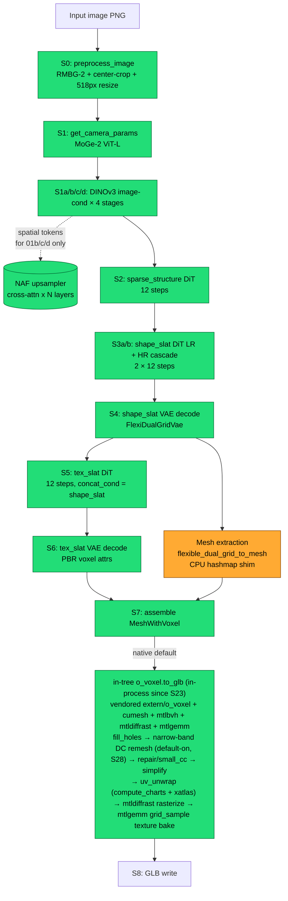
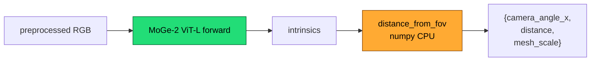
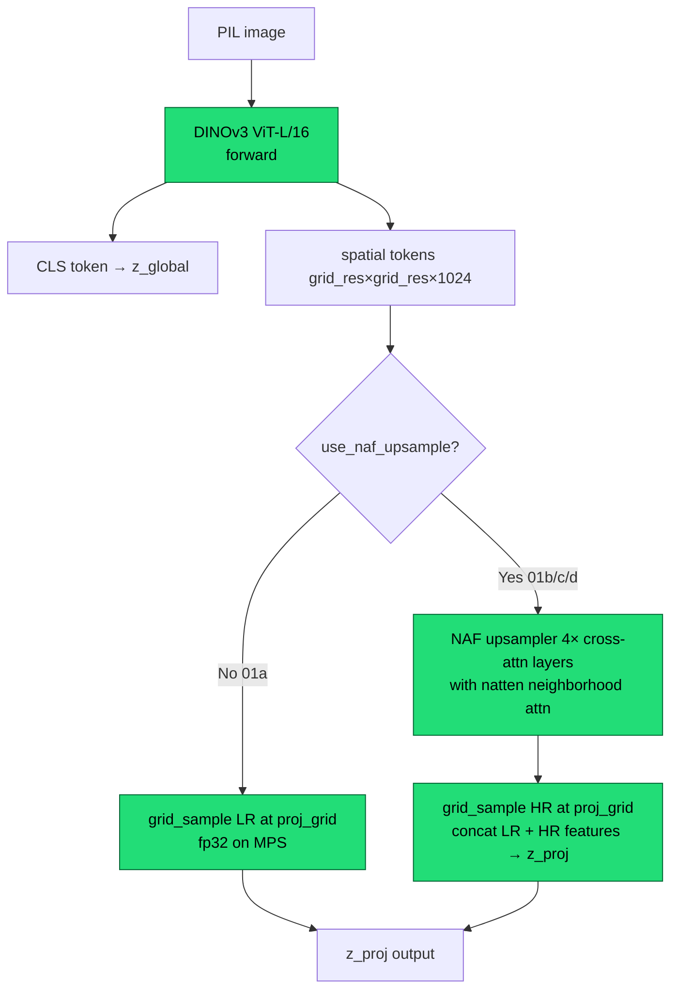
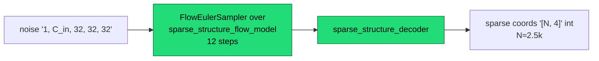
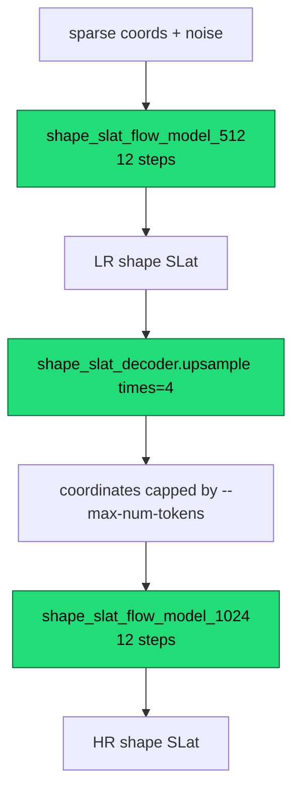

# Pixal3D Apple Silicon Pipeline — Atlas

**Last revised:** 2026-05-30 (Apple Silicon port release)
**Purpose:** Ground-truth map of every stage, every model, every monkey-patch,
every device-routing decision, every known CUDA-vs-Mac divergence, and every
configuration knob. This is the *flat-file* reference I opened before further investigation.

**How to read this doc:**
- §1 is the bird's-eye flow diagram. Look here first.
- §2 lists every model loaded by the Mac pipeline.
- §3 walks every stage in order with per-stage sub-diagrams.
- §4 is the monkey-patch catalog (the section you'll re-read most).
- §5 is the device-routing matrix.
- §6 catalogues every CUDA-specific feature we lose on Mac and what — if
  anything — replaces it. **Read this with §7 (env vars) to know which knobs
  exist.**
- §7 is the exhaustive env-var registry.
- §8 is the canonical fixture-name reference.

Stage tags in this doc match the fixture names dumped by
`generate_mps.py:_install_pipeline_fixture_hooks` so cross-referencing
against captures in `fixtures/` is direct.

---

## §1 — Bird's-eye flow

Colour legend everywhere in this doc:
- **green** = runs on MPS by default
- **orange** = runs on CPU by default (or pinned via env var)

---

## §2 — Models registry

Every model loaded by the Mac pipeline. Source ID in monospace.

| Slot | Source | Stage(s) | Device default | Load timing |
|---|---|---|---|---|
| Pixal3D pipeline (8 submodels) | `TencentARC/Pixal3D` | S2–S6 | MPS | eager in `init_pipeline` |
| ↳ `sparse_structure_flow_model` | bf16 DiT | S2 | MPS | eager |
| ↳ `sparse_structure_decoder` | dense Conv3D | S2 | MPS | eager |
| ↳ `shape_slat_flow_model_512` | bf16 DiT | S3a / S3b LR | MPS | eager |
| ↳ `shape_slat_flow_model_1024` | bf16 DiT | S3b HR | MPS | eager |
| ↳ `shape_slat_decoder` | fp16 FlexiDualGridVae | S4 + mesh extract | MPS (or CPU via `PIXAL3D_CPU_MODELS`) | eager |
| ↳ `tex_slat_flow_model_1024` | bf16 DiT | S5 | MPS | eager |
| ↳ `tex_slat_decoder` | fp16 VAE | S6 | MPS (or CPU) | eager |
| ↳ (`tex_slat_flow_model_512` exists in spec but not used) | — | — | — | — |
| DINOv3 ViT-L/16 (×4 instances) | `camenduru/dinov3-vitl16-pretrain-lvd1689m` | S1a/b/c/d | MPS | eager |
| MoGe-2 ViT-L | `Ruicheng/moge-2-vitl` | S1 | MPS | lazy, freed after S1 |
| NAF upsampler | `valeoai/NAF` via `torch.hub.load` | S1b/c/d only | MPS (or CPU via `PIXAL3D_NAF_DEVICE`) | lazy on first `proj_grid` call |
| RMBG-2 / BiRefNet | `pixal3d.pipelines.rembg.*` | S0 | MPS | eager |
| natten-mps Metal kernels | `pawel-mazurkiewicz/natten-mps` | S1b/c/d NAF inner calls | MPS | on `PIXAL3D_NATTEN_MPS_ENABLE=1` |

Weight dtypes on disk are bf16 (DiTs) / fp16 (VAEs), but PyTorch upcasts to
fp32 at load on MPS. A global `.float()` cast triggered a Metal matmul
dtype mismatch — instead we have per-submodel toggles
(`PIXAL3D_FP32_MODELS`).

---

## §3 — Per-stage detail

### S0 — `00_preprocessed_image`

Background removal + center-crop + resize to ~518 px. `pipeline.preprocess_image()`
at `pixal3d/pipelines/pixal3d_image_to_3d.py:145-189`. Single forward through
RMBG-2.0 / BiRefNet, then PIL ops. Output is a configurable-background RGB PIL.

Runs on MPS. Toggled `.cpu()` if `low_vram=True` (Mac default).

### S1 — `01_camera_params` (MoGe-2)

`generate_mps.py:797 get_camera_params_wild_moge`. Bypassed when CLI
`--fov >0`. We used `--fov 0.6061` for all isolation experiments.

### S1a/b/c/d — DINOv3 image-cond × 4

This is where the work happens. Four separate `DinoV3ProjFeatureExtractor`
instances, each with different image_size / grid_resolution / NAF settings:

| Stage | image_size | grid_resolution | use_naf_upsample | naf_target_size | z_proj shape |
|---|---|---|---|---|---|
| 01a `ss` | 512 | 16 | **No** | — | `[B, 16³, 1024]` |
| 01b `shape_512` | 512 | 32 | Yes | 512 | `[B, 32³, 2048]` |
| 01c `shape_1024` | 1024 | 64 | Yes | 512 | `[B, 64³, 2048]` |
| 01d `tex_1024` | 1024 | 64 | Yes | 1024 | `[B, 64³, 2048]` |

Session 11 proved natten itself is not the cause:
Q/K already differ before the attention kernel. Session 12 then traced NAF
internals and refined the culprit to the NAF image encoder:
`encoder` / `sem_encoder` Conv2d + GroupNorm + SiLU blocks, with the
semantic 3×3 branch (`sem_encoder.1.conv1/conv2`) showing the largest early
jump. There are no explicit `q_proj/k_proj/v_proj` Linear layers in this NAF
variant; Q and K are reshaped/pooled image-encoder outputs, and V is resized
DINO features. V remains GREEN (~1e-5), while Q/K drift is amplified by
softmax + AV gather into ~2e-2 NAF output drift and 2.4-2.8e-2 z_proj RED.

Session 12/13 `01b` trace, CUDA vs MPS. **Bold** rows are Session 13
full-tensor captures (33.5M elements); others are 8192-sample max:

| Boundary | max_abs |
|---|---:|
| image input / first branch inputs | 0 |
| **`encoder.1.conv1`** (full) | **9.02e-4** YELLOW |
| **`encoder.1.conv2`** (full) | **2.34e-3** |
| `encoder.2.conv2` / `encoder.output` | 2.40e-3 |
| **`sem_encoder.1.conv1`** (full) | **6.56e-3** |
| **`sem_encoder.1.conv2`** (full) | **1.16e-2** |
| `sem_encoder.2.norm1` | 7.41e-3 |
| `sem_encoder.2.conv2` / `sem_encoder.output` | 2.11e-3 |
| post-concat / pool / RoPE input | 2.40e-3 |
| `q_raw` | 2.29e-3 |
| `k_raw` | 1.11e-3 |
| `v_raw` | 1.14e-5 |
| NAF upsampler output | 2.20e-2 |
| final `01b z_proj` | 2.77e-2 |

Full-tensor max-abs is consistently 1.8–2.5× the sampled max-abs because
the worst-case pixels live in the tails the 8192 deterministic sample
missed. Qualitative offender ordering is unchanged.

Code: `pixal3d/trainers/flow_matching/mixins/image_conditioned_proj.py`,
forward at line 484, `_load_naf()` at line 420, NAF forward branch
at 562-576.

### S2 — `02_sparse_structure`

Code: `pixal3d_image_to_3d.py:302 sample_sparse_structure`. Per-step
fixtures `02_sparse_structure_stepNN` carry `pred_x_t, pred_x_0`. Sampler
patched (§4-C) to capture RNG state too.

### S3a / S3b — `03a_shape_slat` and `03b_shape_slat_cascade`

Code: `pixal3d_image_to_3d.py:351 sample_shape_slat`, line 391
`sample_shape_slat_cascade`, plus inlined cascade in `run()` lines 717-787.

**S24: `--max-num-tokens` is a no-op at 1024.** The cap is gated `if num_tokens <
max_num_tokens or hr_resolution == 1024:` (lines 455, 731) — the `or hr_resolution
== 1024` always short-circuits at Mac's locked 1024_cascade, so the cap never binds.
Final voxel count (e.g. robocrab 6.32M) is set by the FDG cascade decode, not the
token cap; there is no knob to shrink the decoded field at 1024.

The `03b_shape_slat_cascade` hook fires **twice** in a single `run()` —
once as the LR pass and once as the HR pass. The second invocation lands
in fixtures with a `_call1` suffix.

**S26 — MPS SDPA cliff (Bug D/ §4F).** The HR pass
(`shape_slat_flow_model_1024`, B/F above) runs sparse attention over **~21,500 tokens**,
above the ~18–20k threshold where MPS's fused `scaled_dot_product_attention` is numerically
wrong → HR slat std collapses 5.63→4.99 → geometry shrinkage + colour death. Fixed by the
`naive` chunked-fp32 attention backend (now default); HR slat std restored to 5.67. Simpler
meshes (turtle) stay under the cliff and were never affected.

### S4 — `04_shape_slat_decoded`

`shape_slat_decoder` (`FlexiDualGridVaeDecoder`, `pixal3d/models/sc_vaes/fdg_vae.py`).
Produces a `List[Mesh]` *and* a `List[SparseTensor]` carrying FDG fields
(`fdg_coords / fdg_dual_vertices / fdg_intersected / fdg_split_weight`).

Inside the decoder, mesh extraction routes through
`pixal3d/utils/mesh_extract.py:flexible_dual_grid_to_mesh` — see §4-H for the
CPU hashmap shim that replaces the CUDA-only `o_voxel._C.hashmap_*_3d_cuda`.

**S25 — subdiv-logit VARIANCE COLLAPSE drives the size-shrinkage (INVESTIGATION_FACTS §4F):**
the returned `subs` (= `SparseResBlockC2S3d.to_subdiv` logits) collapse in variance vs CUDA,
worsening with cascade depth (std ratio 0.89→0.88→0.60→0.54; subs3 20.2 vs 37.7) → fewer voxels
clear the `subdiv > -_SUBDIV_BIAS` threshold → 6.27M vs 7.86M. **CPU≡MPS** (not an MPS-op bug),
fp32-insensitive (not fp16), input (03a) bit-identical ⇒ intrinsic Mac↔CUDA reduction, amplified
by the cascade. Recalibrating subdiv std→CUDA recovers voxel count 6.27M→**7.33M**. Multi-pass:
`upsample()` (`pixal3d_image_to_3d.py:716`) + final `decode_shape_slat` (`:505`).

**S25 — the mesh DESTRUCTION (perforation) is HERE, not in the bake/simplify:** the RAW mesh
(`flexible_dual_grid_to_mesh` output, pre-`to_glb`) is already shredded — **7.94% open/boundary
edges** (Euler −83k, non-watertight); recalib → 7.52% (Euler −63k). The holes precede simplify ⇒
latent-driven (gappy field; §4C: FDG extractor is faithful). Size-scaling: fairy raw 2.99%≈CUDA
3.16% vs robocrab 7.94%. **Corrects the reflexive "§4B simplify wall" attribution for robocrab.**

### S5 — `05_tex_slat`

Code: `pixal3d_image_to_3d.py:511 sample_tex_slat`.

### S6 — `06_tex_slat_decoded`

`tex_slat_decoder` produces PBR voxel attributes. Channel layout (from
`o_voxel_native_export.py:20-25`):
- ch 0-2: `base_color`
- ch 3: `metallic`
- ch 4: `roughness`
- ch 5: `alpha`

Output mapped to `[0, 1]` via `* 0.5 + 0.5` (in `decode_tex_slat`, line 570).

**S24 — texture COLOUR desaturation (Mac S5 bug, see INVESTIGATION_FACTS §4E):**
Mac decoded base_color is grey/desaturated and scales with mesh size (turtle ≈ GT,
orc splotchy, robocrab 6.3M → ~0% red); CUDA-vs-Mac decoded `06`: mean-sat 0.49 vs
0.14, red-dominant 0.405 vs 0.0001, metallic 0.0002 vs 0.21. **Mac-specific, localized
upstream of the decoder in S5 (tex_slat flow / conditioning):** the decoder is faithful
(forcing it + its input to fp32 changes nothing), and attention precision
(`PIXAL3D_FP32_ATTN=1`) changes nothing. Distinct from the §4D speckle. Next: rental
stage-diff of `image_cond` + `05_tex_slat`, or cross-inject CUDA `tex_slat`+`subs`
→ Mac `decode_tex_slat`.

**S25 — RESOLVED: colour = tex-flow VARIANCE COLLAPSE, not the decoder (INVESTIGATION_FACTS §4F):**
the rental stage-diff showed conditioning + 03a are **bit-identical** Mac↔CUDA; `05_tex_slat` is
variance-collapsed on every channel (std 2.46 vs 2.70; ch22 0.49, ch8 0.67). Per-channel recalib
of `tex_slat`→CUDA recovers **red 0.0003→0.066** + **metallic 0.222→0.0013** (sat 0.14→0.18,
partial — hue compounds across the 12 flow steps). Same mechanism as the S4/§4F shape-decoder
collapse (one cause, two loci). NB: the geometry perforation is ALSO this collapse (raw mesh
7.94% boundary pre-bake, see S4 note) — NOT the §4B simplify wall, for robocrab.

**S29 — §4F COLOUR CLOSED; tex path proven faithful (INVESTIGATION_FACTS §4F-S29):** the S25
variance collapse was Bug D (S26), fixed by `naive`. The residual is now settled: **bake** loses
no sat (field 0.32 ≈ baked 0.34), **decoder** bit-faithful CPU≡MPS (Δ0.0), **latent** std 2.69 ≈
CUDA 2.70, **flow** forward CPU≡MPS to 1e-6 on real inputs (no 2nd Bug-D; "proj" is a per-voxel
Linear, not cliff attention; fairy tex 10.8k voxels under the cliff). **CUDA fairy ref** (1_img
seed 42): Mac sat **0.324 ≥ CUDA 0.305** (muted = inherent), metallic **0.408 vs 0.313** (CUDA
fairy metallic is 0.31, **not** ~0 — the 0.0002 was robocrab; metallic is object-dependent). The
~0.09 metallic residual is upstream shape-cascade drift (§4C), not the tex path. `--tex-recalib`
(default off) is a **cosmetic** PBR override, not a fidelity fix.

### S7 — `07_run_output`

`MeshWithVoxel` assembled from shape mesh + tex voxel attributes
(`pixal3d_image_to_3d.py:587-606`). This is the checkpoint format we serialize
when `--save-mesh` is used; `--load-mesh` rewinds to here to skip S1–S6.

### S8 — Geometry cleanup + GLB write

**Output orientation — default `pixal3d` transform FIXED (this session).** Native
`o_voxel.to_glb` writes the mesh tipped onto its side: in glTF's Y-up frame the model's
true "up" axis comes out along +Z (a standing character is Z-tall, not Y-tall), so every
viewer showed it lying down. The old `OUTPUT_TRANSFORMS["pixal3d"]` (the default
`--native-output-transform`) was `diag(-1, 1, -1)` — a 180°-about-Y *spin* that preserves
the up axis, so it never corrected the tip (it only matched a long-stale upstream
convention). Empirically confirmed: fairy exported Z-tall (0.881) vs Y (0.606). The fix
re-defines the `pixal3d` matrix to `[[-1,0,0],[0,0,-1],[0,-1,0]]` (maps `(x,y,z)→(-x,-z,-y)`,
det +1 → no winding flip), which stands the model upright — exactly the manual Blender
rotation users were applying (quaternion wxyz=(0.707,-0.707,0,0), i.e. −90° about X)
composed onto the old behaviour. **Behaviour change**: default native GLB orientation is
now upright; modes `o_voxel` (raw) and `y_up` unchanged. NB the **fallback baker** and
`--no-texture` geometry-only paths still use the separate `EXPORT_ROTATION` (Z-negation
only, `generate_mps.py:624`) and were NOT touched — they start from the raw extracted mesh,
not o_voxel output, so their correct orientation may differ. Code:
`o_voxel_native_export.py:OUTPUT_TRANSFORMS` (`pixal3d` entry).

**S28 — Bug E ROOT-CAUSED & FIXED; remesh is now the Mac default (see INVESTIGATION_FACTS
§2 Bug F/G/H).** The "broken Metal remesh" was NOT a cumesh DC/hash defect — it was
`mtlbvh.unsigned_distance` over-estimating on large meshes (the BVH closest-triangle
traversal used a 24-deep stack, `bvh.metal:177`, that silently dropped pushes; the
8.6M-face mesh's BVH4 needs ~34–46 → subtrees skipped). One-line fix `FixedStack24→64`
makes the remesh **watertight** (real fairy: remesh out 8.03%→0.00% boundary; final baked
GLB 0.06% / 353 comp / largest 0.974 vs CUDA 0.0% / 235 / 0.978). `--native-remesh` flipped
default-on + project 0.9; GLB now exports smooth vertex normals (`include_normals=True`,
Bug H — fixes faceted shading + ~9MB of the size gap). Also bounded the cumesh hash GPU
probe loops (Bug G — an unbounded `while(true)` hung the GPU/WindowServer). Residual: §4F
colour saturation + minor post-remesh QEM-simplify thin-feature holes (0.06% vs old 10.7%).

**S27 (superseded by S28 above) — Mac↔CUDA mesh divergence is the `remesh` flag (Bug E, see
INVESTIGATION_FACTS §2/§5/§8).** The CUDA reference always bakes `to_glb(remesh=True)`
(`TRELLIS.2/app.py:503`) → narrow-band dual-contouring rebuilds a **watertight** manifold
(0% welded boundary, ~1.7k charts). Mac runs `remesh=False` (default; `--native-remesh`
opt-in) → the simplify-sieve flow below → **10.7% welded boundary holes + 30k–100k charts**
= the visible "shredded high-detail + bad atlas." Reason Mac skips it: the **Metal DC remesh**
(`mtlmesh/.../metal/simple_dual_contour.metal` + `svox2vert.metal`) is **broken** (outputs
8.78% boundary / 18,636 components, not watertight). Cross-bake proved the cleanup kernels
below are faithful Mac↔CUDA and the Mac decoded mesh is fine (Mac mesh → CUDA `remesh=True`
bake = 0.0% welded boundary). **Fix pending:** port/repair the Metal DC remesh vs
`CuMesh/src/remesh/simple_dual_contour.cu`, then default `remesh=True`.

Two paths — controlled by command-line `--no-texture`, `--force-texture-fallback`,
and whether `cumesh.metallib` is loadable:

**Native default** (`try_export_native_o_voxel_glb`, `generate_mps.py:1649` → in-tree
`extern/o_voxel/o_voxel/postprocess.py:to_glb`). This is the **remesh=True** branch (default
since S28). Texturing is native — `uv_unwrap` (cumesh `compute_charts` + xatlas) then
mtldiffrast rasterize + mtlgemm `grid_sample_3d` trilinear bake from the tex_slat field —
**not** the KDTree-IDW method (that is the fallback path only):

**Opt-out (`--no-native-remesh`)** routes the old **remesh=False** simplify-sieve branch
instead: `fill_holes → simplify×3 → repair_nme → small_cc → fill_holes → simplify×1 →
repair_nme → small_cc → fill_holes → unify_faces → simplify_target` before the same
uv_unwrap/rasterize/bake. That branch is intrinsically holey on thin-feature meshes (≈8–11%
welded boundary) — see Bug E.

**Session 23 — runs IN-PROCESS by default.** After the unify-py310 consolidation
(single Python 3.10 venv, native packages vendored in `extern/` and imported
in-process), `try_export_native_o_voxel_glb` calls `o_voxel_native_export.main(argv)`
directly via `_run_native_o_voxel_in_process`. The old Python 3.11 subprocess
(`trellis-mac/.venv/bin/python`, `.npz`-over-disk) is retained behind
`PIXAL3D_NATIVE_SUBPROCESS=1` and as an auto-fallback if `o_voxel.postprocess`
isn't importable in the running interpreter (sentinel 127).

Six of those nine kernels are monkey-patched — see §4-H for the table.

**Texture quality finding (Session 23 — see INVESTIGATION_FACTS §4D):** the
"Sampling attributes" step samples the sparse tex_slat field at each texel's
interpolated 3D surface position (mtldiffrast rasterize → mtlgemm sparse
`grid_sample_3d`, trilinear). Mac textures show ~15× more speckle than CUDA
(0.13% vs 0.0085% near-black dropout texels) + softer content. **Substitute
bake (CUDA-perfect mesh + tex_slat → Mac `o_voxel`) reproduces the full speckle
→ the bake CHAIN is the cause, not the DiT/tex_slat.** Ruled out: dense fallback
(unused), mtlgemm grid_sample (renormalizes correctly), source noise (smooth),
surface-off-shell (99.99% on shell). Open sub-cause: cumesh simplify roughening
vs mtldiffrast off-surface interpolation. Softness is mostly inherent (CUDA
source only 1.17× sharper). Cheap fix: post-bake inpaint of dropout texels.

**S24 — mtldiffrast depth/tie-break fixed (Bug C).** The Metal rasterizer kept the
*farthest* triangle (`GreaterEqual`+`clearDepth=0`) vs nvdiffrast's smallest-z/w
(`atomicMin`); at the z=0 UV bake this gave last-drawn-wins instead of keep-first
(a UV-seam speckle contributor). Fixed in `extern/mtldiffrast` (vertex z-remap
`(z+w)*0.5`, fragment `2*depth−1`, `Less`+`clearDepth=1`, compute-fallback flipped;
4 test CPU-refs corrected; 66/66 pass). Audits confirmed `interpolate`, `texture`
(dormant on Mac path), and `mtlbvh unsigned_distance` faithful. Addresses one speckle
sub-cause (UV seams); the dominant off-shell-sampling contributor remains.

**Fallback** (`export_fallback_texture_glb`, `generate_mps.py:1132`): pure
PyTorch + trimesh. Used when the native subprocess fails or when
`--force-texture-fallback`. Chain: rotation → `fast_simplification` →
xatlas/Blender UV → KDTree texture bake → GLB.

---

## §4 — Monkey patches

Sorted by load order. Each entry: what's patched, why, where it lives, the
device implication.

### A. `natten.na2d` ⇒ in-tree pure-PyTorch `_torch_na2d`

- **Where:** `generate_mps.py:653-791` (the `_torch_na2d` definition is at
  `generate_mps.py:698`).
- **Why:** natten 0.21's `cutlass-fna` backend is CUDA-only. `flex-fna`
  refuses MPS and materializes the full `[B, H, X, Y, K²]` scores tensor on
  CPU (~80 GB on shape-512), which crashes the MPS allocator.
- **Replacement:** Index-gather over the `K²` neighbor positions (with
  natten's shifted-window boundary rule) → tiled masked SDPA. Memory-tile
  controlled by `_NA2D_QUERY_CHUNK = 2048` (`generate_mps.py:696`).
- **Routing:** Stays on the caller's device (MPS). No CPU round-trip.
- **Status:** The bulletproof fallback. Always defined; bound as the final
  `na2d` only when §4-B opts out (`PIXAL3D_NATTEN_MPS=pytorch`) or when
  `natten_mps` is not importable. Numerical match vs. NATTEN flex-fna is at
  fp32 noise (~5e-7).

### B. `natten.na2d` ⇒ Metal kernels via `natten_mps`

- **Where:** `generate_mps.py:756-789` (per-call shim at `763-775`,
  binding at `786-789`).
- **SESSION 23 — switched BACK to our in-house `extern/natten-mps`.** The
  community **ssmall256/natten-mps 0.3.0** was found to be dead weight: its
  *fused* `na2d` requires Q/K/V to share a head dim, but NAF's cross-attention
  is asymmetric (Q/K head_dim 64, V head_dim 256), so it raised
  `ValueError: Head dim must match` on every call → silent fallback to §4-A's
  pure-PyTorch `_torch_na2d`. The Metal kernel never fired. Our in-house port
  (`extern/natten-mps`, package `natten-mps` v0.1.0a0, installed into the
  venv) has *split* kernels (`na2d_qk` + `na2d_av`, re-exported from
  `natten_mps.compat.v020`) that handle asymmetric K/V natively. The compat
  shim mirrors the community NATTEN-v0.20 API but is backed by the split
  kernels, so `generate_mps.py`'s existing `from natten_mps.compat import
  v020` import is unchanged. Verified: 3/3 NAF dispatches hit Metal, zero
  fallbacks. **BEHAVIOR CHANGE:** mesh shifts ~0.4% (our fp32 ≠ PyTorch
  fallback; flips borderline voxels). Our kernels are
  CUDA-cutlass-fna-golden-validated (~1e-3, S11); the fallback was never
  CUDA-validated, so plausibly closer to CUDA but unmeasured.
- **Historical (pre-S23):** Session 15 had swapped from our port to the
  community package on the (mistaken) belief it was more complete.
- **Replacement:** explicit monkey-patch using the v020 compatibility shim.
  The bound function is `_na2d_community_or_fallback`
  (`generate_mps.py:763`): it strips the v021 `backend` kwarg, calls
  `v020.na2d`, and on `ValueError/NotImplementedError/TypeError/RuntimeError`
  falls back to `_torch_na2d` for that call (warns once). Bound onto both
  `natten.na2d` and `natten.functional.na2d`.
- **Routing:** MPS tensors → in-house split Metal kernels; shapes the v020
  shim rejects → per-call `_torch_na2d` fallback.
- **Default:** ON (`PIXAL3D_NATTEN_MPS` defaults to `"metal"`,
  `generate_mps.py:666`). Opt out via `PIXAL3D_NATTEN_MPS=pytorch` to bind the
  slow-but-bulletproof pure-PyTorch `_torch_na2d` everywhere (was the source
  of the 2.5e-2 z_proj RED that originally spawned the port). Legacy
  `PIXAL3D_NATTEN_MPS_ENABLE=1` is still honoured as a forced-on override
  (`generate_mps.py:667-668`).

### C. `FlowEulerSampler.sample` (fixture capture)

- **Where:** `generate_mps.py:433-508` (`patched_sample` defined at `467`,
  installed at `507`).
- **Why:** Capture per-step `pred_x_t` / `pred_x_0` and RNG state for
  divergence hunting. Patches the base `FlowEulerSampler.sample` that the CFG
  and GuidanceInterval subclasses delegate to via `super().sample(...)`.
- **Replacement:** wraps original, snapshots `torch.get_rng_state()` (plus
  CUDA/MPS state if available), derives a fixture tag from `tqdm_desc`, calls
  original, dumps intermediates per step. Guards against double-patching via
  `_pixal3d_patched`.
- **Trigger:** `PIXAL3D_DUMP_FIXTURES=<dir>`.

### D. Pipeline stage `setattr` wrappers

- **Where:** `generate_mps.py:343-374` (the `setattr` is at `373`).
- **Why:** Same as C, at coarser granularity. Wraps `sample_sparse_structure`,
  `sample_shape_slat`, `sample_shape_slat_cascade`, `decode_shape_slat`,
  `sample_tex_slat`, `decode_tex_slat` and dumps each call's output to its
  numbered fixture (`02_…` through `06_…`).
- **Trigger:** `PIXAL3D_DUMP_FIXTURES=<dir>`.

### E. DINOv3 forward hooks

- **Where:** `generate_mps.py:376-414`.
- **Why:** Capture `(z_global, z_proj)` from each of the 4 DinoV3 extractors
  (`image_cond_model_ss` / `_shape_512` / `_shape_1024` / `_tex_1024`).
- **Replacement:** `register_forward_hook` per model
  (`generate_mps.py:409`), dumps to `01a/b/c/d_image_cond_*`.
- **Trigger:** `PIXAL3D_DUMP_FIXTURES=<dir>`.

### F. `PIXAL3D_CPU_MODELS` model relocator

- **Where:** `generate_mps.py:1148-1280`.
- **Why:** Some VAE decoders are suspected of having MPS bugs (was a
  hypothesis for tex_slat channel 3/4 RED that turned out to be upstream).
- **Replacement:** For each named submodel: walks params/buffers in place
  to CPU, drains `obj._spatial_cache` so SparseTensor neighbor tables
  rebuild on CPU, then replaces `sub.forward` with a closure that
  re-forces CPU each call, ferries args/SparseTensor in (recursively,
  including `.data['feats']` and `coords`), runs orig_forward, ferries
  output back to MPS.
- **Routing:** Submodel runs on CPU; rest of pipeline stays on MPS.
- **Trigger:** `PIXAL3D_CPU_MODELS=<csv>`.

### G. `PIXAL3D_FP32_MODELS` upcast

- **Where:** `generate_mps.py:1045-1146`.
- **Why:** Some VAE forward paths re-downcast via internal
  `h.type(self.dtype)` calls even after we `.float()` the module.
- **Replacement:** For each named submodel: `.float()`, then flip the
  internal dtype gates — `convert_to_fp32()` for decoder-style VAEs,
  `convert_to(torch.float32)` for DiT-style modules
  (`sparse_structure_flow` / `structured_latent_flow`), plus `.dtype = fp32`
  and `.use_fp16 = False`. Also wraps the pipeline call site (`decode_tex_slat`,
  `decode_shape_slat`) to recursively cast `SparseTensor.data['feats']` to
  fp32 on entry.
- **Status:** Proved a no-op in Session 10 — params were already fp32, only
  `self.dtype` flip mattered — but §10's "fp32 was a no-op" rule-out only
  covered decoders (which use `convert_to_fp32`); the DiT `convert_to` branch
  was untouched then, so S19 re-opened it as Bug B (the bf16 DiT activation
  casts). Now part of the production recipe; retained for diagnostic flexibility.
- **Trigger:** `PIXAL3D_FP32_MODELS=<csv>`.

### H. `o_voxel.postprocess` patches (in-process by default)

These live in `pixal3d/utils/o_voxel_native_export.py` and are installed by
its `main()` (`o_voxel_native_export.py:1293-1333`). Since Session 23 the
native export runs **in-process by default** — a single 3.10 venv holds
cumesh / flex_gemm / mtlbvh / mtldiffrast / o_voxel after the unify-py310
consolidation (`generate_mps.py:1653-1657`). The driver calls
`_run_native_o_voxel_in_process`; if the native stack isn't importable in the
current interpreter it returns the **127 sentinel** and the caller
auto-falls-back to a subprocess (`generate_mps.py:1787-1798`). Setting
`PIXAL3D_NATIVE_SUBPROCESS=1` forces the legacy 3.11 trellis-mac subprocess
path explicitly.

`main()` installs ~14 patch functions. The cleanup-chain patches default to
keeping the **native Metal** kernel; `PIXAL3D_<name>=pamo` is the opt-out that
swaps in the CUDA-faithful CPU port (Session 15 default flip, validated via the
"CUDA-mesh-through-Mac-cleanup" exoneration test). Unconditional /
always-installed patches:

| Patch | Original | Default behaviour | `=pamo` / opt-in override |
|---|---|---|---|
| `_patch_grid_sample_output` (230) | flex_gemm `_grid_sample_3d` (CUDA-shaped output) | Always patches: normalizes output to the `(samples, channels)` shape `to_glb` expects | — (unconditional shape shim) |
| `_patch_repair_non_manifold_edges` (626) | Metal `repair_nme` (over-splits ~3×) | **Native Metal** (`PIXAL3D_REPAIR_NME` default `metal`) | `=pamo` → CPU port `cumesh_port/repair.py`; `=noop` skips the call (diagnostic) |
| `_patch_remove_small_connected_components` (733) | Metal small_cc (over-culls) | **No-op** unless `PIXAL3D_SMALL_CC` set (native Metal small_cc runs at upstream `min_area=1e-5`) | `PIXAL3D_SMALL_CC=noop` → print-only stub; `=<float>` → CPU port with that threshold |
| `_patch_simplify` (1016) | cumesh PAMO QEM (Metal) | **Native Metal** (`PIXAL3D_SIMPLIFY` default `metal`) | `=pamo` → CPU port `pixal3d/utils/pamo_simplify.py` |
| `_patch_fill_holes` (918) | Metal fill_holes (perimeter `3e-2` default) | **No-op** unless `PIXAL3D_FILL_HOLES_PERIMETER` set | `PIXAL3D_FILL_HOLES_PERIMETER=<float>` → CPU port `cumesh_port/fill_holes` at that perimeter |
| `_patch_unify_face_orientations` (836) | Buggy Metal unify_face_orientations | **Native Metal** (`PIXAL3D_UNIFY_FACE_ORIENTATIONS` default `metal`) | `=pamo` → CPU port `cumesh_port/unify.py` |
| `_patch_cleanup_to_noop` (252) | to_glb cleanup ops (fill_holes / repair_nme / small_cc / unify / dedup / degen) | No-op stubs only for the ops named by `--skip-cleanup` / `--skip-*` flags | diagnostic flags |
| `_patch_compute_charts` (527) | `_MeshBackend.compute_charts` | Installed every run; applies S17b chart area/perim-weight knobs and `--save-compute-charts-input` bisection save | `--compute-charts-area-weight` / `--compute-charts-perim-weight` / `--save-compute-charts-input` |
| `_patch_presmooth_for_compute_charts` (348) | `_MeshBackend.compute_charts` | Installed every run; no-op when `--precharts-smooth=none` (default) | `--precharts-smooth=laplacian\|taubin\|humphrey` (+ `--precharts-smooth-iterations`) |
| `_patch_fill_holes_before_uv` (435) | `_MeshBackend.compute_charts` | Installed every run; no-op when perimeter ≤ 0 (default) | the S30 `--fill-holes-before-uv` feature (`--fill-holes-before-uv-perimeter > 0`) — one extra Metal `fill_holes` before chart computation |

Conditional / diagnostic patches (installed only when the matching CLI flag is
present, `o_voxel_native_export.py:1311-1318`):

| Patch | Trigger |
|---|---|
| `_patch_simplify_to_noop` (297) | `--skip-simplify` |
| `_patch_simplify_skip_3x` (306) | `--skip-simplify-3x` |
| `_patch_simplify_fast` (480) | `--simplify-impl fast` |
| `_patch_small_cc_threshold` (336) | `--small-cc-threshold <float>` (unless small_cc skipped) |

Session-7 history: the Metal kernels were initially distrusted wholesale
(over-culling, over-splitting), but a `simplify` audit found the Metal port
faithful (`simplify.metal:56` carries the CUDA winding-flip-reject check from
`simplify.cu:127-129`) and ~50% faster. Session-15 then validated the full
Metal cleanup chain (simplify + repair_nme + unify_face_orientations)
end-to-end via the "CUDA-mesh-through-Mac-cleanup" exoneration test and flipped
all three defaults to native Metal; `PIXAL3D_<name>=pamo` opts back to the CPU
port for safe rollback / debugging. Run time on a single mesh drops from
minutes (pamo CPU) to seconds (Metal native).

### I. `flex_gemm.ops.spconv.submanifold_conv3d.SubMConv3dNeighborCache` stub

- **Where:** `generate_mps.py:2358-2379` (inside `load_stage_07_fixture`).
- **Why:** Some pickled fixtures (saved on CUDA) reference the CUDA-only
  neighbor cache class. `torch.load(weights_only=False)` needs *some* class
  to deserialize against.
- **Replacement:** synthesises empty `ModuleType` entries for the
  `flex_gemm.ops.spconv.submanifold_conv3d` module chain in `sys.modules`,
  then registers a pure-Python `SubMConv3dNeighborCache` type subclassing a
  `_PickleStub` (custom `__setstate__` / `__reduce__`) so the pickle resolves.

### J. SDPA kernel context

- **Where:** `generate_mps.py:2623-2646` (the `with _sdpa_ctx:` wrap is at
  `2646`).
- **Why:** Diagnostic. Wraps `pipeline.run()` in
  `torch.nn.attention.sdpa_kernel([MATH|EFFICIENT_ATTENTION|FLASH_ATTENTION])`.
- **Trigger:** `PIXAL3D_SDPA_BACKEND=math|efficient|flash`.
- **Status:** Per Session-5 analysis, all three SDPA backends produce
  identical output on MPS torch 2.12 (the MPS backend ignores the
  selector). Retained for future-proofing. NB this is the *dense* SDPA
  selector and is unrelated to the Bug-D sparse-attention cliff (fixed via
  `SPARSE_ATTN_BACKEND=naive`, see §6/§7).

### K. FDG mesh extractor — `o_voxel._C.hashmap_*_3d_cuda` stub

- **Where:** `pixal3d/utils/mesh_extract.py:30, 42` (`_build_hashmap` and
  `_hashmap_lookup_3d`; Session 8 vendoring).
- **Why:** o_voxel's hashmap is CUDA-only.
- **Replacement:** Plain Python `dict` mimicking the upstream contract.
  `coords.detach().cpu().long().contiguous().tolist()` for keys, lookups
  return a `(M, 4)` long tensor (`-1` for missing) ferried back with
  `.to(device=device)`. Drops upstream's 4D hash-key detail.
- **Routing:** CPU for the hashmap step itself; result lands back on MPS.

### L. NAF internal trace hooks

- **Where:** `generate_mps.py:193-336` (`_install_naf_trace_hooks`).
- **Why:** Fingerprint exactly where Session 11's NAF q/k drift enters before
  natten by capturing image-encoder Conv/GN/SiLU, branch concat, pooling,
  RoPE, query/key encoders, and `_resize` outputs.
- **Replacement:** Instrumentation only. Registers module forward hooks and
  wraps `image_encoder.forward_encoder` plus `upsampler._resize` as bound
  methods.
- **Payload:** Default is scalar stats + deterministic flat samples
  (`PIXAL3D_NAF_TRACE_SAMPLES`, default 4096) so huge 512²/1024² maps remain
  tractable. Selected full tensors are opt-in via `PIXAL3D_NAF_TRACE_FULL`
  (substring selectors) or `PIXAL3D_NAF_TRACE=full` (dump everything).
- **Trigger:** `PIXAL3D_NAF_TRACE=1` with `PIXAL3D_DUMP_FIXTURES=<dir>`.

---

## §5 — Device routing matrix

| Op / submodel | Default device | Can pin to CPU? | Notes |
|---|---|---|---|
| RMBG-2 / BiRefNet | MPS | implicit via `low_vram` | always cycled MPS↔CPU on entry/exit |
| MoGe-2 | MPS | no env knob | freed after S1 |
| DINOv3 (all 4) | MPS | no env knob | identity weights, drift small |
| **NAF upsampler** | MPS | `PIXAL3D_NAF_DEVICE=cpu` | known source of drift (§6); `image_conditioned_proj.py:432` |
| **HR proj_grid** | MPS | `PIXAL3D_PROJ_GRID_DEVICE=cpu` | exonerated by Session-10 Exp 5; `image_conditioned_proj.py:582` |
| natten attention inside NAF | MPS via `_torch_na2d` or natten-mps | follows NAF device | §4-A or §4-B |
| sparse_structure_flow_model | MPS | no env knob | |
| sparse_structure_decoder | MPS | no env knob | |
| shape_slat_flow_model_512 | MPS | no env knob | |
| shape_slat_flow_model_1024 | MPS | no env knob | |
| shape_slat_decoder | MPS | `PIXAL3D_CPU_MODELS=shape_slat_decoder` | per Session-N: deterministic; `generate_mps.py:1158` |
| tex_slat_flow_model_1024 | MPS | no env knob | |
| tex_slat_decoder | MPS | `PIXAL3D_CPU_MODELS=tex_slat_decoder` | per Session-N: deterministic; `generate_mps.py:1158` |
| FDG mesh extract (hashmap) | CPU | always — hard-coded | `cpu().long().tolist()` |
| Sparse 3D conv (when `flex_gemm` absent) | MPS for kernel, CPU for neighbor build | hard-coded | `conv_none.py:54` |
| o_voxel native exporter | in-process (CPU + Apple Metal), single `.venv-py310` | subprocess opt-in via `PIXAL3D_NATIVE_SUBPROCESS=1` | native deps vendored in `extern/`; auto-falls back to subprocess on 127 sentinel — `generate_mps.py:1657`, `1787`, `1792` |

Pipeline base device: `resolve_device(args.device)` (`generate_mps.py:2449`; `--device`
defaults to `mps`, `generate_mps.py:1934`). Resolved once at startup
(`resolve_device` defined at `generate_mps.py:794`) and propagated to everything below.

`low_vram=True` is the config default — every model is `.to(self.device)`
on entry and `.cpu()` on exit. So even the "MPS" submodels above shuttle
through CPU twice per pipeline run.

---

## §6 — CUDA divergence catalog

Every CUDA-specific feature we lose on Apple Silicon, and our current posture
toward it. Read this with §9 to see which postures changed.

**Note on framing (Session 26+):** several rows below were written in early
sessions as "accepted divergence," when the dominant *mesh-quality* damage
(island sieve, geometry shrinkage, perforation, colour death) was still mistaken
for intrinsic kernel drift. It was later root-caused to **Bug D** (the MPS fused
SDPA cliff, see the `flash_attn`/SDPA row) plus **Bug E/F** in the remesh /
cleanup chain, and *fixed* — `SPARSE_ATTN_BACKEND=naive` and `--native-remesh`
are both Mac defaults now. The z_proj-level kernel divergences below are real but
were proven *orthogonal* to that visible mesh bug (Session 15). Treat the
"accepted drift" rows as "real, measured, and not the thing that was breaking
meshes."

| CUDA feature | What it provides | Mac substitute | Status / divergence |
|---|---|---|---|
| `flash_attn` 2/3/4 | Fused exact-attention with online softmax | `naive` backend (chunked fp32 matmul+softmax) in `pixal3d/modules/sparse/attention/full_attn.py`, default on Mac; `sdpa` (PyTorch SDPA) opt-in | Replaced. **Bug D:** MPS's *fused* `scaled_dot_product_attention` is bit-accurate (fp32 floor ~1e-6) only below the ~18–20k-token cliff; above it the fused kernel returns catastrophically wrong output (mae 0.05–0.10, max element error >10) even in fp32, while the identical code path is bit-exact on CUDA and CPU. Across the DiT residual stack this compounds into variance collapse → mesh shrinkage / perforation / colour death. Fix is `SPARSE_ATTN_BACKEND=naive` (chunked fp32 matmul+softmax, matches CPU/CUDA to ~1e-6), set as the Mac default in `generate_mps.py`. `metal-flash-attention` evaluated and retired (Session 7). |
| TF32 matmul on Ada/Hopper | 10-bit-mantissa matmul, default for fp32 on recent NVIDIA | Full fp32 on Mac | **Accepted drift.** Apple has no TF32. Dominant source of Metal-vs-CUDA kernel-level drift in natten-mps (~1e-3 rel). Cannot eliminate. Real but orthogonal to the mesh bug (Bug D). |
| cuDNN reduction order | Vendor-tuned algorithm + reduction strategy per shape | MPSGraph reduction (vendor-tuned but different) | **RETIRED as a relevant-to-mesh direction (Session 15).** History: Session 14 retired CoreML/ANE; Session 15 retired TF32 + Winograd + reduction-order via formal fp32-strict CUDA capture (`mathType=DEFAULT_MATH`, 32/32 conv calls). The Mac↔CUDA z_proj gap stayed at 2.70e-2 (vs 2.77e-2 TF32-on), proving the gap is intrinsic fp32 framework difference (cuDNN DEFAULT_MATH vs MPSGraph), not algorithm choice. **More importantly:** Session 15's 11-mesh bisection battery showed substituting CUDA image_cond / SS / shape_slat does NOT fix the visible Mac mesh damage. z_proj-level fixes are orthogonal to the actual bug, which was later root-caused to Bug D + Bug E/F in the cleanup chain (see §9-F). Custom Metal NAF (§9-C) was built anyway and validated bit-equivalent to MPSGraph; it ships as a controllable substrate but doesn't change mesh quality. |
| TensorCore fp16 / bf16 + fp32 accumulator | High-throughput mixed precision | MPSGraph fp16/bf16 (similar shape) | Replaced. Drift consistent with TF32 case above. |
| `cutlass-fna` / `hopper-fna` / `blackwell-fna` | Fused neighborhood attention on tensor cores | `_torch_na2d` index-gather (§4-A) OR `natten_mps` Metal kernels (§4-B) | Replaced. Kernel correctness validated. Not the bottleneck. |
| `flex_gemm` (Pixal3D's sparse 3D submanifold conv) | Specialized CUDA sparse conv | `pixal3d/modules/sparse/conv/conv_none.py` (CPU + MPS, slow neighbor build on CPU) | Replaced. Speed worse, correctness unaffected. |
| `o_voxel._C.hashmap_*_3d_cuda` | Spatial hash for FDG mesh extraction | Python dict shim in `pixal3d/utils/mesh_extract.py` (`_build_hashmap` / `_hashmap_lookup_3d`) | Replaced. Session 8 vendoring is bit-identical on stored FDG checkpoint. |
| `Mesh.fill_holes()` (CUDA-only) | In-pipeline hole filling | Pedro's `cumesh_port/fill_holes.py` mtlmesh port, run inside the native export bridge | Picked up by the in-process native o_voxel bridge (in-process by default since S23, not a subprocess). Optional pre-UV watertight pass via `--fill-holes-before-uv`. |
| `o_voxel.postprocess._grid_sample_3d` (CUDA-specialised) | 3D bilinear sampling on grid | Dense volume + `F.grid_sample` (§4-H) | Replaced. Correctness OK; some perf cost. |
| `cumesh` PAMO QEM Metal port | Mesh decimation | Native Metal Q-EM (now trusted) OR `pamo_simplify.py` (CPU port) | **Default Metal since S15** (`PIXAL3D_SIMPLIFY` defaults to `"metal"` in `o_voxel_native_export.py`); `=pamo` opts back to the CPU port for safe rollback. Earlier "default CPU for safety" framing was superseded once Metal was validated. |
| `cumesh.repair_non_manifold_edges` Metal | NME repair | `cumesh_port/repair.py` (CPU port) | **Default Metal since S15** (`PIXAL3D_REPAIR_NME` defaults to `"metal"`); `=pamo` opts back to the CPU port, `=noop` skips. |
| `cumesh.unify_face_orientations` Metal | Face winding repair | `cumesh_port/unify.py` (CPU re-impl) | **Default Metal since S15** (`PIXAL3D_UNIFY_FACE_ORIENTATIONS` defaults to `"metal"`); `=pamo` opts back to the CPU port. |
| `cumesh.remove_small_connected_components` Metal | Tiny island culling | Native Metal small_cc (default); CPU-port override or disable via `PIXAL3D_SMALL_CC` | **On by default** — native Metal runs at upstream `min_area=1e-5`. The `_patch_remove_small_connected_components` override is opt-in only: `PIXAL3D_SMALL_CC=<float>` softens the threshold (CPU port; e.g. `1e-7` keeps fragments down to the noise floor), `=noop` disables it entirely (diagnostic — leaves debris/spikes). |

Drift roll-up (current best understanding):

| Source | Magnitude | Sessions confirming |
|---|---|---|
| **Bug D — MPS fused SDPA cliff** (FIXED via `naive` backend, Mac default) | bit-exact below ~18–20k tokens (fp32 floor ~1e-6); above the cliff mae 0.05–0.10, max element error >10, even in fp32 | 7 (floor), 26 (cliff + fix) |
| TF32 vs fp32 in matmul layers | ~1e-3 rel | 11 (CUDA golden test) |
| cuDNN-vs-MPS conv/norm reduction order in NAF image encoder | first jump 9e-4–1.16e-2 (full); q_raw 2.29e-3, k_raw 1.11e-3, V GREEN | 11, 12, 13 |
| NAF attention amplification of q/k drift | q/k drift → NAF output 2.20e-2 → `01b z_proj` 2.77e-2 | 11, 12, 13 |
| ~~ANE fp16 vs CUDA fp32 for `sem_encoder.1.conv1` (validated relief)~~ — RETRACTED Session 14 | local win real (1.08e-3 / 1.02e-5) but does NOT propagate end-to-end | 13 (probe), 14 (end-to-end disproof) |
| MPS SDPA precision floor (below the Bug-D cliff) | ~1e-6 abs | 7 |
| Sampler accumulated drift over 12 DiT steps | grows from `pred_x_t` ~1e-3 → ~1e-1 by step 11 | 9, 10 |
| ~~Mesh-quality divergence (sieve / shrinkage / colour death) framed as intrinsic kernel drift~~ — RESOLVED | root-caused to Bug D + Bug E/F (remesh); fixed via `SPARSE_ATTN_BACKEND=naive` + `--native-remesh` defaults | 15 (orthogonality proof), 26 (root cause + fix) |

---

## §7 — Env-var registry

### Pixal3D-namespaced

| Var | Type | Read at | Effect |
|---|---|---|---|
| `PIXAL3D_DUMP_FIXTURES` | path | `generate_mps.py:29` | Enable fixture capture |
| `PIXAL3D_STOP_AFTER` | string | `generate_mps.py:84` | Clean process exit after fixture name |
| `PIXAL3D_NAF_TRACE` | `0/1/summary/full` | `generate_mps.py:202,214` | Enable NAF internals trace; `full` dumps all tensors |
| `PIXAL3D_NAF_TRACE_SAMPLES` | int | `generate_mps.py:213` | Number of deterministic flat samples per tensor (default 4096) |
| `PIXAL3D_NAF_TRACE_FULL` | csv substrings | `generate_mps.py:215` | Dump full tensors whose label contains any selector |
| `PIXAL3D_NATTEN_MPS` | `metal/pytorch` (default `metal` since S15) | `generate_mps.py:666` | `=pytorch` opts out to slow PyTorch fallback. Default routes via in-house `extern/natten-mps` `compat.v020` split-kernel shim. |
| `PIXAL3D_NATTEN_MPS_ENABLE` | `0/1` (legacy) | `generate_mps.py:667` | Pre-S15 opt-in alias. `=1` still forces Metal on; otherwise inert (new default already on). |
| `PIXAL3D_NAF_METAL` | `0/1` | `generate_mps.py:1010` (post NAF preload) | **S15 opt-in.** Swaps NAF `image_encoder` Conv2d/GroupNorm/SiLU for the custom Metal kernels in `scripts/metal_naf_kernels.py`. Bit-equivalent to MPSGraph within fp32 noise. Currently no win or loss vs MPSGraph; substrate for future precision experiments. |
| `PIXAL3D_NAF_METAL_SCOPE` | dotted path | `generate_mps.py:1023` | Override the scope attr name (default `image_encoder`). |
| `PIXAL3D_CUDA_SUBSTITUTE` | csv `<stage>:<path>[,...]` | `generate_mps.py:2568` | **S15 bisection harness** (`scripts/cuda_substitute.py`). Substitutes the named stage's output with a tensor loaded from a CUDA fixture, bypassing the Mac producer entirely. Stage names mirror `_install_pipeline_fixture_hooks`: `01a/b/c/d_image_cond_*`, `02_sparse_structure`, `03a_shape_slat`, `03b_shape_slat_cascade`, `04_shape_slat_decoded`, `05_tex_slat`, `06_tex_slat_decoded`. **S20 gotcha**: `03b_shape_slat_cascade` substitution is silently no-op because `pipeline.sample_shape_slat_cascade()` is defined but never called by `pipeline.run()` in 1024_cascade mode (HR sampling is inlined). Use `PIXAL3D_HR_SLAT_INJECT` for HR slat injection instead. |
| `PIXAL3D_HR_SLAT_INJECT` | path | `generate_mps.py:2584` | **S20**. Monkey-patches `pipeline.shape_slat_sampler.sample` to return a pre-loaded HR shape SLAT (SparseTensor pickle) instead of running Mac's HR DiT. Fills the gap left by `PIXAL3D_CUDA_SUBSTITUTE`'s broken `03b_shape_slat_cascade` stage (see above). Drains `_spatial_cache` after `.to(device)` to prevent stale CPU index tensors from crashing the texture sampler's RoPE downstream. Used with `PIXAL3D_CUDA_SUBSTITUTE=03a_shape_slat:...` to fully bypass both DiT stages for decoder-only divergence isolation. |
| `PIXAL3D_DUMP_SUBDIV` | path | — | **S20 diagnostic — DEAD/REMOVED.** No longer read; `pixal3d/models/sc_vaes/sparse_unet_vae.py` has zero env reads. (Was: dumped `subdiv.feats`/`coords` per `SparseResBlockC2S3d._forward` for cascade-trajectory bisection. Analysis script `scripts/cuda/diff_subdiv_dumps.py` may still reference it.) |
| `PIXAL3D_FP32_ATTN` | `0/1` | `pixal3d/modules/sparse/attention/full_attn.py:241` | **S21 — DEAD LEVER, kept for diagnostic completeness**. Upcasts SDPA inputs to fp32 around the sparse `scaled_dot_product_attention` call. Idea was that MPS SDPA might use fp16 accumulators on bf16/fp16 inputs, but with `PIXAL3D_FP32_MODELS` already set (production recipe), q/k/v entering SDPA are fp32 and the cast is a no-op. Verified bit-identical to baseline. Only the *sparse* attention path reads it; the dense `pixal3d/modules/attention/full_attn.py` has no such hook. |
| `PIXAL3D_NAF_DEVICE` | `cpu/mps/cuda` | `image_conditioned_proj.py:432` | Pin NAF device |
| `PIXAL3D_PROJ_GRID_DEVICE` | `cpu/mps` | `image_conditioned_proj.py:582` | Pin HR proj_grid device |
| `PIXAL3D_FP32_MODELS` | csv | `generate_mps.py:1056` | Upcast named submodels to fp32. **S19 (Bug B)**: now handles DiTs too — falls back to `convert_to(torch.float32)` for DiT-style API (sparse_structure_flow / structured_latent_flow / texture flow) when `convert_to_fp32()` is absent. Forces activation casts inside DiT forwards from bf16 → fp32. **Production recipe**: `PIXAL3D_FP32_MODELS=sparse_structure_flow_model,sparse_structure_decoder,shape_slat_flow_model_512,shape_slat_flow_model_1024,tex_slat_flow_model_1024`. Wall-time cost ~7% on 1024 cascade. (NB the headline flow-DiT divergence was Bug D, fixed by `SPARSE_ATTN_BACKEND=naive`; this fp32 recipe predates that and is kept.) |
| `PIXAL3D_CPU_MODELS` | csv | `generate_mps.py:1158` | Pin named submodels to CPU. **S19**: SparseTensor device-shuffle bug fixed in `_to_device` — now uses `SparseTensor.to(device)` + drains `_spatial_cache` on the result. Functional as a slow-but-correct fallback (40-60 min wall on shape DiT alone, not production-viable). |
| `PIXAL3D_SUBDIV_BIAS` | float | — | **S19/S20 — DEAD/REMOVED.** No longer read; `sparse_unet_vae.py` has zero env reads. (Was: shifted the C2S3d cascade threshold from `subdiv.feats > 0` to `> -bias`. S20 measurement showed even bias=1.0 recovers <16% of dropped cells — decisive negatives, not borderline waverers. Lever was a no-op in practice.) |
| `PIXAL3D_PRECLEAN_NME` | `0/1/true/yes` | `generate_mps.py:2690` | Run CPU NME repair before native export (also gated by `--native-preclean-nme`) |
| `PIXAL3D_KEEP_NATIVE_O_VOXEL_INPUT` | `0/1` | `generate_mps.py:1815` | Keep .npz handed to native subprocess |
| `PIXAL3D_SDPA_BACKEND` | `math/efficient/flash` | `generate_mps.py:2626` | Dense SDPA selector context (diagnostic; no-op on MPS — see §4-J) |
| `PIXAL3D_NAF_ANE_REPLACE` | csv substrs | `generate_mps.py:893` (post NAF preload) | Per-conv ANE swap (Session 14). Substring-matches `Conv2d` modules under each NAF, replaces with `CoreMLConv2dWrap`. Empirically does not move z_proj end-to-end; kept as general-purpose tool. |
| `PIXAL3D_NAF_ANE_WHOLE` | csv dotted paths | `generate_mps.py:948` | Whole-module ANE wrap (Session 14). e.g. `image_encoder.encoder,image_encoder.sem_encoder`. Replaces subgraphs with `CoreMLWholeModuleWrap`. Also doesn't move z_proj. |
| `PIXAL3D_NAF_ANE_KEEP_FP32` | csv op_type substrs | `generate_mps.py:963` | For whole-module path: passes `ct.transform.FP16ComputePrecision(op_selector=...)` keeping matching ops fp32 (e.g. `group_norm,layer_norm,reduce_mean,reduce_sum`). Documented coremltools mechanism. |
| `PIXAL3D_NAF_ANE_COMPUTE_UNITS` | `ALL/CPU_ONLY/CPU_AND_GPU/CPU_AND_NE` | `generate_mps.py:907,961` | CoreML compute_units, default `ALL`. Use `ALL`, not split (Session 13/14 confirmed). |
| `PIXAL3D_NAF_ANE_PRECISION` | `FLOAT16/FLOAT32` | `generate_mps.py:908,962` | CoreML compute_precision, default `FLOAT16`. fp32 routes to GPU = MPSGraph. |
| `PIXAL3D_NAF_ANE_CACHE_DIR` | path | `generate_mps.py:909,965` | Where compiled mlpackages are cached. Default `/private/tmp/naf_ane_swap_models`. |
| `PIXAL3D_FDG_CAP_PARTIAL_QUADS` | `0/1` | `generate_mps.py:1569` (set from `--fdg-cap-partial-quads`; never read back) | **INERT** (Session 8 vendoring obsoleted) |
| `PIXAL3D_FDG_VERBOSE` | `0/1` | `mesh_extract.py:133,181` (set at `generate_mps.py:1570`) | Per-call stats from FDG extractor |
| `PIXAL3D_REPAIR_NME` | `metal/pamo/noop` (default `metal` since S15) | `o_voxel_native_export.py:667` | `=pamo` opts back to CPU port; `=noop` skips |
| `PIXAL3D_REPAIR_VERBOSE` | `0/1` | `o_voxel_native_export.py:712` | CPU repair verbose |
| `PIXAL3D_SMALL_CC` | `noop\|<float>` | `o_voxel_native_export.py:767` | small_cc override (`=1e-7` keeps fine, `=noop` disables) |
| `PIXAL3D_UNIFY_FACE_ORIENTATIONS` | `metal/pamo` (default `metal` since S15) | `o_voxel_native_export.py:867` | `=pamo` opts back to CPU port |
| `PIXAL3D_UNIFY_VERBOSE` | `0/1` | `o_voxel_native_export.py:893` | unify_face_orientations verbose |
| `PIXAL3D_FILL_HOLES_PERIMETER` | float | `o_voxel_native_export.py:941` (also set from `--fill-holes-perimeter` at `:1298`) | fill_holes threshold override |
| `PIXAL3D_SIMPLIFY` | `metal/pamo` (default `metal` since S15) | `o_voxel_native_export.py:1044` | `=pamo` opts back to CPU port |
| `PIXAL3D_NATIVE_SUBPROCESS` | `0/1` | `generate_mps.py:1657` | Force the native o_voxel export to run as an out-of-process subprocess (default in-process since S23). |

### Optional CLI enhancements (non-faithful, off by default)

CLI flags (not env vars) that add quality enhancements which intentionally
diverge from the CUDA reference. Default OFF so the faithful path is unchanged.

| Flag | Default | Effect |
|---|---|---|
| `--fill-holes-before-uv` (+ `--fill-holes-before-uv-perimeter`, default 0.1) | off | **Native path only.** Argparse at `generate_mps.py:2264,2271`; bridged at `generate_mps.py:1755` (only when flag set *and* perimeter > 0) to the native flag `--fill-holes-before-uv-perimeter` (`o_voxel_native_export.py:1272`, default 0.0). Wired by `_patch_fill_holes_before_uv` (`o_voxel_native_export.py:435`, applied at `:1333`) which wraps `_MeshBackend.compute_charts` to run one more `fill_holes(max_hole_perimeter=...)` right *before* `compute_charts`/`uv_unwrap` — i.e. after the final `simplify` that reopens thin-feature holes, but before xatlas counts charts. Patch faces get UVs + sampled texture **and** closing boundary loops drops the chart count. Closes the S29 post-simplify residual (~0.06% boundary). Larger perimeter closes bigger holes but may seal legitimate openings (mouths, cup interiors). |
| `--tex-recalib` (`--no-tex-recalib`) | off | **COSMETIC, NOT a fidelity fix** (the tex path already matches CUDA). Argparse `generate_mps.py:1968` (`BooleanOptionalAction`); applied via `_install_tex_pbr_recalib` at `generate_mps.py:2494`. Forces the decoded metallic channel toward a target mean/std (`--tex-metallic-mean`/`--tex-metallic-std`) and multiplies base_color chroma (`--tex-sat-boost`, 1.0 = off). Enabling it pushes output *away* from CUDA ground truth. |

### Native-export CLI knobs (faithful path; flags, not env vars)

Flags on `generate_mps.py` that bridge into the native `o_voxel_native_export.py`
export. The remesh branch is the faithful (watertight) path; the rest are
diagnostics / sieve overrides.

| Flag | Default | Bridged → native flag | Effect |
|---|---|---|---|
| `--native-remesh` / `--no-native-remesh` | **on** (S28) | `--remesh` (`o_voxel_native_export.py:1217`); appended at `generate_mps.py:1720` | `BooleanOptionalAction`, argparse `generate_mps.py:2115`. Uses o_voxel's narrow-band dual-contouring remesh (rebuilds a watertight manifold, matching the CUDA reference). `--no-native-remesh` falls back to the simplify-sieve branch. `--native-remesh-band` (default 1.0) / `--native-remesh-project` (default 0.9) bridge to `--remesh-band`/`--remesh-project`. |
| `--native-simplify-impl` | `metal` | `--simplify-impl` (`o_voxel_native_export.py:1255`, bridged at `generate_mps.py:1758` only when ≠ metal) | `metal` = Pedro's port (`cumesh.simplify`), `fast` = `fast_simplification` CPU QEM (S17b chart-blowup root-cause test). |
| `--native-skip-cleanup` / `-fill-holes` / `-repair-nme` / `-small-cc` / `-unify` / `-dedup` / `-degen` / `-simplify` / `-simplify-3x` | off | `--skip-*` (`o_voxel_native_export.py:1237-1248`); appended at `generate_mps.py:1730-1748` | Per-stage skip diagnostics. `--skip-simplify-3x` (S21) skips only the destructive intermediate `simplify(target*3)` pass, cutting swiss-cheese boundary edges ~3x on Mac MPS raw meshes. |
| `--native-small-cc-threshold` | `None` | `--small-cc-threshold` (`o_voxel_native_export.py:1251`) | Override `min_area` for `remove_small_connected_components` (try `1e-7`). |
| `--native-precharts-smooth` (+ `--native-precharts-smooth-iterations`, default 5) | `none` | `--precharts-smooth` / `--precharts-smooth-iterations` (`o_voxel_native_export.py:1268,1271`); bridged at `generate_mps.py:1765` | Smooth vertices (`none/laplacian/taubin/humphrey`) right before `compute_charts` to heal QEM-induced per-face normal noise (S17b root-cause fix). |
| `--native-save-compute-charts-input` | `None` | `--save-compute-charts-input` (`o_voxel_native_export.py:1260`); bridged at `generate_mps.py:1759` | Dump `(vertices, faces, kwargs)` handed to `compute_charts` as `.npz` for cross-platform bisection on a CUDA box. |
| `--native-compute-charts-area-weight` / `--native-compute-charts-perim-weight` | `None` | `--compute-charts-area-weight` / `--compute-charts-perim-weight` (`o_voxel_native_export.py:1263,1265`); bridged at `generate_mps.py:1761,1763` | Override `area_penalty_weight` (cumesh default 0.1) / `perimeter_area_ratio_weight` (cumesh default 0.0001) kwargs to `compute_charts`; set 0 to disable. |

### Backend selectors (read by pixal3d itself)

| Var | Default on Mac | Read at | Effect |
|---|---|---|---|
| `ATTN_BACKEND` | `sdpa` (setdefault `generate_mps.py:556`) | `pixal3d/modules/attention/config.py:12` | Full (dense) attention backend — image-cond; proven faithful (S25). Also the fallback for `SPARSE_ATTN_BACKEND` when that is unset. |
| `SPARSE_ATTN_BACKEND` | **`naive`** (S26; was `sdpa`) (setdefault `generate_mps.py:565`) | `pixal3d/modules/sparse/config.py:19` (falls back to `ATTN_BACKEND` at `:21` if unset) | Sparse-attention backend; `naive`=chunked-fp32 matmul+softmax, works around the MPS fused-SDPA cliff (Bug D). Valid set: `xformers, flash_attn, flash_attn_3, flash_attn_4, sdpa, naive`. |
| `SPARSE_CONV_BACKEND` | `none` (auto `flex_gemm` if import succeeds; else `none`) (set `generate_mps.py:570-575`) | `pixal3d/modules/sparse/config.py:17` | Sparse conv backend. Valid set: `none, spconv, torchsparse, flex_gemm`. |

### Auxiliary

| Var | Value | Read/set at | Why |
|---|---|---|---|
| `PYTORCH_ENABLE_MPS_FALLBACK` | `1` | `generate_mps.py:555` | Allow MPS ops with missing kernels to silently fall back to CPU |
| `OPENCV_IO_ENABLE_OPENEXR` | `1` | `generate_mps.py:566,1522`; `o_voxel_native_export.py:1290` | EXR I/O for camera dumps |
| `FLEX_GEMM_AUTOTUNE_CACHE_PATH` | path | `generate_mps.py:567,1520`; `o_voxel_native_export.py:1286` | Set even though flex_gemm absent (harmless) |
| `FLEX_GEMM_AUTOTUNER_VERBOSE` | `0` | `generate_mps.py:568,1521`; `o_voxel_native_export.py:1289` | Same (default `0`, not `1`) |
| `TMPDIR` | path | `generate_mps.py:1524,1776` | Set to the GLB output dir for the native o_voxel export |

### natten-mps

| Var | Effect |
|---|---|
| `NATTEN_MPS_NO_AUTOINSTALL` | Disable shim auto-install on import |
| `NATTEN_MPS_DISABLE` | Runtime disable (CPU/CUDA passthrough only) |
| `NATTEN_MPS_VERBOSE` | Print dispatch counts |
| `NATTEN_MPS_CAPTURE_FIRST` | Path to dir; dump first call's (q, k, v, attn_scores, attn, out) |

---

## §8 — Fixture names

Canonical fixture names dumped by `_install_pipeline_fixture_hooks` and the
top-level `_dump_fixture` / `_dump_run_metadata` calls. Tag → file → contents.

| Tag | Contents |
|---|---|
| `00_metadata.json` | image_path, image_sha256, image_size_bytes, seed, args, torch_version, device_kind/name, platform, python_version, env subset (`ATTN_BACKEND`, `SPARSE_CONV_BACKEND`, `SPARSE_ATTN_BACKEND`, `PIXAL3D_DUMP_FIXTURES`, `PIXAL3D_NAF_TRACE*`, `NATTEN_MPS_CAPTURE_FIRST`) |
| `00_preprocessed_image.pt` | `{mode, size, pixels HxWx3 uint8}` |
| `01_camera_params.pt` | `{camera_angle_x, distance, mesh_scale}` |
| `01a_image_cond_ss.pt` | `{z_global, z_proj}` from `image_cond_model_ss` (forward-hook output) |
| `01b_image_cond_shape_512.pt` | `{z_global, z_proj}` from `image_cond_model_shape_512` |
| `01c_image_cond_shape_1024.pt` | `{z_global, z_proj}` from `image_cond_model_shape_1024` |
| `01d_image_cond_tex_1024.pt` | `{z_global, z_proj}` from `image_cond_model_tex_1024` |
| `02_sparse_structure.pt` | `sample_sparse_structure` return — coords `[N, 4]` int |
| `02_sparse_structure_rng_state.pt` | RNG snapshot `{cpu, mps, cuda_all (if present)}` captured before the sampler runs |
| `02_sparse_structure_stepNN.pt` | `{pred_x_t, pred_x_0}` per denoising step (NN=00..) |
| `03a_shape_slat.pt` | LR shape SLat `SparseTensor` (`sample_shape_slat` return) |
| `03a_shape_slat_rng_state.pt` | RNG snapshot |
| `03a_shape_slat_stepNN.pt` | per-step `{pred_x_t, pred_x_0}` |
| `03b_shape_slat_cascade.pt` | HR shape SLat (`sample_shape_slat_cascade` return) |
| `03b_shape_slat_cascade_rng_state.pt` | RNG snapshot |
| `03b_shape_slat_cascade_stepNN.pt` | per-step `{pred_x_t, pred_x_0}` |
| `04_shape_slat_decoded.pt` | `decode_shape_slat` return (`List[Mesh]` + FDG `SparseTensor` fields) |
| `05_tex_slat.pt` | tex SLat (`sample_tex_slat` return) |
| `05_tex_slat_rng_state.pt` | RNG snapshot |
| `05_tex_slat_stepNN.pt` | per-step `{pred_x_t, pred_x_0}` |
| `06_tex_slat_decoded.pt` | `decode_tex_slat` return — PBR voxel attrs |
| `07_run_output.pt` | `{mesh, shape_slat, tex_slat, res}` — final run checkpoint |

Notes on naming:

- Stage hooks (`02`/`03a`/`03b`/`04`/`05`/`06`) and the four `image_cond`
  hooks add a `_callN` suffix on the 2nd+ invocation of the same stage
  (e.g. `03b_shape_slat_cascade_call1.pt`).
- Per-step / RNG fixtures are named off the sampler's `tqdm_desc`
  (`02_sparse_structure`, `03a_shape_slat`, `03b_shape_slat_cascade` for "hr
  shape slat", `05_tex_slat`), so the `03b` cascade dumps land in their own
  files even though they share `FlowEulerSampler.sample`. Steps are
  zero-padded (`_step00`, `_step01`, …).

natten-specific (when `NATTEN_MPS_CAPTURE_FIRST=<dir>` is set — emitted by
`extern/natten-mps/natten_mps/_shim.py` on the first `na2d` call, not by
`generate_mps.py`):

| Tag | Contents |
|---|---|
| `natten_mps_call0.pt` (Mac) | `{q, k, v, attn_scores, attn, out, kernel_size, dilation, scale, shapes_str}` — q/k/v `[B,H,X,Y,D]`, attn(_scores) `[B,H,X,Y,K*K]` |

The CUDA-side `natten_qk_call0.pt` / `natten_av_call0.pt` are rental/golden
capture fixtures consumed by `extern/natten-mps/tests/test_cuda_golden.py`;
they are not produced by this repo's Mac run.

NAF trace-specific (when `PIXAL3D_NAF_TRACE=1`, installed per `image_cond`
stage that exposes a `naf_model`):

| Tag pattern | Contents |
|---|---|
| `01b_image_cond_shape_512_naf_<label>.pt` | NAF internals for shape-512 |
| `01c_image_cond_shape_1024_naf_<label>.pt` | NAF internals for shape-1024 |
| `01d_image_cond_tex_1024_naf_<label>.pt` | NAF internals for tex-1024 |

`<label>` is a sanitized module/op path (Conv2d/GroupNorm/SiLU forward
outputs, plus the wrapped `forward_encoder.{input,concat,pooled}` and
`upsampler.{q_raw,k_raw,resize_k,resize_v,forward.output}` boundaries);
repeated labels get a `_callN` suffix.

Each NAF trace payload stores `{name, shape, dtype, device, numel,
sample_count_requested, summary, samples}`, where `summary` =
`{mean, std, min, max, l2}` and `samples` = `{indices, values}` with
`indices` deterministic flat positions (via `torch.linspace` →
`unravel_index`). Floating tensors also get `sample_finite`. The default
sample count is `PIXAL3D_NAF_TRACE_SAMPLES` (4096). If a label matches
`PIXAL3D_NAF_TRACE_FULL` (comma-separated substrings) — or
`PIXAL3D_NAF_TRACE=full` for all — the payload additionally includes the
raw `full` tensor.

Historical capture dirs from the investigation (illustrative, not
auto-generated by current code), under `fixtures/`:

| Dir | What it is |
|---|---|
| `fixtures_cuda/` | Reference CUDA full-run capture |
| `mps_fdg/` + `.glb` | Mac baseline |
| `mps_isolate_naf_cpu/` | Session 10 Exp 3 — NAF pinned to CPU |
| `mps_isolate_proj_grid_cpu/` | Session 10 Exp 5 — NAF=CPU + HR proj_grid=CPU |
| `mps_natten_mps_naf/` | Session 11 Exp 6 — natten-mps active |
| `mps_natten_mps_diag/` | Session 11 instrumentation-only diag (stop after 01b) |
| `mps_natten_inputs/` | Session 11 Exp 7 — first natten call's IO for diff |
| `mps_naf_trace_01b/` | Session 12 NAF internals trace for Mac, stopped after `01b_image_cond_shape_512` |
| `cuda_naf_trace_01b.tar` | Session 12 rental CUDA NAF internals trace archive |
| `mps_naf_trace_01b_full/` | Session 13 Mac trace with `encoder.1.conv{1,2}` + `sem_encoder.1.conv{1,2}` full tensors |
| `cuda_naf_trace_01b_full.tar` | Session 13 rental CUDA trace with same 4 full tensors (4.0 GB) |
| `mps_naf_trace_01b_probe_inputs/` | Session 13 Mac trace with `sem_encoder.1.activation_fn` full (CoreML probe inputs) |
| `mps_naf_ane_swap_01b/` | Session 14 v1 — end-to-end 2-layer per-conv ANE swap (`sem_encoder.1.{conv1,conv2}`) |
| `mps_naf_ane_swap_01b_v2_all_encs/` | Session 14 v2 — end-to-end 8-layer per-conv ANE swap (all 4 EncBlocks) |
| `mps_naf_ane_swap_01b_v6a_whole_fp16/` | Session 14 v6a — whole-module ANE wrap, vanilla fp16 |
| `mps_naf_ane_swap_01b_v6b_whole_fp32gn/` | Session 14 v6b — whole-module ANE wrap, fp16 + GroupNorm-fp32 hybrid (via `op_selector`) |
| `sieve_test_stage08/` | Session 7 cleanup-only replay (consumes a CUDA `08_to_glb_geometry.pt`) |
| `natten-fixture.tar` | Rental capture archive |

